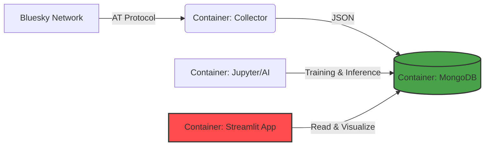

# Thumalien — Social Media Intelligence & AI Monitor


## Description du Projet

**Thumalien** est une solution complète de surveillance et d'analyse des réseaux sociaux (Bluesky) en temps réel. Le projet intègre un pipeline Data Engineering complet et deux modèles d'Intelligence Artificielle pour qualifier l'information.

L'objectif est de détecter les potentiels signaux faibles, les **Fake News** et d'analyser l'**ambiance émotionnelle** des discussions en ligne.

### Fonctionnalités Clés
* **Collecte en temps réel :** Ingestion continue des posts Bluesky via l'API AT Protocol.
* **Détection de Fake News (V9) :** Pipeline cascade 2 étapes : filtre fait/opinion puis analyse V8 (meta-learner V5+V6+CamemBERT). Bilingue FR/EN, 15 features linguistiques + 28 features stylistiques.
* **Analyse Émotionnelle (Deep Learning) :** Réseau de neurones MLP (PyTorch) classifiant les textes selon 7 émotions (Colère, Dégoût, Joie, Neutre, Peur, Surprise, Tristesse).
* **Modèles avancés :** CamemBERT (FR, F1 0.957) et RoBERTa (EN, F1 0.874) fine-tunés pour les textes ultra-courts type réseaux sociaux.
* **Explicabilité IA (XAI) complète :** Pipeline 6 modules dans `src/explainability/` couvrant les 4 niveaux de l'IA explicable :
    * SHAP global (beeswarm + dependence) sur V6
    * Attention CamemBERT (CLS dernière couche + heatmap par couche)
    * Layer Integrated Gradients (Captum) avec axiome de Completeness vérifié
    * Décomposition exacte du méta-learner V8 (β·x) intégrée au dashboard
    * Validation faithfulness (AOPC, Comprehensiveness@k, Sufficiency@k vs random) — **uplift +0.21** sur le gold set
    * Model Card formelle (`docs/12_model_card.md`) avec section dédiée XAI
    * Reproductible en 1 commande : `python scripts/run_xai_pipeline.py`
* **Dashboard Interactif :** 5 pages Streamlit (Dashboard, Analyse IA, Explorateur, Performance, À propos).
* **Green IT :** Monitoring de l'empreinte carbone des calculs IA via CodeCarbon.
* **Tests :** 342 tests unitaires et d'intégration (pytest, 49% couverture), benchmark latence automatisé.

### Métriques clés (V9)
* **245 000+ posts** collectés depuis décembre 2025 (collecte continue)
* **197 782 textes** d'entraînement (7 datasets, FR+EN)
* **F1-score V5** : 0.913 (CV), seuil de décision : 0.44
* **V9 Cascade** : faux positifs réduits de -67% (Fisher p=0.0005)
* **CamemBERT FR** : F1 0.957 sur textes ultra-courts
* **RoBERTa EN V2** : F1 0.874 sur textes ultra-courts (+4.3% vs V1)
* **Latence** : 1.5 ms/texte (728 textes/sec)
* **67%** des posts Bluesky classés fiables
* **Empreinte CO2** : 6.14 g (total entraînement, dont 64% Transformers)

---

## Architecture Technique

Le projet repose sur une architecture micro-services conteneurisée avec Docker.



---

## Structure du Projet

```
projet_etude/
├── dashboard/              # Application Streamlit (Dashboard V5, 5 pages)
├── data/training/          # Datasets d'entraînement (FR+EN, 6 sources)
├── docs/                   # Documentation complète du projet
│   └── pdf/                # Documents PDF exportés
├── models/                 # Modèles entraînés (.joblib, .pt)
├── notebooks/              # Notebooks d'exploration, entraînement et analyse
├── src/
│   ├── app/                # Point d'entrée application
│   ├── collection/         # Collecteur Bluesky + qualité des données
│   ├── explainability/     # Pipeline XAI : SHAP global, attention, IG, decomposition meta-learner, faithfulness
│   ├── monitoring/         # Monitoring hebdomadaire (drift detection)
│   └── pipeline/           # Pipeline NLP expert + CamemBERT + agrégations
├── scripts/
│   └── run_xai_pipeline.py # Pipeline XAI complet en 1 commande (figures + INDEX.md + results.json)
├── docker-compose.yml
└── requirements.txt
```

---

## Notebooks

| # | Notebook | Description |
|---|----------|-------------|
| 00 | `00_Audit_Qualite_Donnees.ipynb` | Audit qualité des données collectées |
| 01 | `01_Exploration_Bluesky.ipynb` | Exploration initiale du réseau Bluesky |
| 02 | `02_Analyse_Emotions_MLP.ipynb` | Modèle MLP PyTorch — 7 émotions (early stopping + class weights) |
| 03 | `03_Mise_a_jour_Quotidienne.ipynb` | Pipeline de mise à jour quotidienne (incrémental MongoDB) |
| 04 | `04_Modele_Avance_RoBERTa.ipynb` | Prototype RoBERTa pour détection fake news |
| 05 | `05_Detection_Expert_Bilingue.ipynb` | Pipeline expert bilingue FR/EN (LogReg + TF-IDF) |
| 06 | `06_Documentation_Technique.ipynb` | Documentation technique du pipeline |
| 07 | `07_Analyse_Modele_GridSearch.ipynb` | GridSearch hyperparamètres (C, min_df, ngram) |
| 08 | `08_Integration_Datasets_V2.ipynb` | Intégration des 6 datasets V2 |
| 09 | `09_Analyse_Erreurs_Qualitative.py` | Analyse qualitative des erreurs sur 2000 textes |
| 10 | `10_Analyse_Modele_Par_Longueur.py` | Performance du modèle par longueur de texte |
| 11 | `11_Retraining_V3.py` | Réentraînement V3 (correction preprocessing) |
| 12 | `12_Retraining_V4.py` | Réentraînement V4 + CamemBERT FR |
| 13 | `13_FineTune_CamemBERT_FR.py` | Fine-tuning CamemBERT sur données FR |
| 14 | `14_Retraining_V5_Social.py` | V5 avec 10K textes sociaux FR synthétiques |
| 15 | `15_Seuil_Adaptatif.py` | Seuil adaptatif par longueur (non significatif) |
| 16 | `16_FineTune_CamemBERT_V2_Social.py` | CamemBERT V2 (F1 0.957 ultra-court) |
| 17 | `17_Pipeline_Hybride_Stacking.py` | Pipeline hybride stacking V5 + CamemBERT V2 |
| 18 | `18_FineTune_RoBERTa_EN.py` | RoBERTa EN V1 (F1 0.838) |
| 19 | `19_FineTune_RoBERTa_EN_V2.py` | RoBERTa EN V2 +10K synthétique (F1 0.874) |
| 20 | `20_Tests_Significativite_Bootstrap.py` | Tests de significativité bootstrap |
| 21 | `21_Gold_Test_Set_Evaluation.py` | Évaluation sur gold test set (ancien) |
| 22 | `22_Gold_Test_Set_Evaluation.py` | Évaluation pipeline V5 sur 200 posts annotés (F1 suspect=0.087) |
| 23 | `23_Style_Only_V6.py` | Modèle style-only V6 (GradientBoosting, 35 features, F1 suspect=0.103) |
| 24 | `24_Hybrid_Ensemble_V7_SHAP.py` | Ensemble hybride V5+V6 + SHAP explicabilité (F1 suspect=0.127) |
| 25 | `25_V8_Hybrid_Extended_CamemBERT.py` | V8 meta-learner V5+V6+CamemBERT (F1 suspect +28%) |
| 26 | `26_V5_Finetune_Bluesky.py` | Self-training sur Bluesky (échec documenté) |
| 27 | `27_Pipeline_2_Etapes.py` | V9 cascade fait/opinion (FP -67%, Fisher p=0.0005) |

---

## Documentation PDF

Tous les documents sont disponibles dans [`docs/pdf/`](docs/pdf/) :

| Document | Description |
|----------|-------------|
| [**Executive Summary**](docs/pdf/00_executive_summary.pdf) | **Synthèse 1 page : problème, solution, KPI, livrables, impact** |
| [Cahier des charges techniques](docs/pdf/01_cahier_des_charges_techniques.pdf) | Spécifications techniques détaillées du projet |
| [Conformité RGPD & AI Act](docs/pdf/02_conformite_RGPD_AI_Act.pdf) | Analyse de conformité réglementaire |
| [Méthodologie projet](docs/pdf/03_methodologie_projet.pdf) | Méthodologie et organisation du projet |
| [Revue & challenge équipe](docs/pdf/04_revue_challenge_equipe.pdf) | Revue critique et retours d'équipe |
| [Analyse erreurs qualitative](docs/pdf/05_analyse_erreurs_qualitative.pdf) | Analyse qualitative des erreurs du modèle |
| [Analyse par longueur de texte](docs/pdf/06_analyse_modele_par_longueur.pdf) | Performance du modèle selon la longueur |
| [Évolution des modèles V1→V5](docs/pdf/07_evolution_modeles_comparatif.pdf) | Comparatif de toutes les versions du modèle |
| [Planification & Gantt](docs/pdf/08_planification_gantt.pdf) | WBS, Gantt, dépendances, jalons et calendrier |
| [PRA/PCA](docs/pdf/09_PRA_PCA.pdf) | Plan de Reprise et Continuité d'Activité |
| [Veille technologique](docs/pdf/10_veille_technologique.pdf) | Politique de veille technique et réglementaire |
| [Accessibilité & handicap](docs/pdf/11_accessibilite_handicap.pdf) | Mesures d'accessibilité du système |
| [Rapport de projet](docs/pdf/rapport_projet_thumalien.pdf) | Rapport complet du projet Thumalien |
| [Guide utilisateur](docs/pdf/guide_utilisateur.pdf) | Guide d'utilisation du système |
| [Rôles et compétences](docs/pdf/roles_et_competences_projet.pdf) | Distribution des rôles et compétences |
| [Rendu individuel Azelie](docs/pdf/rendu_individuel_azelie_bernard.pdf) | Bilan personnel et compétences |
| [Rendu individuel Sebastien](docs/pdf/rendu_individuel_sebastien_lazcanotegui.pdf) | Bilan personnel et compétences |

---

## Historique des versions

| Version | Date | F1 global | F1 FR court | F1 EN court | Innovation clé |
|---------|------|-----------|-------------|-------------|----------------|
| V1.0 | Dec 2025 | 0.996 (biaisé) | N/A | N/A | Baseline TF-IDF EN (biais Reuters) |
| V1.5 | Jan 2026 | 0.986 | N/A | N/A | Bilingue + débiaisage Reuters + 12 features linguistiques |
| V2.0 | Fev 2026 | 0.897 | 0.650 | 0.763 | +3 datasets sociaux, seuil calibré 0.44, 73.4% Bluesky fiables |
| V3.0 | Mars 2026 | 0.900 | 0.650 | 0.763 | Bug fix features linguistiques (5/12 étaient nulles) |
| V4.0 | Avril 2026 | 0.905 | 0.860 | 0.752 | Augmentation FR court (+32% F1), +3 features, 187K textes |
| CamemBERT V1 | Avril 2026 | 0.950 (FR) | 0.901 | N/A | Transformer FR fine-tuné, test 3/6 |
| V5.0 | Avril 2026 | 0.913 | 0.904 | 0.774 | +10K FR social synthétique, test 12/12, 197K textes |
| CamemBERT V2 | Avril 2026 | 0.966 (FR) | 0.957 | N/A | +10K FR social, test 9/10 (+6.2% ultra-court) |
| Hybride P1 | Avril 2026 | 0.916 | 0.909 | 0.773 | Stacking V5 + CamemBERT V2, F1 FR +0.52% |
| RoBERTa EN V1 | Avril 2026 | 0.940 (EN) | N/A | 0.838 | Transformer EN fine-tuné, test 6/10 |
| RoBERTa EN V2 | Avril 2026 | 0.944 (EN) | N/A | 0.874 | +10K EN social, test 16/18 (+4.3% ultra-court) |
| V6 Style-Only | Avril 2026 | 0.830 | N/A | N/A | GradientBoosting 35 features style, topic-agnostic, F1 suspect gold +18% |
| V7 Hybride | Avril 2026 | N/A | N/A | N/A | Ensemble V5+V6, meta-learner LOO, F1 suspect gold 0.127 (+46% vs V5), SHAP |
| V8 Meta | Avril 2026 | N/A | N/A | N/A | Meta-learner V5+V6+CamemBERT, F1 suspect gold 0.163 (+28% vs V7) |
| **V9 Cascade** | **Mai 2026** | **N/A** | **N/A** | **N/A** | **Pipeline 2 étapes fait/opinion, FP -67%, Fisher p=0.0005** |

---

## Installation & Lancement

```bash
# Cloner le projet
git clone https://github.com/azelbanks/projet_etude.git
cd projet_etude

# Lancer avec Docker Compose
docker-compose up -d

# Ou installation locale
pip install -r requirements.txt
```

### Prérequis
- Python 3.13+
- Docker & Docker Compose
- MongoDB
- GPU recommandé pour le fine-tuning des modèles Transformer

---

## Tests

```bash
# Lancer tous les tests
python3 -m pytest tests/ -v

# Avec rapport de couverture
python3 -m pytest tests/ --cov=src --cov=dashboard --cov-report=term-missing

# Benchmark de latence seul
python3 -m pytest tests/test_benchmark_latence.py -v -s
```

| Module testé | Tests | Couverture |
|-------------|:-----:|:----------:|
| Collecteur Bluesky (validation, langue) | 17 | 25% |
| Pipeline NLP (features, détecteur) | 16 | 27% |
| CamemBERT (architecture, dataset) | 13 | 28% |
| MongoDB (agrégations, requêtes) | 11 | 61% |
| Monitoring (scoring, rapports) | 11 | 50% |
| Dashboard (syntaxe, style features) | 6 | 19% |
| Qualité données | 7 | 79% |
| Intégration pipeline | 11 | — |
| Benchmark latence | 3 | — |
| Sécurité / validation entrées | 7 | — |
| **Total** | **342** | **49%** |

---

## Green IT

L'empreinte carbone de l'ensemble des entraînements est suivie via **CodeCarbon** :
- **Total CO2** : 6.14 g (6 sessions d'entraînement V1-V9 + CamemBERT + RoBERTa)
- Equivalent à moins d'une recherche Google (~7 g). Le choix de modèles frugaux (LogReg + fine-tuning court) limite l'empreinte
