# Planification detaillee du projet Thumalien
## Diagramme de Gantt, WBS, dependances et jalons

**Reference** : PLAN-THUM-2026-001
**Version** : 2.0
**Date** : Mai 2026
**Equipe** : Azelie Bernard (Lead technique), Sebastien Lazcanotegui (Consolidation ML)

---

## 1. Work Breakdown Structure (WBS)

### 1.1 Decomposition hierarchique

```
THUMALIEN - Projet Etude M1
|
|-- WP1 : Cadrage & Infrastructure (Dec 2025)
|   |-- T1.1 : Analyse des besoins et specification
|   |-- T1.2 : Choix technologiques (Python, MongoDB, Docker)
|   |-- T1.3 : Mise en place environnement Docker Compose
|   |-- T1.4 : Configuration MongoDB + volumes persistants
|   |-- T1.5 : Creation du depot Git et structure projet
|
|-- WP2 : Collecte de donnees (Dec 2025 - Continu)
|   |-- T2.1 : Developpement collecteur Bluesky (AT Protocol)
|   |-- T2.2 : Validation schema JSON + deduplication
|   |-- T2.3 : Audit qualite des donnees collectees
|   |-- T2.4 : Maintenance et monitoring continu
|
|-- WP3 : Modele d'emotions (Jan 2026)
|   |-- T3.1 : Exploration datasets emotions (GoEmotions, FR tweets)
|   |-- T3.2 : Developpement MLP PyTorch (7 classes)
|   |-- T3.3 : Early stopping + class weights
|   |-- T3.4 : Evaluation et validation
|
|-- WP4 : Pipeline NLP Expert (Jan - Avril 2026)
|   |-- T4.1 : Baseline V1.0 (TF-IDF + LogReg EN)
|   |-- T4.2 : Audit biais Reuters + debiaisage
|   |-- T4.3 : V1.5 bilingue + features linguistiques
|   |-- T4.4 : V2 integration datasets sociaux + seuil 0.44
|   |-- T4.5 : V3 correction preprocessing
|   |-- T4.6 : V4 augmentation FR court + 15 features
|   |-- T4.7 : V5 + 10K posts sociaux synthetiques
|   |-- T4.8 : GridSearch hyperparametres (C, min_df, ngram)
|
|-- WP5 : Modeles Transformer (Avril 2026)
|   |-- T5.1 : Fine-tuning CamemBERT V1 (FR)
|   |-- T5.2 : CamemBERT V2 + donnees sociales
|   |-- T5.3 : Fine-tuning RoBERTa EN V1
|   |-- T5.4 : RoBERTa EN V2 + 10K synthétique
|   |-- T5.5 : Pipeline hybride stacking V5 + CamemBERT V2
|
|-- WP6 : Dashboard & Visualisation (Mars 2026)
|   |-- T6.1 : Dashboard V1 (metriques basiques)
|   |-- T6.2 : Dashboard V2 (glassmorphism, 3 pages)
|   |-- T6.3 : Dashboard V3 (radar charts, live prediction)
|   |-- T6.4 : Integration weighted loss + securite
|
|-- WP7 : Documentation & Conformite (Fev - Avril 2026)
|   |-- T7.1 : Cahier des charges techniques
|   |-- T7.2 : Conformite RGPD & AI Act
|   |-- T7.3 : Rapport de projet
|   |-- T7.4 : Guide utilisateur
|   |-- T7.5 : Documentation technique (22 notebooks)
|   |-- T7.6 : Planification et gouvernance
|
|-- WP8 : Evaluation & Gold Test Set (Avril - Mai 2026)
|   |-- T8.1 : Gold set V1 (200 posts, kappa=0.808)
|   |-- T8.2 : Gold set V2 annotation (500 posts, 2 annotateurs, kappa=0.498)
|   |-- T8.3 : Evaluation systematique V5-V9 sur gold
|
|-- WP9 : Iterations avancees V6-V9 (Avril - Mai 2026)
|   |-- T9.1 : V6 Style-Only topic-agnostic (28 features, GBT)
|   |-- T9.2 : V7 Ensemble hybride V5+V6 + SHAP
|   |-- T9.3 : V8 Meta-learner V5+V6+CamemBERT
|   |-- T9.4 : Self-training Bluesky (echec documente)
|   |-- T9.5 : V9 Pipeline 2 etapes fait/opinion
|
|-- WP10 : Collecteur V3 & Reeequilibrage (Avril 2026)
|   |-- T10.1 : Reeequilibrage termes FR/EN (28 FR + 16 EN)
|   |-- T10.2 : Inference automatique emotions + V5
|   |-- T10.3 : Rate limiting & backoff progressif
|
|-- WP11 : Dashboard V4-V5 (Avril - Mai 2026)
|   |-- T11.1 : Dashboard V4 (V9 + SHAP + Explorateur)
|   |-- T11.2 : Dashboard V5 (5 pages, accents, Performance)
|
|-- WP12 : Tests & Qualite (Mai 2026)
|   |-- T12.1 : Tests unitaires (107 tests, 26% coverage)
|   |-- T12.2 : Benchmark latence (1.5ms/texte)
|   |-- T12.3 : Tests d'integration pipeline
|
|-- WP13 : Video MVP (Mai 2026)
|   |-- T13.1 : Script et storyboard
|   |-- T13.2 : Tournage demo live
|   |-- T13.3 : Montage et post-production
|   |-- T13.4 : Livraison finale
```

---

## 2. Diagramme de Gantt

### 2.1 Planning macro (semaines)

```mermaid
gantt
    title Planification Projet Thumalien
    dateFormat YYYY-MM-DD
    axisFormat %d/%m
    todayMarker off

    section WP1 Cadrage & Infra
    T1.5 Depot Git                          :done, t15, 2025-12-01, 2025-12-10
    T1.1 Analyse besoins                    :done, t11, 2025-12-01, 2025-12-14
    T1.2 Choix techno                       :done, t12, 2025-12-01, 2025-12-14
    T1.3 Docker Compose                     :done, t13, 2025-12-10, 2025-12-22
    T1.4 MongoDB config                     :done, t14, 2025-12-10, 2025-12-22
    J0 Lancement projet                     :milestone, j0, 2025-12-01, 0d

    section WP2 Collecte donnees
    T2.1 Collecteur Bluesky                 :done, t21, 2025-12-10, 2025-12-22
    T2.2 Validation schema                  :done, t22, 2025-12-10, 2025-12-22
    T2.3 Audit qualite                      :done, t23, 2026-01-06, 2026-01-20
    T2.4 Monitoring continu                 :done, t24, 2025-12-22, 2026-05-19
    J1 Collecteur operationnel              :milestone, j1, 2025-12-15, 0d

    section WP3 Modele emotions
    T3.1 Exploration datasets               :done, t31, 2026-01-05, 2026-01-15
    T3.2 MLP PyTorch                        :done, t32, 2026-01-05, 2026-01-25
    T3.3 Early stopping                     :done, t33, 2026-01-18, 2026-01-25
    T3.4 Evaluation                         :done, t34, 2026-01-18, 2026-01-25
    J4 Modele emotions                      :milestone, j4, 2026-01-20, 0d

    section WP4 Pipeline NLP V1-V5
    T4.1 Baseline V1.0 (LogReg EN)          :done, t41, 2025-12-15, 2025-12-28
    T4.2 Audit biais Reuters                :done, t42, 2026-01-05, 2026-01-15
    T4.3 V1.5 bilingue + features           :done, t43, 2026-01-18, 2026-02-08
    T4.8 GridSearch hyperparametres         :done, t48, 2026-02-10, 2026-02-20
    T4.4 V2 datasets sociaux + seuil 0.44  :done, t44, 2026-02-20, 2026-03-05
    T4.5 V3 correction preprocessing        :done, t45, 2026-03-10, 2026-03-25
    T4.6 V4 augmentation FR court           :done, t46, 2026-04-01, 2026-04-10
    T4.7 V5 +10K posts synthetiques         :done, t47, 2026-04-10, 2026-04-18
    J2 Baseline V1.0                        :milestone, j2, 2025-12-20, 0d
    J3 Audit qualite                        :milestone, j3, 2026-01-10, 0d
    J5 Pipeline V1.5                        :milestone, j5, 2026-02-05, 0d
    J6 GridSearch                           :milestone, j6, 2026-02-15, 0d
    J7 Pipeline V2                          :milestone, j7, 2026-02-25, 0d
    J9 Pipeline V3                          :milestone, j9, 2026-03-20, 0d
    J10 Pipeline V4                         :milestone, j10, 2026-04-05, 0d
    J11 Pipeline V5                         :milestone, j11, 2026-04-10, 0d

    section WP5 Modeles Transformer
    T5.1 CamemBERT V1 (FR)                 :done, t51, 2026-04-05, 2026-04-12
    T5.2 CamemBERT V2 + donnees sociales   :done, t52, 2026-04-12, 2026-04-16
    T5.3 RoBERTa EN V1                     :done, t53, 2026-04-12, 2026-04-18
    T5.4 RoBERTa EN V2 + 10K synthetique   :done, t54, 2026-04-18, 2026-04-22
    T5.5 Pipeline hybride stacking          :done, t55, 2026-04-18, 2026-04-22
    J12 CamemBERT V1/V2                    :milestone, j12, 2026-04-12, 0d
    J13 RoBERTa EN V1/V2                   :milestone, j13, 2026-04-15, 0d
    J14 Pipeline hybride                   :milestone, j14, 2026-04-18, 0d

    section WP6 Dashboard V1-V3
    T6.1 Dashboard V1 (metriques)           :done, t61, 2026-03-01, 2026-03-12
    T6.2 Dashboard V2 (glassmorphism)       :done, t62, 2026-03-12, 2026-03-25
    T6.3 Dashboard V3 (radar, prediction)   :done, t63, 2026-03-25, 2026-04-08
    T6.4 Securite + weighted loss           :done, t64, 2026-04-08, 2026-04-16
    J8 Dashboard V2                         :milestone, j8, 2026-03-10, 0d

    section WP7 Documentation
    T7.1 CDC techniques                     :done, t71, 2026-02-01, 2026-02-14
    T7.2 RGPD & AI Act                     :done, t72, 2026-02-01, 2026-02-14
    T7.3 Rapport projet                     :done, t73, 2026-04-05, 2026-05-15
    T7.4 Guide utilisateur                  :done, t74, 2026-04-10, 2026-04-28
    T7.5 Doc technique (22 notebooks)       :done, t75, 2026-04-05, 2026-05-15
    T7.6 Planification                      :done, t76, 2026-04-22, 2026-05-08
    J24 Documentation finale                :milestone, j24, 2026-05-12, 0d

    section WP8 Gold Test Set
    T8.1 Gold set V1 (200 posts)            :done, t81, 2026-04-05, 2026-04-15
    T8.2 Gold set V2 (500 posts, 2 annot.)  :done, t82, 2026-04-15, 2026-04-28
    T8.3 Eval V5-V9 sur gold                :done, t83, 2026-04-25, 2026-05-08
    J19 Gold Test Set V2                    :milestone, j19, 2026-04-25, 0d

    section WP9 Iterations V6-V9
    T9.1 V6 Style-Only (GBT, 28 feat.)     :done, t91, 2026-04-15, 2026-04-22
    T9.2 V7 Ensemble + SHAP                :done, t92, 2026-04-22, 2026-04-28
    T9.3 V8 Meta-learner                   :done, t93, 2026-04-22, 2026-04-28
    T9.4 Self-training (echec documente)    :done, t94, 2026-04-25, 2026-04-28
    T9.5 V9 Cascade fait/opinion            :done, t95, 2026-04-28, 2026-05-05
    J15 Consolidation ML                    :milestone, j15, 2026-04-20, 0d
    J16 V6 Style-Only                       :milestone, j16, 2026-04-20, 0d
    J21 V9 Cascade                          :milestone, j21, 2026-05-02, 0d

    section WP10 Collecteur V3
    T10.1 Reequilibrage FR/EN               :done, t101, 2026-04-15, 2026-04-22
    T10.2 Inference auto emotions + V5      :done, t102, 2026-04-15, 2026-04-25
    T10.3 Rate limiting & backoff           :done, t103, 2026-04-22, 2026-04-28
    J20 Collecteur V3                       :milestone, j20, 2026-04-28, 0d

    section WP11 Dashboard V4-V5
    T11.1 Dashboard V4 (V9 + SHAP)         :done, t111, 2026-04-25, 2026-05-02
    T11.2 Dashboard V5 (5 pages, perf.)    :done, t112, 2026-05-02, 2026-05-08
    J22 Dashboard V5                        :milestone, j22, 2026-05-05, 0d

    section WP12 Tests & Qualite
    T12.1 Tests unitaires (107 tests)       :done, t121, 2026-05-02, 2026-05-10
    T12.2 Benchmark latence (1.5ms)         :done, t122, 2026-05-02, 2026-05-08
    T12.3 Tests integration pipeline        :done, t123, 2026-05-08, 2026-05-14
    J23 Tests & Benchmark                   :milestone, j23, 2026-05-08, 0d

    section WP13 Video MVP
    T13.1 Script et storyboard              :done, t131, 2026-05-08, 2026-05-13
    T13.2 Tournage demo live                :done, t132, 2026-05-13, 2026-05-16
    T13.3 Montage et post-production        :done, t133, 2026-05-15, 2026-05-18
    T13.4 Livraison finale                  :done, t134, 2026-05-18, 2026-05-19
    J25 Video MVP                           :milestone, j25, 2026-05-15, 0d
    DEADLINE                                :milestone, crit, deadline, 2026-05-19, 0d
```



### 2.2 Legende

- Toutes les taches sont marquees `done` (projet en phase finale)
- Les losanges representent les jalons (milestones)
- DEADLINE : 19 mai 2026

---

## 3. Calendrier formel avec dates cles

| Date | Jalon | Livrable | Responsable |
|------|-------|----------|-------------|
| 01/12/2025 | J0 - Lancement projet | Repo Git, Docker, MongoDB | Azelie |
| 15/12/2025 | J1 - Collecteur operationnel | collect_bluesky.py fonctionnel | Azelie |
| 20/12/2025 | J2 - Baseline V1.0 | LogReg EN, F1=0.99 (biaise) | Azelie |
| 10/01/2026 | J3 - Audit qualite | Biais Reuters identifie | Azelie |
| 20/01/2026 | J4 - Modele emotions | MLP PyTorch 7 emotions | Azelie |
| 05/02/2026 | J5 - Pipeline V1.5 | Bilingue, 12 features, F1=0.986 | Azelie |
| 15/02/2026 | J6 - GridSearch | C=5.0, min_df=5, ngram=(1,2) | Sebastien |
| 25/02/2026 | J7 - Pipeline V2 | +3 datasets sociaux, seuil=0.44 | Azelie |
| 10/03/2026 | J8 - Dashboard V2 | Glassmorphism, 3 pages | Azelie |
| 20/03/2026 | J9 - Pipeline V3 | Correction features linguistiques | Azelie |
| 05/04/2026 | J10 - Pipeline V4 | Augmentation FR court, 15 features | Azelie |
| 10/04/2026 | J11 - Pipeline V5 | +10K FR synthetique, F1=0.913 | Azelie |
| 12/04/2026 | J12 - CamemBERT V1/V2 | F1 FR ultra-court = 0.957 | Azelie |
| 15/04/2026 | J13 - RoBERTa EN V1/V2 | F1 EN ultra-court = 0.874 | Azelie |
| 18/04/2026 | J14 - Pipeline hybride | Stacking V5 + CamemBERT V2 | Azelie |
| 20/04/2026 | J15 - Consolidation ML | Debiaisage, hyperparametres | Sebastien |
| 20/04/2026 | J16 - V6 Style-Only | GradientBoosting 28 features, topic-agnostic | Azelie |
| 22/04/2026 | J17 - V7 Ensemble + SHAP | Meta-learner V5+V6, explicabilite SHAP | Azelie |
| 24/04/2026 | J18 - V8 Meta-learner | V5+V6+CamemBERT, F1 suspect +28% | Azelie |
| 25/04/2026 | J19 - Gold Test Set V2 | 500 posts, 2 annotateurs, kappa=0.498 | Azelie |
| 28/04/2026 | J20 - Collecteur V3 | Reeequilibrage FR/EN + inference auto | Azelie |
| 02/05/2026 | J21 - V9 Cascade fait/opinion | FP -67%, Fisher p=0.0005 | Azelie |
| 05/05/2026 | J22 - Dashboard V5 | 5 pages, accents FR, page Performance | Azelie |
| 08/05/2026 | J23 - Tests & Benchmark | 107 tests, 1.5ms/texte, 728 textes/sec | Azelie |
| 12/05/2026 | J24 - Documentation finale | Rapport, planification, rendus individuels | Azelie |
| 15/05/2026 | J25 - Video MVP | Video 15-20 min face-cam + dossier | Azelie + Sebastien |
| **19/05/2026** | **DEADLINE** | **Livraison finale — dossier + video + code** | **Equipe** |

---

## 4. Dependances entre taches

### 4.1 Graphe de dependances

```
T1.3 (Docker) ──> T1.4 (MongoDB) ──> T2.1 (Collecteur)
                                          |
T1.5 (Git) ──────────────────────────────>|
                                          |
                                          v
                                     T2.3 (Audit qualite)
                                          |
                              +-----------+-----------+
                              |                       |
                              v                       v
                         T4.1 (V1.0)             T3.1 (Emotions)
                              |                       |
                              v                       v
                         T4.2 (Audit biais)      T3.2 (MLP)
                              |                       |
                              v                       |
                         T4.3 (V1.5) <────────────────+
                              |
                              v
                         T4.4 (V2) ──> T4.8 (GridSearch)
                              |
                              v
                         T4.5 (V3)
                              |
                              v
                         T4.6 (V4) ──> T5.1 (CamemBERT V1)
                              |              |
                              v              v
                         T4.7 (V5) ──> T5.2 (CamemBERT V2)
                              |              |
                              v              v
                         T5.3 (RoBERTa V1)  T5.5 (Hybride)
                              |
                              v
                         T5.4 (RoBERTa V2)

T4.4 (V2) ──> T6.1 (Dashboard V1) ──> T6.2 (V2) ──> T6.3 (V3)

T4.7 (V5) ──> T7.3 (Rapport) ──> T8.1 (Script video)
```

### 4.2 Matrice de dependances

| Tache | Depend de | Type | Critique |
|-------|-----------|------|----------|
| T1.4 MongoDB | T1.3 Docker | Fin-Debut | Oui |
| T2.1 Collecteur | T1.4 MongoDB | Fin-Debut | Oui |
| T4.1 Baseline | T2.1 Collecteur | Fin-Debut | Oui |
| T4.2 Audit biais | T4.1 Baseline | Fin-Debut | Oui |
| T4.3 V1.5 | T4.2 Audit + T3.4 Emotions | Fin-Debut | Oui |
| T4.4 V2 | T4.3 V1.5 | Fin-Debut | Oui |
| T4.5 V3 | T4.4 V2 | Fin-Debut | Oui |
| T4.6 V4 | T4.5 V3 | Fin-Debut | Oui |
| T4.7 V5 | T4.6 V4 | Fin-Debut | Oui |
| T5.1 CamemBERT | T4.6 V4 | Fin-Debut | Non |
| T5.3 RoBERTa | T4.7 V5 | Fin-Debut | Non |
| T5.5 Hybride | T5.2 CamemBERT V2 + T4.7 V5 | Fin-Debut | Non |
| T6.1 Dashboard | T4.4 V2 | Fin-Debut | Non |
| T7.3 Rapport | T4.7 V5 | Fin-Debut (contenu) | Non |
| T8.1 Gold set V1 | T4.7 V5 | Fin-Debut | Non |
| T8.3 Eval gold | T9.5 V9 + T8.2 Gold V2 | Fin-Debut | Non |
| T9.1 V6 Style | T4.7 V5 + T8.1 Gold V1 | Fin-Debut | Oui |
| T9.2 V7 Ensemble | T9.1 V6 | Fin-Debut | Oui |
| T9.3 V8 Meta | T9.2 V7 + T5.2 CamemBERT V2 | Fin-Debut | Oui |
| T9.5 V9 Cascade | T9.3 V8 + T8.2 Gold V2 | Fin-Debut | Oui |
| T11.1 Dashboard V4 | T9.3 V8 | Fin-Debut | Non |
| T11.2 Dashboard V5 | T11.1 Dashboard V4 + T9.5 V9 | Fin-Debut | Non |
| T12.1 Tests | T9.5 V9 + T11.2 Dashboard V5 | Fin-Debut | Non |
| T13.1 Video | T12.1 Tests + T7.3 Rapport | Fin-Debut | Oui |

### 4.3 Chemin critique

Le chemin critique du projet est :

```
T1.3 -> T1.4 -> T2.1 -> T4.1 -> T4.2 -> T4.3 -> T4.4 -> T4.5 -> T4.6 -> T4.7
  -> T9.1 (V6) -> T9.2 (V7) -> T9.3 (V8) -> T9.5 (V9) -> T7.3 (Rapport) -> T13.1 (Video)
```

Duree totale du chemin critique : **~24 semaines** (Dec 2025 - Mai 2026)
Deadline de livraison : **19 mai 2026**

Toute tache sur le chemin critique qui prend du retard retarde la livraison finale.

---

## 5. Repartition des responsabilites (RACI)

| Tache | Azelie Bernard | Sebastien Lazcanotegui |
|-------|:--------------:|:---------------------:|
| WP1 Infrastructure | R/A | I |
| WP2 Collecte | R/A | C (support termes de recherche) |
| WP3 Emotions | R/A | I |
| WP4 Pipeline V1-V5 | R/A | R (GridSearch, debiaisage) |
| WP5 Transformers | R/A | I |
| WP6 Dashboard | R/A | C (feedback utilisateur) |
| WP7 Documentation | R | R (revue, relecture, validation) |
| WP8 Gold Test Set | R | R (annotation 2e annotateur, kappa) |
| WP9 Iterations V6-V9 | R/A | C (evaluation gold set) |
| WP10 Collecteur V3 | R/A | I |
| WP11 Dashboard V4-V5 | R/A | C (tests fonctionnels) |
| WP12 Tests & Qualite | R | C (validation resultats) |
| WP13 Video MVP | R | R (co-production) |

**Legende RACI** : R = Responsable, A = Approbateur, C = Consulte, I = Informe

### 5.1 Charge de travail estimee

| Work Package | Azelie (heures) | Sebastien (heures) | Total |
|-------------|:----------------:|:-------------------:|:-----:|
| WP1 Cadrage & Infra | 20 | 2 | 22 |
| WP2 Collecte | 25 | 3 | 28 |
| WP3 Emotions | 30 | 0 | 30 |
| WP4 Pipeline NLP (V1-V5) | 80 | 15 | 95 |
| WP5 Transformers | 40 | 0 | 40 |
| WP6 Dashboard (V1-V3) | 20 | 3 | 23 |
| WP7 Documentation | 40 | 10 | 50 |
| WP8 Gold Test Set | 20 | 15 | 35 |
| WP9 Iterations V6-V9 | 50 | 5 | 55 |
| WP10 Collecteur V3 | 10 | 0 | 10 |
| WP11 Dashboard V4-V5 | 20 | 3 | 23 |
| WP12 Tests & Qualite | 15 | 5 | 20 |
| WP13 Video MVP | 10 | 10 | 20 |
| **Total** | **380** | **71** | **451** |

---

## 6. Outils de planification utilises

| Outil | Usage | Justification |
|-------|-------|---------------|
| **Git / GitHub** | Versioning du code et des documents | Tracabilite complete des modifications, historique des commits |
| **Docker Compose** | Orchestration des services | Reproductibilite de l'environnement, deploiement standardise |
| **Jupyter Notebooks** | Experimentation ML iterative | Documentation executable des experiences |
| **GitHub Issues** | Suivi des taches et bugs | Integration native avec Git, assignation, labels |
| **Markdown** | Documentation | Versionnable, lisible, convertible en PDF |
| **CodeCarbon** | Suivi empreinte carbone | Mesure automatique de la consommation energetique |

---

## 7. Indicateurs de suivi du planning

| KPI | Methode | Frequence | Seuil d'alerte |
|-----|---------|-----------|----------------|
| Avancement reel vs planifie | Comparaison jalons | Hebdomadaire | Retard > 1 semaine |
| Nombre de taches completees | Comptage Git commits | Hebdomadaire | < 3 commits/semaine |
| F1-score progression | Metriques ML | A chaque version | Regression > 2% |
| Volume donnees collectees | MongoDB count | Quotidien | < 500 posts/jour |
| Bugs ouverts | GitHub issues | Hebdomadaire | > 5 bugs critiques |

---

## 8. Gestion des risques lies au planning

| Risque | Probabilite | Impact | Mitigation |
|--------|:-----------:|:------:|------------|
| Retard sur le pipeline NLP (chemin critique) | Moyenne | Eleve | Parallelisation des taches non-critiques (dashboard, docs) |
| Indisponibilite API Bluesky | Faible | Moyen | Cache local, retry automatique, donnees existantes suffisantes |
| Probleme de convergence du modele | Moyenne | Moyen | Rollback vers version precedente validee |
| Surcharge d'un membre du binome | Moyenne | Eleve | Repartition dynamique, priorisation des taches critiques, points hebdomadaires |
| Changement de specifications | Faible | Moyen | Methodologie agile, iterations courtes |

---

*Document valide par l'equipe projet - Mai 2026*
*Reference : PLAN-THUM-2026-001 - Version 2.0*
*Deadline de livraison : 19 mai 2026*
