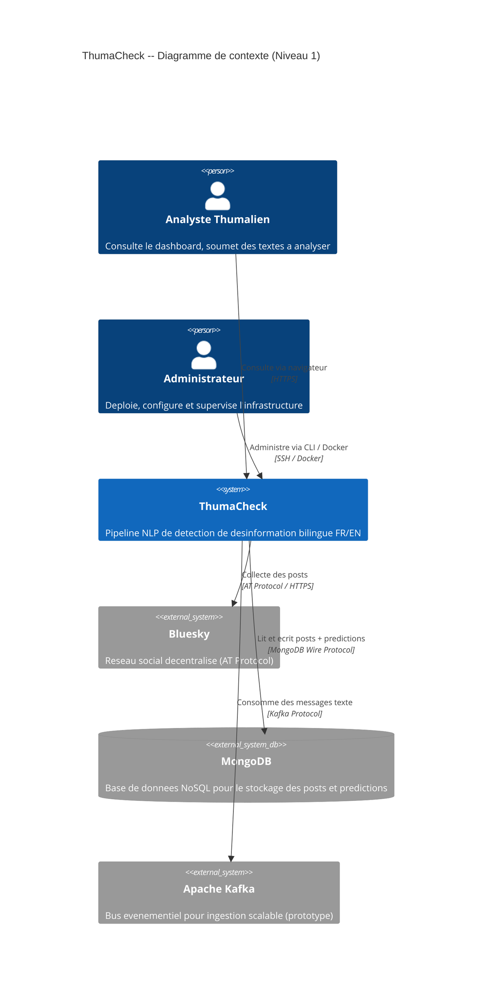
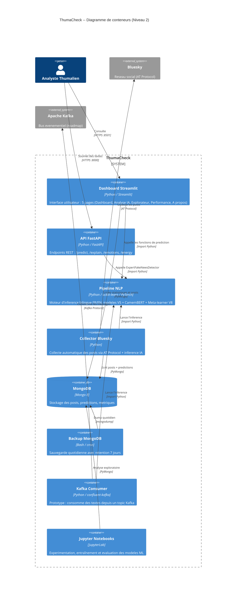
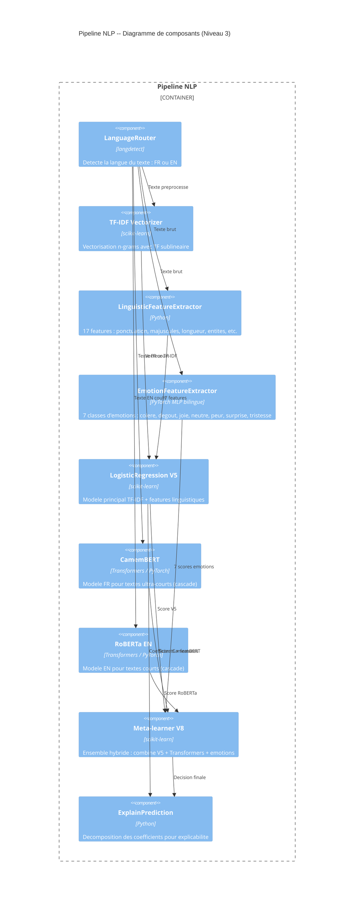
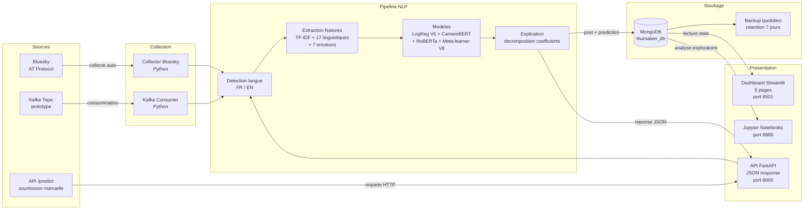

# Architecture C4 -- ThumaCheck

Ce document presente l'architecture de ThumaCheck selon le modele C4 (Context, Containers, Components) de Simon Brown, illustree par des diagrammes Mermaid.

---

## Niveau 1 -- Contexte systeme

Le diagramme de contexte montre ThumaCheck dans son environnement : les utilisateurs humains et les systemes externes avec lesquels il interagit.

- **Analyste Thumalien** : utilisateur principal, consulte le dashboard et lance des analyses.
- **Administrateur** : gere l'infrastructure (Docker, MongoDB, backups).
- **Bluesky (AT Protocol)** : reseau social source des posts collectes.
- **MongoDB** : base de donnees persistante.
- **Kafka** : bus evenementiel (prototype, roadmap scalabilite).

---

## Niveau 2 -- Conteneurs

Le diagramme de conteneurs detaille les briques techniques deployables de ThumaCheck, telles que definies dans le `docker-compose.yml`.

| Conteneur | Technologie | Port | Role |
|---|---|---|---|
| Dashboard | Streamlit (Python) | 8501 | Interface utilisateur, 5 pages |
| API | FastAPI (Python) | 8000 | Endpoint REST `/predict`, `/explain`, `/energy` |
| Pipeline NLP | Python (scikit-learn, PyTorch) | -- | Moteur d'inference, modeles V5/V8 |
| Collector Bluesky | Python | -- | Collecte automatique des posts via AT Protocol |
| MongoDB | Mongo 8 | 27017 | Stockage posts, predictions, metriques |
| Backup | Mongo 8 (cron script) | -- | Sauvegarde quotidienne automatisee |
| Kafka Consumer | Python (confluent-kafka) | -- | Prototype d'ingestion evenementielle |
| Jupyter Notebooks | JupyterLab | 8888 | Experimentation ML, entraînement des modeles |

---

## Niveau 3 -- Composants du Pipeline NLP

Le pipeline NLP est le coeur de ThumaCheck. Il orchestre la detection de langue, l'extraction de features, l'inference par plusieurs modeles, et la production d'explications.

### Architecture du routage

1. Le texte entre dans le `LanguageRouter` qui detecte la langue (FR ou EN).
2. Les features sont extraites en parallele : TF-IDF, linguistiques (17 features), emotions (7 classes).
3. Le modele principal `LogisticRegression V5` produit une prediction de base.
4. Pour les textes courts, un modele Transformer prend le relais en cascade :
   - **CamemBERT** pour les textes FR ultra-courts
   - **RoBERTa EN** pour les textes EN courts
5. Le **Meta-learner V8** combine les signaux (ensemble hybride).
6. Le module **ExplainPrediction** decompose les coefficients pour fournir une explication humaine.

---

## Diagramme de flux -- Donnees de bout en bout

Ce diagramme illustre le chemin complet d'un post Bluesky, de sa collecte jusqu'a son affichage dans le dashboard.

---

## Resume des correspondances code source

| Composant | Chemin source |
|---|---|
| Pipeline NLP | `src/pipeline/expert_detector.py` |
| API FastAPI | `src/api/main.py` |
| Dashboard Streamlit | `dashboard/app.py` |
| Collector Bluesky | `src/collection/` |
| Kafka Consumer | `src/scalability/kafka_consumer.py` |
| Explicabilite | `src/explainability/` |
| Monitoring | `src/monitoring/` |
| Notebooks ML | `notebooks/` |
| Docker Compose | `docker-compose.yml` |
