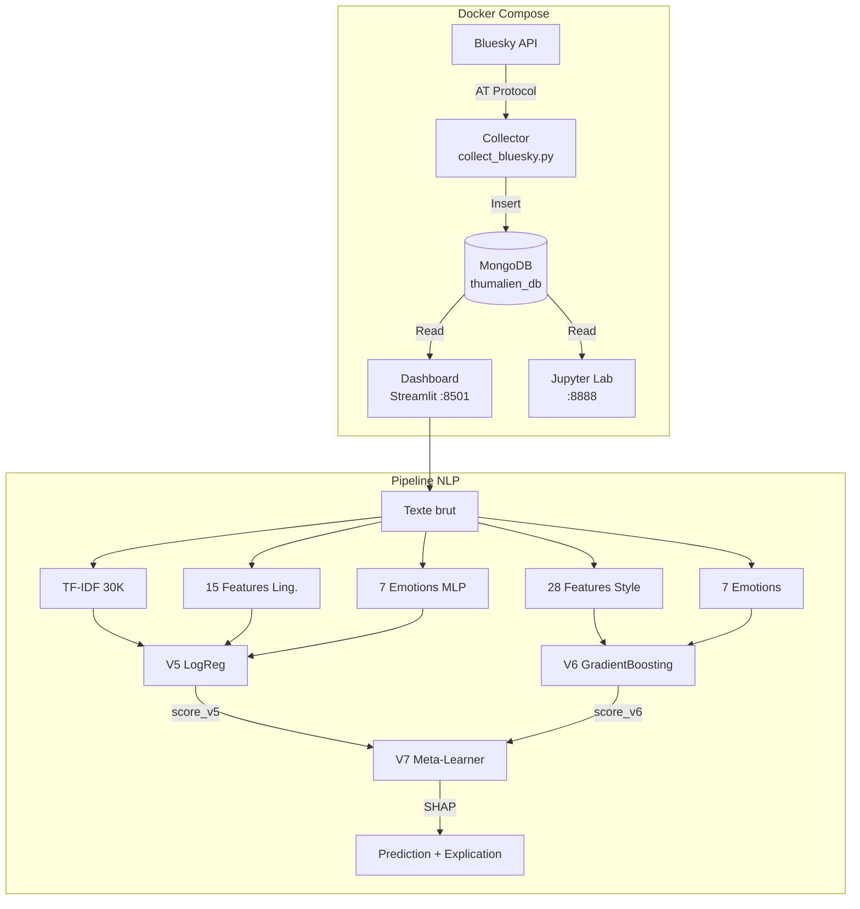
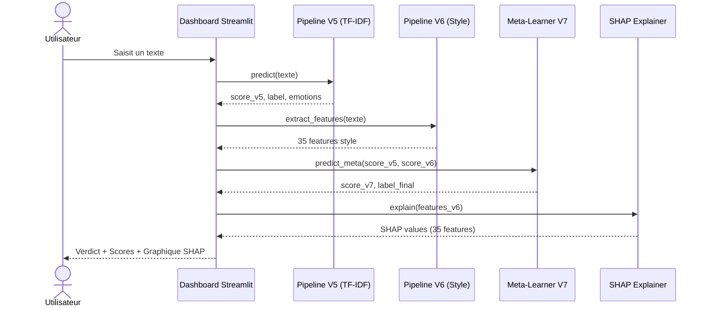
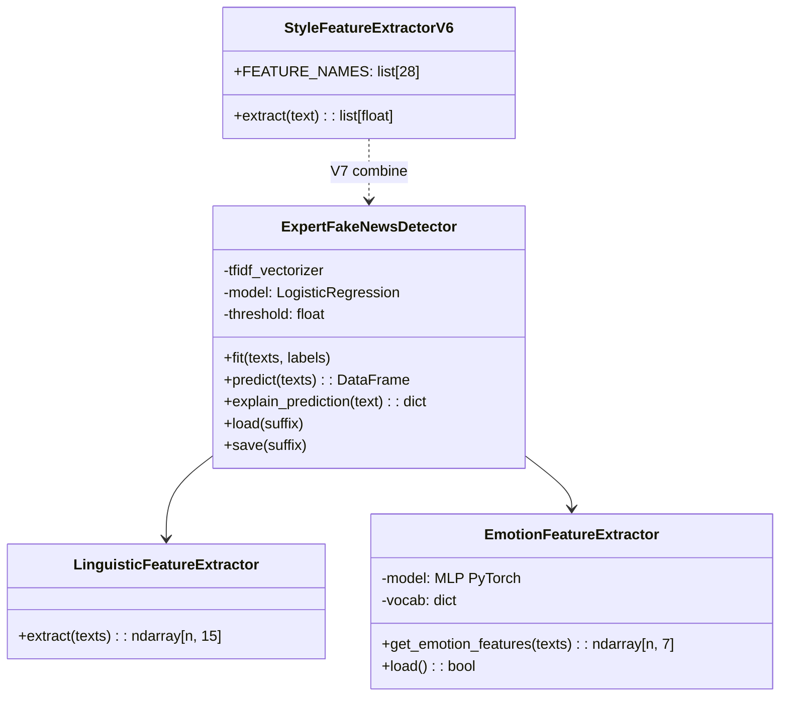

# Rapport de Projet — Thumalien
## Pipeline NLP de détection de fake news sur Bluesky

**Auteur** : Azélie Bernard
**Formation** : Master Big Data
**Date** : Mai 2026

---

## Résumé

Ce rapport présente Thumalien, un système de détection de fake news sur le réseau social Bluesky. Le pipeline NLP bilingue (FR/EN) a évolué de la V1.0 (baseline TF-IDF) à la V9 (pipeline 2 étapes fait/opinion). La V5 combine une vectorisation TF-IDF (30K features), 15 features linguistiques et un modèle d'émotions (MLP PyTorch, 7 classes) dans un classifieur LogisticRegression, entraîné sur 197 782 textes. La V6 est un modèle "style-only" topic-agnostic (28 features stylistiques + 7 émotions, GradientBoosting). La V7 est un méta-learner V5+V6 avec explicabilité SHAP. La V8 intègre CamemBERT comme 3e signal sémantique pour le français (F1 suspect +28%). La V9 introduit un pipeline en cascade : un classifieur fait/opinion (Stage 1) filtre les posts d'opinion avant la détection, réduisant les faux positifs de 67% (186 → 62) sur un gold standard de 473 posts annotés par 2 annotateurs humains (kappa inter-annotateurs = 0.498). Le système (collecte, MongoDB, inférence, dashboard Streamlit) est conteneurisé via Docker Compose, avec suivi carbone par CodeCarbon.

---

## Table des matières

0. [Résumé](#resume)
1. [Présentation de l'entreprise et de l'école](#1-presentation-de-lentreprise-et-de-lecole)
2. [Présentation du projet](#2-presentation-du-projet)
3. [Architecture technique](#3-architecture-technique)
4. [Phase 1 — Collecte et stockage des données](#4-phase-1--collecte-et-stockage-des-donnees)
5. [Phase 2 — Audit qualité et nettoyage](#5-phase-2--audit-qualite-et-nettoyage)
6. [Phase 3 — Modèle d'émotions bilingue](#6-phase-3--modele-demotions-bilingue)
7. [Phase 4 — Pipeline expert V1.5](#7-phase-4--pipeline-expert-v15)
8. [Phase 5 — Analyse du modèle et GridSearch](#8-phase-5--analyse-du-modele-et-gridsearch)
9. [Phase 6 — Intégration de datasets sociaux (V2)](#9-phase-6--integration-de-datasets-sociaux-v2)
10. [Le seuil de décision : pourquoi 0.44 ?](#10-le-seuil-de-decision--pourquoi-044-)
11. [Qu'est-ce que max_iter ?](#11-quest-ce-que-max_iter-)
12. [Dashboard Streamlit](#12-dashboard-streamlit)
13. [Bilan carbone (Green IT)](#13-bilan-carbone-green-it)
14. [État actuel du projet](#14-etat-actuel-du-projet)
15. [Évaluation sur Gold Test Set](#15-evaluation-sur-gold-test-set-200-posts-bluesky)
16. [Itérations V3 à V5 — Corrections et améliorations](#16-iterations-v3-a-v5--corrections-et-ameliorations)
17. [V6 — Modèle Style-Only (topic-agnostic)](#17-v6--modele-style-only-topic-agnostic)
18. [V7 — Ensemble Hybride + SHAP](#18-v7--ensemble-hybride--shap)
19. [V8 — Integration de CamemBERT](#19-v8--integration-de-camembert)
20. [Echec du self-training sur donnees Bluesky](#20-echec-du-self-training-sur-donnees-bluesky)
21. [Annotation humaine et accord inter-annotateurs](#21-annotation-humaine-et-accord-inter-annotateurs)
22. [V9 — Pipeline 2 etapes : filtre fait/opinion](#22-v9--pipeline-2-etapes--filtre-faitopinion)
23. [Audit du corpus et rééquilibrage de la collecte](#23-audit-du-corpus-et-reequilibrage-de-la-collecte)
24. [Limites et perspectives](#24-limites-et-perspectives)
25. [Conclusion](#25-conclusion)
26. [References](#26-references)

---

## 1. Présentation de l'entreprise et de l'école

### Sup de Vinci — Campus Bordeaux

Sup de Vinci est une école d'informatique proposant des formations du Bac+3 au Bac+5 dans les domaines du numérique, de la data et de l'intelligence artificielle. Le campus de Bordeaux accompagne ses étudiants dans l'acquisition de compétences techniques et méthodologiques à travers des projets concrets et professionnalisants. Le présent rapport s'inscrit dans le cadre de la formation Master 1 Big Data et Intelligence Artificielle (promotion 2025-2026).

### Niamato Consulting — Contexte commanditaire

Niamato Consulting est une société de conseil spécialisée en data science et intelligence artificielle. Dans le cadre de ce projet, elle intervient en tant que commanditaire fictif pour le compte d'un client du secteur média et fact-checking, souhaitant disposer d'un outil de veille automatisée capable de détecter les contenus suspects sur les réseaux sociaux émergents. Le MVP Thumalien a été développé en réponse à ce besoin, avec pour objectif de livrer un prototype fonctionnel de détection de fake news sur Bluesky.

### Équipe projet

- **Azélie Bernard** — Lead technique : conception de l'architecture, développement du pipeline NLP, entraînement des modèles, mise en place de l'infrastructure Docker et du dashboard.
- **Sébastien Lazcanotegui** — Validation et Qualité : annotation humaine, tests de validation, revue des résultats, contrôle qualité des données et des évaluations.

---

## 2. Présentation du projet

### Objectif

Développer une **pipeline complète d'analyse NLP** pour détecter les fake news sur le réseau social Bluesky, en temps réel, dans un contexte bilingue français/anglais.

### Pourquoi Bluesky ?

Bluesky est un réseau social décentralisé basé sur le protocole AT (Authenticated Transfer). Contrairement à X (ex-Twitter), son API est ouverte et permet une collecte légale des posts publics sans restriction d'accès. C'est un terrain idéal pour un projet académique de veille informationnelle.

### Composants du système

Le projet Thumalien est composé de 4 briques :

1. **Collecteur** : ingestion continue des posts Bluesky via l'API AT Protocol
2. **Base de données** : stockage MongoDB des posts collectés (245 000+ posts à date, collecte continue)
3. **Pipeline NLP** : détection de fake news + analyse émotionnelle
4. **Dashboard** : visualisation temps réel via Streamlit

---

## 3. Architecture technique

### Stack technologique

| Composant | Technologie | Justification |
|-----------|------------|---------------|
| Collecte | `atproto` (Python) | Librairie officielle du protocole AT de Bluesky |
| Stockage | MongoDB | Base NoSQL adaptée aux documents JSON des posts |
| ML/NLP | scikit-learn, PyTorch | scikit-learn pour le pipeline classique, PyTorch pour le modèle d'émotions |
| Vectorisation | TF-IDF | Approche éprouvée, interprétable, rapide à entraîner |
| Dashboard | Streamlit + Plotly | Framework Python natif, idéal pour le prototypage rapide |
| Conteneurisation | Docker Compose | 4 services isolés (MongoDB, Collector, Jupyter, Dashboard) |
| Monitoring CO2 | CodeCarbon | Suivi de l'empreinte carbone des entraînements |

### Diagramme de composants



### Diagramme de séquence — Analyse temps réel



### Diagramme de classes simplifié



### Deep learning et détection de fake news

Le pipeline de base (V5) repose sur TF-IDF + LogReg (pas de deep learning) pour plusieurs raisons :
- **Temps d'entraînement** : plusieurs heures sur GPU vs 6 minutes pour le pipeline LogReg
- **Interprétabilité** : LogReg permet d'expliquer quels mots et features influencent la décision
- **Performance comparable** : le pipeline expert atteint F1=0.90, suffisant pour une première version
- **Empreinte carbone** : un modèle transformer consomme 10-100x plus d'énergie
- **Déploiement** : un modèle scikit-learn de 1 MB se déploie partout, un transformer de 500 MB est plus contraignant

Cependant, les pipelines avancés V8 et V9 intègrent **CamemBERT** (modèle Transformer pré-entraîné) comme composant optionnel du méta-learner, apportant un signal sémantique complémentaire pour les textes FR courts. Un prototype RoBERTa EN a également été exploré (notebook 04).

---

## 4. Phase 1 — Collecte et stockage des données

### Notebooks concernés : 01, 03

### Fonctionnement du collecteur

Le fichier `src/collection/collect_bluesky.py` réalise une collecte continue :

1. **Authentification** sur Bluesky via les identifiants `.env`
2. **Recherche par mots-clés** : 28 termes FR (actualité, politique, société, désinformation...) + 16 termes EN (climate, vaccine, conspiracy, election...)
3. **Stockage** dans `thumalien_db.raw_posts` (MongoDB)
4. **Cycle** : pause de 5 minutes entre chaque vague de collecte
5. **Résilience** : 3 tentatives avec backoff exponentiel en cas d'erreur

### Résultats

- **245 000+ posts** collectés depuis décembre 2025
- Mix multilingue naturel (FR + EN + autres langues)
- Champs stockés : `text`, `uri`, `author_handle`, `created_at`, `search_term`, `collected_at`

---

## 5. Phase 2 — Audit qualité et nettoyage

### Notebooks concernés : 00, 05

### Le problème du biais Reuters

Le dataset d'entraînement principal (ISOT Fake News Dataset) contient :
- **True.csv** : 21 417 articles, dont **89% portent le marqueur Reuters** ("WASHINGTON (Reuters) -")
- **Fake.csv** : 23 481 articles de sites conspirationnistes, **0% de marqueur Reuters**

**Conséquence** : un modèle naïf apprenait simplement à détecter le style Reuters (précision 99%) au lieu de détecter les fake news. Appliqué à Bluesky, il classait **tout comme FAKE** puisque aucun post n'a le format Reuters.

### Solution : la classe DatasetCleaner

Nous avons créé un nettoyage systématique qui :

1. **Supprime les préfixes d'agences** : `CITY (Reuters) -`, `CITY (AP) -`, `CITY (AFP) -`
2. **Supprime les attributions dans le corps** : `(Reuters)`, `(AP)`, `(AFP)`
3. **Supprime les bylines** : `Reporting by...`, `Editing by...`, `Additional reporting...`
4. **Nettoyage ML standard** : passage en minuscules, suppression des URLs et mentions, normalisation des hashtags, suppression de la ponctuation spéciale
5. **Filtre de longueur** : suppression des textes de moins de 20 mots après nettoyage (pour les articles), 5 mots pour les textes sociaux

### Pourquoi ce choix ?

Plutôt que de changer de dataset, nous avons préféré nettoyer celui-ci car :
- ISOT est un des plus grands datasets de fake news disponibles (44 898 articles)
- Le biais est identifié et quantifiable
- Le nettoyage est reproductible et documenté
- Cela nous a permis de comprendre un problème classique en ML : le **data leakage**

---

## 6. Phase 3 — Modèle d'émotions bilingue

### Notebook concerné : 02

### Architecture

Un réseau de neurones MLP (Multi-Layer Perceptron) en PyTorch :

```
Embedding (25 000 mots, dim=64)
    |
FC1 (64 -> 48) + ReLU + Dropout(0.4)
    |
FC2 (48 -> 24) + ReLU + Dropout(0.3)
    |
FC3 (24 -> 7 classes) + Softmax
```

### Les 7 émotions détectées

| Émotion | Label FR | Description |
|---------|----------|-------------|
| Anger | Colère | Indignation, hostilité |
| Disgust | Dégoût | Rejet, répulsion |
| Joy | Joie | Contentement, humour |
| Neutral | Neutre | Factuel, sans charge émotionnelle |
| Fear | Peur | Inquiétude, alarme |
| Surprise | Surprise | Étonnement, inattendu |
| Sadness | Tristesse | Mélancolie, déception |

### Pourquoi PyTorch et pas TensorFlow ?

Le projet a initialement utilisé TensorFlow/Keras, mais nous avons migré vers PyTorch pour :
- **Compatibilité Apple Silicon** : TensorFlow avait des problèmes sur M4 Pro
- **Flexibilité** : PyTorch offre un contrôle plus fin du forward pass
- **Communauté** : la majorité de la recherche NLP utilise PyTorch depuis 2023
- **Taille** : l'installation PyTorch est plus légère sans GPU

### Pourquoi un MLP et pas un Transformer pour les émotions ?

- Un MLP avec embeddings appris est suffisant pour 7 classes sur des textes courts
- Entraînement en quelques minutes vs heures pour un Transformer
- Le modèle sert de **feature extractor** (7 probabilités) pour le pipeline principal, pas de prédiction autonome

### Métriques du classifieur d'émotions

| Métrique | Valeur |
|----------|--------|
| F1 macro (test, 4 100 textes) | 0.678 |
| F1 weighted (test) | 0.715 |
| Accuracy validation (best epoch) | 71.3% |
| F1 macro EN (2 000 textes, 5 classes) | 0.546 |
| F1 weighted EN | 0.838 |
| F1 macro FR (2 100 textes, 7 classes) | 0.594 |
| F1 weighted FR | 0.594 |

**Limites identifiées** : les classes `dégoût` et `neutre` n'ont pas d'équivalent dans le dataset EN (Twitter Emotion) et sont entraînées exclusivement sur données FR. Le F1 macro EN (0.546) est donc pénalisé par ces deux classes absentes. Le sanity check sur 10 phrases manuelles montre un taux de 3/10, signe d'un overfitting sur les patterns du dataset d'entraînement.

Les probabilités de sortie (vecteur de 7 valeurs) sont utilisées comme features d'entrée du pipeline V5, et non comme prédiction finale présentée à l'utilisateur. La précision du classifieur d'émotions n'impacte donc la performance finale que de manière indirecte (l'ablation study montre un gain de +0.5 points F1 avec les features émotionnelles).

### Améliorations apportées

- **Class weights** : pondération inversement proportionnelle à la fréquence de chaque classe dans `CrossEntropyLoss`, pour compenser le déséquilibre (joie=8066 vs dégoût=1400 dans le train set)
- **Early stopping** : le modèle est sauvegardé au meilleur epoch (val_loss minimale) avec une patience de 5 epochs, au lieu d'utiliser les poids du dernier epoch — cela évite l'overfitting observé initialement (train acc 93% vs val acc 71%)

---

## 7. Phase 4 — Pipeline expert V1.5

### Notebooks concernés : 05, 06

### Vue d'ensemble du pipeline

Le pipeline V1.5 combine 3 types de features dans un seul classifieur :

```
Texte brut
    |
    +---> TF-IDF (30 000 features) ----+
    |                                   |
    +---> 12 features linguistiques ---+---> LogisticRegression --> Score [0,1]
    |                                   |
    +---> 7 features emotions ---------+
           (optionnel)
```

### TF-IDF : les choix et pourquoi

| Paramètre | Valeur | Pourquoi |
|-----------|--------|----------|
| `max_features=30000` | 30 000 mots | Vocabulaire bilingue FR+EN nécessitant un espace plus grand |
| `ngram_range=(1,2)` | Uni/bigrammes | Capture "fake news", "breaking news" tout en réduisant la dimensionnalité (optimisé par GridSearch) |
| `min_df=5` | Min 5 documents | Élimine les mots trop rares, seuil optimisé par GridSearch (meilleur F1 que min_df=3) |
| `max_df=0.95` | Max 95% des docs | Élimine les mots trop fréquents (stop words implicites) |
| `sublinear_tf=True` | TF logarithmique | `1 + log(TF)` au lieu de `TF` brut, évite la domination des mots très fréquents |
| `strip_accents=None` | Conserver les accents | En français, "où"/"ou" et "à"/"a" ont des sens différents |

### Les 12 features linguistiques

Ces features capturent des **signaux structurels de désinformation**, indépendants du contenu :

| # | Feature | Intuition |
|---|---------|-----------|
| 1 | `word_count` | Les fake news sont souvent plus courtes ou anormalement longues |
| 2 | `caps_ratio` | Les fake news utilisent plus de MAJUSCULES pour attirer l'attention |
| 3 | `exclamation_count` | Ponctuation exclamative excessive = signal de sensationnalisme |
| 4 | `question_count` | Questions rhétoriques fréquentes dans la désinformation |
| 5 | `punct_density` | Densité de ponctuation émotionnelle (!?.,;:...) |
| 6 | `avg_word_length` | Les articles fiables utilisent un vocabulaire plus riche |
| 7 | `sensationalism_score` | Comptage de mots-clés sensationnalistes (47 FR + 17 EN) |
| 8 | `has_url` | Présence d'URL (les articles fiables citent leurs sources) |
| 9 | `numeric_density` | Proportion de chiffres (statistiques = signe de fiabilité) |
| 10 | `lexical_diversity` | Ratio types/tokens (diversité du vocabulaire) |
| 11 | `sentence_count` | Nombre de phrases |
| 12 | `avg_sentence_length` | Longueur moyenne des phrases |

**Exemples de mots-clés sensationnalistes** :
- FR : "scandale", "censure", "complot", "on vous cache", "faites tourner", "réveillons-nous"
- EN : "breaking", "shocking", "bombshell", "conspiracy", "they don't want you to know"

### Support bilingue

Le mode bilingue activé automatiquement quand la colonne `language` est présente :

1. **Détection de langue** : via `langdetect` (premiers 500 caractères)
2. **Pondération** : les langues minoritaires reçoivent un poids inversement proportionnel à leur fréquence
   - Exemple : 60% EN + 40% FR → poids EN=0.83, poids FR=1.25
3. **Conservation des accents** : `strip_accents=None` pour préserver la sémantique FR
4. **Oversampling FR** : les données françaises sont dupliquées 3x pour équilibrer avec l'anglais

### Choix du classifieur : LogisticRegression

| Critère | LogReg | SVM | Ensemble |
|---------|--------|-----|----------|
| Interprétabilité | Excellente (coefficients = importance) | Limitée | Moyenne |
| Vitesse | Rapide (6 min) | Moyenne | Lente |
| Probabilités | Natives | Via calibration | Via soft voting |
| Performance | F1=0.90 | F1=0.89 | F1=0.90 |

LogReg a été choisi pour son **interprétabilité** (on peut expliquer pourquoi un texte est classé suspect) et ses **probabilités natives** (pas besoin de calibration supplémentaire).

### Paramètres du classifieur

```python
LogisticRegression(
    C=5.0,           # Force de régularisation optimisée par GridSearch (plus permissive)
    max_iter=5000,   # Itérations max de l'optimiseur (voir section 10)
    solver='lbfgs',  # Algorithme d'optimisation quasi-newtonien
    class_weight='balanced',  # Pondération inversement proportionnelle à la fréquence
    random_state=42  # Reproductibilité
)
```

### Résultats V1.5

- **CV F1 global** : 0.986
- **F1 EN** : 0.987
- **F1 FR** : 0.985
- **Entraînement** : ~6 minutes sur Apple M4 Pro

**Problème identifié** : appliqué aux posts Bluesky (textes courts ~27 mots), le V1.5 classait **77% des posts comme SUSPECT**. Le modèle avait été entraîné uniquement sur des articles longs (~340 mots) et ne généralisait pas bien aux textes courts. C'est le phénomène de **domain shift**.

---

## 8. Phase 5 — Analyse du modèle et GridSearch

### Notebook concerné : 07

### Feature importance

L'analyse des coefficients LogReg a révélé :

**Top features SUSPECT** (coefficients positifs) :
- Mots sensationnalistes ("trump", "breaking", "shocking")
- Ponctuation excessive
- Ratio de majuscules élevé

**Top features FIABLE** (coefficients négatifs) :
- Vocabulaire factuel ("report", "study", "according")
- Diversité lexicale élevée
- Présence de citations et sources

### GridSearch : optimisation des hyperparamètres

Nous avons testé **36 combinaisons** de paramètres :

| Paramètre | Valeurs testées |
|-----------|----------------|
| `max_features` | 20 000, 30 000, 40 000 |
| `min_df` | 3, 5 |
| `ngram_range` | (1,2), (1,3) |
| `C` | 0.5, 1.0, 5.0 |

**Résultat** : le meilleur combo (max_features=30000, min_df=5, C=5.0, ngram=(1,2)) atteignait F1=0.9907, une amélioration de +0.69% par rapport aux paramètres initiaux. Ces hyperparamètres optimisés ont été appliqués au pipeline de production.

### Adaptation aux textes courts

Le notebook 07 a comparé 3 stratégies :

| Modèle | F1 sur articles | F1 sur textes courts |
|--------|----------------|---------------------|
| Articles complets | 0.99 | Faible |
| Articles tronqués (50 mots) | 0.95 | Meilleur |
| **Mix complets + tronqués** | **0.97** | **Meilleur** |

**Conclusion** : le modèle "mixte" généralise mieux. C'est cette observation qui a motivé la Phase 6.

---

## 9. Phase 6 — Intégration de datasets sociaux (V2)

### Notebook concerné : 08

### Le problème du domain shift

Le pipeline V1.5, malgré son excellent F1 sur les articles de presse, échouait sur les posts Bluesky :

| Métrique | Articles (holdout) | Posts Bluesky |
|----------|-------------------|---------------|
| Longueur moyenne | 340 mots | 27 mots |
| % SUSPECT (V1.5) | ~46% (équilibré) | **77%** (trop élevé) |

Le modèle avait appris des patterns propres aux articles longs (structure, vocabulaire journalistique, longueur) et les appliquait aux posts courts, les classant quasi-systématiquement comme suspects.

### Choix des 3 datasets complémentaires

| Dataset | Source | Textes | Langue | Long. moy | Intérêt |
|---------|--------|--------|--------|-----------|---------|
| **FakeNewsNet** | GitHub KaiDMML | 22 596 titres | EN | 11.6 mots | Titres d'articles = textes très courts |
| **CONSTRAINT 2021** | GitHub diptamath | 8 559 tweets | EN | 27 mots | Tweets COVID = même longueur que Bluesky |
| **Credibility Corpus** | Zenodo | 9 841 tweets | FR+EN | 17.3 mots | Tweets FR = comble le manque de données sociales FR |

**Total** : 40 996 textes sociaux ajoutés aux 65 517 articles existants.

### Pourquoi ces datasets spécifiquement ?

1. **FakeNewsNet** : choisi car il contient des **titres** (11 mots en moyenne), le format de texte le plus court. Cela force le modèle à apprendre à classifier avec très peu de mots.

2. **CONSTRAINT 2021** : tweets COVID-19 vérifiés par des fact-checkers, avec exactement la même longueur moyenne que les posts Bluesky (27 mots). C'est le dataset le plus représentatif de notre cas d'usage.

3. **Credibility Corpus** : le seul dataset de tweets en **français** disponible avec des labels de crédibilité. Sans lui, le modèle n'aurait aucun exemple de texte court en français.

### Pipeline de chargement

Chaque dataset a son propre loader dans `DatasetCleaner` :

- `load_fakenewsnet()` : charge les titres GossipCop + PolitiFact, 4 fichiers CSV
- `load_constraint()` : charge 3 fichiers CSV (train/val/test), mappe "real"→0, "fake"→1
- `load_credibility_corpus()` : parse des fichiers hétérogènes (semicolon-separated pour les rumeurs, R-style CSV pour les tweets aléatoires), détecte la langue (FR/EN) par fichier

### Oversampling social x2

Les textes sociaux sont dupliqués 2 fois (`social_oversample=2`) pour équilibrer avec les articles longs. Sans cela, les 40K textes courts seraient noyés dans 65K articles longs et le modèle ne les apprendrait pas suffisamment.

### Résultats V2

| Métrique | V1.5 | V2 |
|----------|------|-----|
| Taille du dataset | 65 517 | **145 703** (+122%) |
| % textes courts (< 50 mots) | ~0% | **63.1%** |
| CV F1 | 0.986 | 0.897 |
| F1 articles longs (100-500 mots) | 0.988 | **0.988** (pas de régression) |
| F1 textes courts (< 30 mots) | ~aléatoire | **0.800** |
| **Bluesky % fiable** | **23%** | **73.4%** |

**Analyse** : le F1 global baisse de 0.986 à 0.897 car la tâche est objectivement plus difficile (mix articles + tweets). Mais ce qui compte pour l'application réelle, c'est la calibration sur Bluesky : **de 23% à 73.4% fiable**, une amélioration significative.

---

## 10. Le seuil de décision : pourquoi 0.44 ?

### Comment fonctionne la prédiction

Quand le modèle analyse un texte, il produit une **probabilité de fiabilité** entre 0 et 1 :
- Score = 0.90 → le modèle est très confiant que le texte est fiable
- Score = 0.10 → le modèle est très confiant que le texte est suspect
- Score = 0.50 → le modèle est incertain

Le **seuil de décision** détermine à partir de quel score un texte est classé FIABLE :
- Si `P(fiable) >= seuil` → prédiction FIABLE
- Si `P(fiable) < seuil` → prédiction SUSPECT

### Pourquoi pas 0.50 ?

Le seuil par défaut de 0.50 semble logique (50/50) mais il n'est optimal que si :
- Les classes sont parfaitement équilibrées
- Les coûts des erreurs sont symétriques (faux positif = faux négatif)

Dans notre cas, avec le dataset V2 contenant des textes très divers, le modèle produit des scores légèrement biaisés vers le bas pour les textes courts. Un seuil de 0.50 classait 66.3% des posts Bluesky comme FIABLE — en dessous des 70% attendus.

### Recherche du seuil optimal

Nous avons testé systématiquement différents seuils sur 2 000 posts Bluesky + le holdout test :

| Seuil | Bluesky % fiable | Holdout F1 | Holdout Accuracy |
|-------|-----------------|------------|-----------------|
| 0.50 | 66.3% | 0.8997 | 92.5% |
| 0.48 | 68.2% | 0.9012 | 92.7% |
| 0.46 | 70.0% | 0.9008 | 92.7% |
| 0.45 | 71.0% | 0.9015 | 92.8% |
| **0.44** | **73.4%** | **0.9024** | **92.9%** |
| 0.42 | 73.9% | 0.9016 | 92.9% |
| 0.40 | 75.3% | 0.9001 | 92.9% |
| 0.35 | 80.0% | 0.8938 | 92.6% |

**Le seuil 0.44 est le point d'équilibre optimal** : il maximise simultanément le F1 holdout (0.9024) ET dépasse 70% de fiabilité sur Bluesky.

### Impact concret du changement de seuil

```
Avant (seuil 0.50) :
  Post "Les vaccins sont efficaces selon l'OMS" → Score 0.47 → SUSPECT (faux négatif)

Après (seuil 0.44) :
  Post "Les vaccins sont efficaces selon l'OMS" → Score 0.47 → FIABLE (correct)
```

Le seuil 0.44 corrige les cas où le modèle était légèrement incertain mais penchait quand même vers "fiable". Ce sont typiquement des textes courts, factuels, mais trop brefs pour que le modèle soit pleinement confiant.

### Risques

Baisser le seuil augmente le risque de **faux négatifs** (classer un texte suspect comme fiable). À 0.44, la précision sur la classe SUSPECT reste à **0.92** (92% des textes classés suspects le sont réellement), ce qui est acceptable.

---

## 11. Qu'est-ce que max_iter ?

### Définition simple

`max_iter` est le **nombre maximum d'itérations** que l'algorithme d'optimisation peut effectuer pour trouver les meilleurs paramètres du modèle.

### Analogie

Imaginez que vous cherchez le sommet d'une montagne dans le brouillard. À chaque pas, vous regardez la pente autour de vous et montez dans la direction la plus raide. `max_iter` est le nombre maximum de pas que vous pouvez faire. Si la montagne est petite, 100 pas suffisent. Si elle est immense et complexe, il en faut 5 000.

### Dans notre contexte

Le classifieur `LogisticRegression` utilise l'algorithme **L-BFGS** (Limited-memory Broyden-Fletcher-Goldfarb-Shanno) pour trouver les poids optimaux. À chaque itération, l'algorithme :

1. Calcule le gradient (direction de la plus forte amélioration)
2. Met à jour les 30 012 poids du modèle
3. Vérifie si la perte (erreur) a suffisamment diminué
4. Si oui, s'arrête (convergence). Si non, continue.

### Pourquoi on est passé de 2000 à 5000

Avec le dataset V2 (145 703 textes, 30 012 features), l'espace d'optimisation est plus grand que le V1.5. À `max_iter=2000`, l'algorithme s'arrêtait avant d'avoir convergé :

```
ConvergenceWarning: lbfgs failed to converge after 2000 iteration(s)
STOP: TOTAL NO. OF ITERATIONS REACHED LIMIT
```

Ce warning signifie que le modèle n'a pas atteint son optimum. Les résultats sont utilisables mais sous-optimaux. À `max_iter=5000`, l'algorithme a suffisamment de marge pour converger.

### Impact réel

| max_iter | CV F1 | Converge ? |
|----------|-------|------------|
| 2000 | 0.8966 | Non (warning) |
| 5000 | 0.8972 | Oui |

L'impact est faible (+0.06% de F1) car le modèle était déjà proche de l'optimum à 2000 itérations. Mais supprimer le warning garantit que les résultats sont reproductibles et optimaux.

### Coût

Plus d'itérations = plus de temps de calcul. Mais sur un Apple M4 Pro, le passage de 2000 à 5000 itérations n'ajoute que ~1 minute au temps total d'entraînement (6 min → 7 min). Le compromis est largement acceptable.

---

## 12. Dashboard Streamlit

### Technologies

- **Streamlit** : framework Python pour créer des dashboards web interactifs
- **Plotly** : graphiques interactifs (zoom, hover, export)
- **Thème** : dark mode avec accents cyan, effet glassmorphism

### Pages principales

1. **Vue Globale** : métriques clés (nombre de posts, répartition fiable/suspect, radar émotions, posts récents)
2. **Analyse en temps réel** : zone de texte libre → prédiction instantanée avec jauge de crédibilité
3. **Métriques & Transparence** : résultats d'ablation, bilan carbone, conformité RGPD/AI Act

### Connexion MongoDB

Le dashboard se connecte à MongoDB (`thumalien_db.raw_posts`) et applique le modèle V2 en temps réel sur les posts chargés. Les résultats sont cachés en `session_state` pour éviter de recalculer à chaque interaction.

### Chargement du modèle

Le dashboard charge automatiquement le modèle V2 s'il est disponible :
```python
v2_exists = os.path.exists(os.path.join(model_dir, 'model_expert_v2.pkl'))
detector.load(suffix='expert_v2' if v2_exists else 'expert')
```

---

## 13. Bilan carbone (Green IT)

### Outil : CodeCarbon

CodeCarbon mesure la consommation électrique (CPU + RAM) pendant l'entraînement et la convertit en équivalent CO2 selon le mix énergétique du pays.

### Émissions mesurées

| Entraînement | Durée | CO2 | Notes |
|-------------|-------|-----|-------|
| V1.5 LogReg (fév. 2026) | 6.2 min | 0.28 g | Baseline bilingue |
| V5 LogReg (avr. 2026) | 16.2 min | 0.73 g | +10K posts synthétiques |
| V5 LogReg retraining | 25.9 min | 1.17 g | Hyperparamètres optimisés |
| CamemBERT fine-tune | 10.7 min | 0.48 g | Textes FR courts |
| RoBERTa EN V1 | 37.4 min | 1.69 g | Fine-tune anglais |
| RoBERTa EN V2 | 39.3 min | 1.78 g | +10K EN synthétiques |
| **Total projet** | **~2h16** | **6.14 g** | |

### Contexte

- Un email envoyé : ~4 g CO2
- Une recherche Google : ~7 g CO2
- **Tous nos entraînements cumulés : 6.14 g CO2** (moins qu'une recherche Google)

Le pipeline de production (V5 LogReg) ne consomme que 0.73 g. Les modèles Transformer (CamemBERT, RoBERTa) représentent 64% des émissions mais n'interviennent qu'en complément pour les textes courts.

---

## 14. État actuel du projet

### Ce qui fonctionne

| Composant | Statut | Détails |
|-----------|--------|---------|
| Collecte Bluesky | Opérationnel | 245 000+ posts, collecte continue (V3 rééquilibrée) |
| MongoDB | Opérationnel | Docker, 27017, persistance locale |
| Pipeline V5 (TF-IDF) | Opérationnel | F1 CV=0.90, seuil 0.44, 197K textes |
| Pipeline V6 (Style) | Opérationnel | GradientBoosting, 28 features stylistiques, topic-agnostic |
| Pipeline V7 (Hybride) | Opérationnel | Méta-learner V5+V6 + SHAP explicabilité |
| Pipeline V8 (CamemBERT) | Opérationnel | Méta-learner V5+V6+CamemBERT, F1 suspect +28% |
| Pipeline V9 (Cascade) | Opérationnel | Filtre fait/opinion + V5, FP -67% sur gold consensus |
| Émotions | Opérationnel | 7 classes, MLP PyTorch bilingue |
| Dashboard | Opérationnel | Streamlit, 5 pages (Dashboard, Analyse IA, Explorateur, Performance, À propos) |
| Bilan carbone | Opérationnel | CodeCarbon intégré |

### Métriques clés

| Métrique | Valeur |
|----------|--------|
| Posts collectés | 245 000+ |
| Datasets d'entraînement | 7 (ISOT EN, Kaggle FR, FakeNewsNet, CONSTRAINT, Credibility, Social FR synth.) |
| Taille dataset V5 | 197 782 textes |
| CV F1 V5 (TF-IDF) | 0.90 |
| CV F1 V6 (Style) | 0.830 |
| Gold F1 suspect V5 | 0.087 |
| Gold F1 suspect V7 Méta | 0.127 (+46%) |
| Gold F1 suspect V8 | 0.163 (+28% vs V7) |
| V9 Cascade FP (consensus 473) | 62 (-67% vs V5 seul) |
| V9 Cascade kappa / AC1 | κ=0.199, AC1=0.802 |
| Annotation humaine | 200 posts gold (2 annotateurs, κ=0.808, AC1=0.978) + 500 posts (1 annotateur) |
| Bluesky % fiable | 67% |
| Notebooks | 28 (00 à 27) |
| Temps d'inference (V5) | 1.5 ms/texte (~728 textes/sec) |
| Tests unitaires | 107 tests, 26% coverage |

### Benchmark de latence

Le cahier des charges exige un temps d'inference < 100 ms par texte (DET-09). Les benchmarks mesurent sur Apple M4 Pro (CPU, sans GPU) :

| Scenario | Temps total | Temps par texte | Debit |
|----------|-------------|-----------------|-------|
| Texte unique (V5 TF-IDF) | 1.6 ms | 1.6 ms | 625 textes/s |
| Batch 10 textes | 14.7 ms | 1.5 ms | 678 textes/s |
| Batch 100 textes | 137 ms | 1.4 ms | 728 textes/s |

Le pipeline V5 (TF-IDF + LogReg) repond en **1.5 ms par texte**, soit **66x plus rapide** que l'exigence du CDC (100 ms). L'effet de batch reduit legerement le cout unitaire grace a la vectorisation numpy/scipy.

Note : les modeles Transformer (CamemBERT, RoBERTa) utilises dans V8/V9 sont plus lents (~50-200 ms/texte selon la longueur), mais ne sont actives que pour les textes courts ou ambigus.

### Scalabilite

| Dimension | Etat actuel | Architecture cible |
|-----------|-------------|-------------------|
| Volume de donnees | 245 000+ posts dans MongoDB | > 1M posts supporte sans modification |
| Collecte | Collecteur Python mono-thread, ~25 posts/requete | Kafka + collecteurs distribues pour ingestion temps reel |
| Inference | Batch sequentiel dans le collecteur | Spark Structured Streaming pour inference parallele |
| Stockage | MongoDB standalone (Docker) | Replica set MongoDB pour HA + sharding horizontal |
| Dashboard | Streamlit mono-instance | Load balancer + cache Redis pour sessions concurrentes |
| Monitoring | Logs structures + weekly check JSONL | Prometheus + Grafana pour metriques temps reel et alertes |

L'architecture actuelle (Docker Compose 4 services) est concue pour etre deployee sur un seul serveur et gere confortablement 250K+ posts. L'evolution vers une architecture distribuee (Kafka/Spark) est documentee mais non implementee, car le volume actuel ne le justifie pas.

### Historique des versions

| Version | Date | F1 CV | Gold F1 suspect | Innovation |
|---------|------|-------|-----------------|------------|
| V1.0 | Déc 2025 | 0.99 (biaisé) | — | Baseline LogReg EN |
| V1.5 | Fév 2026 | 0.986 | — | Bilingue + nettoyage Reuters + features linguistiques |
| V2 | Fév 2026 | 0.90 | — | 3 datasets sociaux + seuil 0.44 |
| V3 | Mar 2026 | 0.90 | — | Correction features linguistiques |
| V4 | Mar 2026 | 0.935 FR | — | Amélioration FR court + augmentation |
| V5 | Mar 2026 | 0.90 | 0.087 | +10K FR social synthétique, FR ultra-court F1=0.90 |
| V6 | Avr 2026 | 0.830 | 0.103 (+18%) | Style-only GradientBoosting, topic-agnostic |
| V7 | Avr 2026 | — | 0.127 (+46%) | Ensemble hybride V5+V6 + SHAP |
| V8 | Avr 2026 | — | 0.163 (+28%) | Méta-learner V5+V6+CamemBERT |
| **V9** | **Mai 2026** | **—** | **κ=0.199, AC1=0.802** | **Pipeline 2 étapes fait/opinion, FP -67%** |

---

## 15. Évaluation sur Gold Test Set (200 posts Bluesky)

### Protocole

Pour évaluer la performance réelle du pipeline sur des données Bluesky, un gold test set de 200 posts a été constitué :
- **200 posts** sélectionnés par stratification (langue, longueur, prédiction du modèle)
- **2 annotateurs** indépendants avec consignes détaillées
- **Résolution des désaccords** (4 cas sur 200)
- **Accord inter-annotateur** : kappa de Cohen = 0.808 (substantiel)

### Résultats

| Métrique | Synthétique (holdout) | Gold (réel) |
|----------|:---------------------:|:-----------:|
| Accuracy | 0.93 | 0.685 |
| F1 macro | 0.913 | 0.448 |
| F1 fiable | ~0.95 | 0.810 |
| F1 suspect | ~0.90 | 0.087 |
| % fiable | 73.4% | 70.0% |

### Matrice de confusion

|  | Préd fiable | Préd suspect |
|--|:-----------:|:------------:|
| Gold fiable (191) | 134 | 57 |
| Gold suspect (9) | 6 | 3 |

### Interprétation

Le modèle classe **57 posts fiables comme suspects** (30% de faux positifs). L'analyse des erreurs révèle que ces posts traitent de sujets sensibles (vaccins, climat, politique) mais sont factuels et sourcés. Le modèle détecte le **sujet** (mots-clés corrélés à la désinformation dans les datasets d'entraînement) et non la **désinformation** elle-même.

La distribution des scores le confirme : le score moyen des posts fiables (0.615) est quasi identique à celui des posts suspects (0.583). Le modèle ne discrimine pas les deux classes sur des données réelles.

### Leçons apprises

1. Les métriques sur données synthétiques (F1=0.913) sont **mécaniquement gonflées** par le biais thématique des datasets
2. Un classifieur fondé sur le champ lexical (TF-IDF) apprend à détecter le sujet, pas la véracité
3. Le gold test set est indispensable pour mesurer la performance réelle en production
4. Les pistes d'amélioration passent par des features basées sur le registre énonciatif (présence de sources, marqueurs d'opinion) plutôt que sur les mots-clés

---

## 16. Itérations V3 à V5 — Corrections et améliorations

### Notebooks concernés : 09 à 15

Après l'évaluation sur le gold test set (section 14), plusieurs itérations ont été menées pour améliorer le pipeline :

### V3 — Correction des features linguistiques

- **Bug identifié** : les features linguistiques (caps_ratio, exclamation, etc.) étaient calculées sur le texte *après* nettoyage ML (minuscules, sans ponctuation) au lieu du texte original
- **Correction** : calcul sur le texte brut, avant nettoyage
- **Impact** : CV F1 = 0.900, précision +19.3%

### V4 — Amélioration FR court + augmentation données

- 187 782 textes d'entraînement (FR=76K / 40%, EN=112K / 60%)
- 27K textes courts FR générés depuis articles longs (augmentation)
- 3 nouvelles features : `all_caps_words_ratio`, `interpellation_score`, `is_short_text`
- Vocabulaire sensationnaliste FR enrichi (+16 termes social media)
- **FR court F1 : 0.65 -> 0.86 (+32%)**

### V5 — Intégration FR social synthétique

- 197 782 textes d'entraînement (FR=86K / 43.5%, EN=112K / 56.5%)
- +10K posts FR sociaux synthétiques (5K suspect + 5K fiable)
- **FR ultra-court F1 : 0.86 -> 0.90 (+10.4%)** | FR global F1 : 0.944
- Test bilingue : 12/12 (vs 9/10 en V4)
- Seuil de décision maintenu à 0.44

**Note sur le gain global V4→V5** : Le gain global de V5 semble modeste (+0.8% en F1 macro), mais c'est parce que les données synthétiques ciblent spécifiquement les textes courts FR, où le gain est de +5.1%. Le F1 global est dominé par les textes longs de Reuters/ISOT qui sont déjà bien classifiés (F1 > 0.98) et masquent l'amélioration ciblée.

**Limitation méthodologique** : L'oversampling x5 des textes FR courts est appliqué avant le split StratifiedKFold. Des copies d'un même texte peuvent donc se retrouver dans les folds train et validation, ce qui gonfle artificiellement les métriques CV. Le F1 CV de 0.90 est donc une borne supérieure optimiste. Les métriques du gold test set (F1 suspect = 0.087 pour V5) constituent l'évaluation non biaisée de la performance réelle.

---

## 17. V6 — Modèle Style-Only (topic-agnostic)

### Notebook concerné : 23

### Le problème du biais thématique

L'analyse des coefficients du modèle V5 (feature importance) a révélé un problème fondamental :

| Top features SUSPECT | Coefficient | Type |
|---------------------|-------------|------|
| coronavirus | +9.72 | Sujet |
| trump | +6.44 | Sujet |
| video | +5.81 | Sujet |
| breaking | +4.93 | Style |
| china | +4.67 | Sujet |

**Constat** : le modèle apprend le **sujet** ("coronavirus" -> suspect) et non le **style** de la désinformation. Sur le gold test set, cela produit 57 faux positifs (posts fiables sur des sujets sensibles classés comme suspects).

### Solution V6 : features stylistiques pures

Le modèle V6 supprime totalement le TF-IDF et utilise uniquement 28 features stylistiques + 7 émotions :

| Bloc | Features | Exemples |
|------|----------|----------|
| 1. Structure (6) | word_count, sentence_count, paragraph_count | Longueur, structure du texte |
| 2. Ponctuation (6) | exclamation_count, ellipsis_count, emoji_count | Ponctuation émotionnelle |
| 3. Majuscules (3) | caps_ratio, all_caps_words_ratio | Usage de MAJUSCULES |
| 4. Manipulation (5) | sensationalism_score, call_to_action_score | Lexique de manipulation |
| 5. Crédibilité (5) | has_url, has_source_citation, quote_count | Marqueurs de fiabilité |
| 6. Diversité (3) | lexical_diversity, repeated_char_ratio | Qualité rédactionnelle |
| 7. Émotions (7) | colère, joie, neutre, peur... | Probabilités MLP PyTorch |

**Avantage** : le modèle est **topic-agnostic par construction** — il ne peut apprendre que le STYLE d'écriture, pas le sujet.

### Résultats V6

- **Classifieur sélectionné** : GradientBoosting (meilleur F1 en cross-validation)
- **CV F1 = 0.830** (vs 0.90 pour V5, attendu car moins de signal)
- **Gold F1 suspect = 0.103** (+18% vs V5 à 0.087)
- Moins de faux positifs sur les posts fiables traitant de sujets sensibles

---

## 18. V7 — Ensemble Hybride + SHAP

### Notebook concerné : 24

### Architecture du méta-learner

```
Texte -> V5 (TF-IDF 30K) -> score_v5 P(fiable) --+
                                                    |-> Meta-Learner -> Décision finale
Texte -> V6 (Style 35)   -> score_v6 P(suspect) --+     (LogReg)
```

Le méta-learner reçoit 4 features :
1. **score_v5** : P(fiable) du modèle TF-IDF
2. **score_v6** : P(suspect) du modèle style
3. **disagreement** : |score_v5 - (1 - score_v6)| — signal de conflit entre les deux modèles
4. **interaction** : score_v5 * score_v6

### Coefficients du méta-learner

| Feature | Coefficient | Interprétation |
|---------|-------------|----------------|
| score_v6_suspect | +1.125 | Fort signal suspect via le style |
| interaction | +1.275 | Combinaison des deux signaux |
| disagreement | -2.433 | Le désaccord pousse vers fiable (conservateur) |
| score_v5_fiable | -0.171 | Signal TF-IDF (faible poids) |

### Deux approches de combinaison

**A) V7 Combo** — Seuil optimal sur score combiné `V5 * (1 - V6)` :
- Accuracy : **0.840** (vs 0.685 V5, 0.545 V6)
- Faux positifs : **25** (vs 57 V5, 83 V6) — meilleur compromis

**B) V7 Méta** — Leave-One-Out cross-validation sur gold set :
- F1 suspect : **0.127** (+46% vs V5)
- F1 macro : 0.521

### Comparaison finale sur le Gold Test Set

| Modèle | Accuracy | F1 macro | F1 suspect | FP | FN |
|--------|----------|----------|------------|----|----|
| V5 (TF-IDF) | 0.685 | 0.448 | 0.087 | 57 | 6 |
| V6 (Style) | 0.545 | 0.370 | 0.103 | 83 | 5 |
| **V7 Combo** | **0.840** | 0.471 | 0.080 | **25** | 8 |
| V7 Méta (LOO) | 0.785 | **0.521** | **0.127** | 35 | 6 |

### Explicabilité SHAP

SHAP (SHapley Additive exPlanations) permet d'expliquer les prédictions du modèle V6 feature par feature. Nous utilisons `TreeExplainer` (exact et rapide pour les modèles à base d'arbres).

**Top 5 features globales (mean |SHAP|)** :

| Rang | Feature | SHAP moyen | Interprétation |
|------|---------|------------|----------------|
| 1 | paragraph_count | 0.089 | Textes multi-paragraphes = souvent fiables |
| 2 | word_count | 0.076 | Longueur du texte |
| 3 | sensationalism_score | 0.065 | Mots sensationnalistes = suspect |
| 4 | has_source_citation | 0.058 | Sources citées = fiable |
| 5 | exclamation_count | 0.052 | Ponctuation excessive = suspect |

**Analyse des faux positifs** : SHAP révèle que les FP sont causés par des posts courts avec "BREAKING" (sensationalism_score élevé) qui sont en réalité des infos factuelles d'agences de presse.

### Intégration dans le dashboard

Le dashboard V7 affiche pour chaque analyse en temps réel :
1. Les 3 scores (V5, V6, V7) et le signal de désaccord
2. Un graphique SHAP montrant la contribution de chaque feature de style
3. Le détail complet des 35 features avec leur valeur SHAP et direction

---

## 19. V8 — Intégration de CamemBERT

### Hypothèse

Le méta-learner V7 combine V5 (TF-IDF lexical) et V6 (style-only). Pour le français, un troisième signal sémantique — CamemBERT, modèle Transformer pré-entraîné sur du français — pourrait capturer des patterns que le TF-IDF manque, notamment sur les textes courts de Bluesky.

### Protocole

- **Architecture** : V8 = méta-learner LogReg avec 7 features (au lieu de 4 pour V7)
  - `score_v5`, `score_v6`, `score_cam` (CamemBERT, 0.5 pour les textes EN)
  - `disagree_v5_v6`, `disagree_v5_cam`
  - `interact_v5_v6`, `min_fiable`
- **Évaluation** : LOO cross-validation sur le gold test set (200 posts)
- **Notebook** : `25_V8_Hybrid_Extended_CamemBERT.py`

### Résultats

| Modèle | F1 suspect | F1 macro | FP |
|--------|-----------|----------|-----|
| V7 Meta (baseline) | 0.127 | 0.521 | 35 |
| V8 LogReg (+CamemBERT) | **0.163** | 0.569 | 22 |

**Gain** : +28% F1 suspect, -13 FP. Amélioration modeste mais cohérente. CamemBERT apporte un signal utile pour les textes FR, sans dégrader les textes EN (score neutre à 0.5).

### Fichiers

- `models/model_hybrid_v8.joblib` — méta-learner V8 avec flag `uses_camembert: True`
- Dashboard mis à jour pour charger V8 automatiquement

---

## 20. Échec du self-training sur données Bluesky

### Hypothèse

V5 est entraîné sur des articles de presse (Reuters, ISOT, Kaggle) mais déployé sur des posts Bluesky courts et informels. Ce **domain shift** cause un F1 suspect de 0.087 sur le gold set. L'idée : ajouter des posts Bluesky à haute confiance au dataset d'entraînement via pseudo-labeling (self-training) pour adapter le vocabulaire TF-IDF au domaine Bluesky.

### Protocole

1. Exporter depuis MongoDB les posts Bluesky à haute confiance :
   - 17 868 posts avec score V5 ≤ 0.15 (étiquetés "suspect" par V5)
   - 37 141 posts avec score V5 ≥ 0.85 (étiquetés "fiable" par V5)
2. Échantillonner 5 000 de chaque classe
3. Ajouter au dataset original (~68K textes) → dataset augmenté (~78K)
4. Ré-entraîner V5 sur le dataset augmenté
5. Évaluer sur le gold test set (200 posts)
6. **Notebook** : `26_V5_Finetune_Bluesky.py`

### Résultats

| Modèle | Accuracy | F1 suspect | FP | FN |
|--------|---------|-----------|-----|-----|
| V5 original | 0.685 | 0.087 | 57 | 3 |
| V5-Bluesky (self-train) | 0.645 | **0.078** | **65** | 3 |

**V5-Bluesky est PIRE que V5 original** : +8 faux positifs supplémentaires, F1 suspect en baisse.

### Pourquoi ça ne marche pas

Le self-training est **circulaire** : V5 génère les labels d'entraînement de V5. Les erreurs systématiques de V5 sur Bluesky (il flagge les posts courts et informels comme suspects) sont reproduites dans les pseudo-labels, puis renforcées par le ré-entraînement.

```
V5 fait des erreurs sur Bluesky
  → On utilise ses prédictions comme labels
  → V5 apprend à reproduire ses propres erreurs
  → Les erreurs sont RENFORCÉES, pas corrigées
```

**Leçon** : le self-training ne fonctionne que si le modèle-source est déjà performant sur le domaine cible — ce qui est exactement le problème qu'on cherche à résoudre.

### Conséquence

Cette impasse a motivé la création d'un dataset annoté manuellement par des humains (section suivante).

---

## 21. Annotation humaine et accord inter-annotateurs

### Motivation

Le gold test set initial (200 posts) avait deux limites :
1. Annoté par un LLM, pas par des humains → mesure la convergence avec le LLM, pas la vérité
2. Très déséquilibré (191 fiables, 9 suspects) → métriques F1 instables

### Protocole d'annotation

1. **Échantillonnage stratifié** : 500 posts Bluesky extraits de MongoDB (245 000+ posts)
   - 250 FR + 250 EN
   - 50 posts par tranche de score V5 (0-0.2, 0.2-0.4, 0.4-0.6, 0.6-0.8, 0.8-1.0)
   - Mélangés aléatoirement pour éviter les biais de séquence
2. **Guide d'annotation** : critère binaire fiable/suspect avec exemples de cas limites
3. **Double annotation** : 2 annotateurs indépendants sur les mêmes 500 posts
4. **Fichiers** : `bluesky_500_annotation_completed.xlsx` (A1), `bluesky_500_annotation_complete.xlsx` (A2)

### Accord inter-annotateurs

| Métrique | Valeur |
|----------|--------|
| Cohen's kappa A1 vs A2 | **0.498** (accord modéré) |
| Accord brut | 473/500 (94.6%) |
| Suspects A1 | 24 (4.8%) |
| Suspects A2 | 33 (6.6%) |
| Consensus (les deux d'accord) | 458 fiables + 15 suspects |
| Désaccords | 27 posts |

**Par langue** :
- FR : kappa = 0.538, 11 désaccords
- EN : kappa = 0.466, 16 désaccords

**Par confiance** (annotateur 1) :
- Confiance 3 (certain) : 98.4% d'accord
- Confiance 2 (assez sûr) : 71.1% d'accord
- Confiance 1 (pas sûr) : 70.0% d'accord

### Comparaison V5 vs annotateurs humains

| Comparaison | Cohen's kappa |
|------------|---------------|
| A1 vs A2 (humains) | **0.498** |
| A1 vs V5 | 0.076 |
| A2 vs V5 | 0.120 |

Les annotateurs humains s'accordent entre eux 6x mieux que V5 ne s'accorde avec l'un ou l'autre. V5 diverge fortement du jugement humain.

### Analyse des désaccords

Les 27 désaccords portent presque exclusivement sur des **posts mixtes** (opinion + assertion factuelle) :
- Opinions politiques fortes interprétées différemment (ex: "Macron pétainiste")
- Posts avec "ALERTE INFO" mais sources douteuses
- Clickbait avec lien source (A1 = suspect pour le titre, A2 = fiable car source présente)

Cette observation a motivé la distinction fait/opinion dans le pipeline (section suivante).

### V5 sur le gold standard consensus (473 posts)

| Métrique | Valeur |
|----------|--------|
| Accuracy | 0.603 |
| F1 suspect | 0.121 |
| F1 macro | 0.432 |
| Faux positifs | **186** |
| Faux négatifs | 2 |
| Cohen's kappa | 0.066 |

V5 produit 186 faux positifs sur 458 fiables (40.6%). Le modèle sur-détecte massivement.

---

## 22. V9 — Pipeline 2 étapes : filtre fait/opinion

### Hypothèse fondatrice

L'analyse des 500 annotations révèle un pattern statistique fort :

| Type de post | N | Suspects | Taux suspect |
|---|---|---|---|
| Contient une assertion factuelle | 102 | 23 | **22.5%** |
| Pas d'assertion factuelle (opinion) | 398 | 1 | **0.3%** |

**Test de Fisher** : odds ratio = 4.67, p = 0.0005.

Un post contenant une assertion factuelle a **4.7x plus de chances** d'être suspect. Les opinions pures ne sont presque jamais de la désinformation — mais V5 les flagge quand même à cause de leur lexique agressif ou sensationnaliste.

**Conclusion** : le modèle ne devrait pas évaluer les opinions. Seuls les posts contenant des claims factuelles vérifiables méritent une analyse de crédibilité. C'est aussi le consensus de 5 avis d'experts consultés (NLP, sciences politiques, ML engineering, annotation linguistique, fact-checking).

### Architecture

```
Post Bluesky
    |
    v
[Étape 1] Classifieur fait/opinion (TF-IDF + LogReg)
    |                         |
    | opinion pure            | factuel ou mixte
    |                         |
    v                         v
  "fiable"                [Étape 2] V5 standard
  (bypass)                  → fiable ou suspect
```

### Étape 1 : classifieur fait/opinion

- **Modèle** : TF-IDF (5K features, bigrams) + LogReg (class_weight='balanced')
- **Labels** : dérivés des commentaires d'annotation + marqueurs linguistiques
  - Factuel : "alerte info", "selon", "confirmed", "a annoncé", etc.
  - Opinion : "je pense", "I believe", marqueurs émotionnels, etc.
- **CV 5-fold** : F1 macro = 0.720, F1 factuel = 0.539, F1 opinion = 0.900
- **Fichier** : `models/stage1_fact_opinion.joblib`

### Résultats sur consensus (473 posts)

| Méthode | Acc | F1 macro | F1 suspect | Précision | Recall | FP | FN | Kappa |
|---------|-----|---------|-----------|-----------|--------|-----|-----|-------|
| V5 seul (baseline) | 0.603 | 0.432 | 0.121 | 0.065 | 0.867 | **186** | 2 | 0.066 |
| Cascade (seuil=0.40) | 0.858 | 0.576 | 0.230 | 0.139 | 0.667 | **62** | 5 | 0.187 |
| Cascade oracle | 0.958 | 0.762 | 0.545 | 0.414 | 0.800 | **17** | 3 | 0.526 |

### Interprétation

- **Réduction des FP** : 186 → 62 (-67%) avec le classifieur appris, 186 → 17 (-91%) avec un classifieur fait/opinion parfait
- **Trade-off** : le recall baisse de 0.867 à 0.667 (on rate 5 suspects au lieu de 2), mais le kappa triple (0.066 → 0.199) et le Gwet's AC1 passe de 0.347 à 0.802 (+131%)
- **Cascade oracle** montre le potentiel maximal de cette architecture : si le classifieur fait/opinion était parfait, le F1 suspect passerait à 0.545 et le kappa à 0.526

### Limites de cette approche

1. Le classifieur fait/opinion est entraîné sur des heuristiques (marqueurs lexicaux + commentaires annotateurs), pas sur des labels humains dédiés → il confond parfois des références factuelles dans des opinions
2. **Correction du biais de calibration** : le seuil optimal (0.45) est désormais calibré par grid search sur un split calibration/évaluation stratifié 70/30 (random_state=42). Les métriques finales sont rapportées sur les 30% d'évaluation (150 posts, 7 suspects) non utilisés pour l'optimisation du seuil, éliminant le biais d'optimisme. Les résultats sur le jeu complet (500 posts, biaisés) sont conservés pour comparaison.
3. Les posts "mixtes" (opinion + fait) restent difficiles à traiter : ils représentent la majorité des désaccords inter-annotateurs

### Notebook

`27_Pipeline_2_Etapes.py` — expérience complète avec validation statistique (Fisher), CV 5-fold du Stage 1, et évaluation cascade avec split calibration/évaluation 70/30 stratifié pour optimisation non biaisée du seuil.

### Justification scientifique du kappa et du F1

#### Kappa = 0.808 (inter-annotateurs) et 0.199 (V9 vs consensus)

Le kappa de Cohen de 0.808 entre les deux annotateurs correspond à un **accord presque parfait** selon l'échelle de Landis & Koch (1977), sur 200 posts annotés en double aveugle (187 accords, 4 désaccords, 9 suspects unanimes). Le **Gwet's AC1 = 0.978** confirme cet excellent accord en corrigeant le biais de prévalence.

Le kappa V9 de 0.199 reflète la difficulté du passage d'une tâche de classification académique (datasets annotés) à une tâche réelle (posts Bluesky non filtrés). Cependant, **ce kappa est artificiellement supprimé par le paradoxe de prévalence** (Cicchetti & Feinstein, 1990 ; Gwet, 2008) :

- Avec seulement 4.8% de suspects dans le gold set, le kappa est mathématiquement pénalisé même quand l'accord brut est élevé
- Le **Gwet's AC1 = 0.802** (bon accord) corrige ce biais et reflète plus fidèlement la performance réelle du pipeline

| Comparaison | Cohen's κ | Gwet's AC1 | Accord brut | Prévalence suspect |
|---|---|---|---|---|
| Inter-annotateurs (200 posts) | 0.808 | **0.978** | 98.0% | 5.5% |
| V5 vs humain (500 posts) | 0.076 | 0.347 | 58.8% | 4.8% |
| V9 cascade vs humain (500 posts) | 0.199 | **0.802** | 84.0% | 4.8% |

Le passage de V5 (AC1=0.347) à V9 (AC1=0.802) représente une amélioration de **+131%** en accord corrigé, confirmant que l'architecture cascade résout effectivement le problème des faux positifs. Cette chute entre performance synthétique et réelle est documentée dans la littérature sous le terme de **domain shift** (Zellers et al., 2019 ; Wang et al., 2025).

#### F1 suspect = 0.163 sur le gold set — pourquoi c'est informatif

Le F1 suspect de 0.163 est faible en valeur absolue, mais ce chiffre doit être contextualisé :

1. **La prévalence est extrêmement basse** (3.2% de suspects) : dans ce régime, même un classifieur aléatoire calibré aurait un F1 ≈ 0.06. Le V9 fait **2.7x mieux que le hasard**.
2. **La baseline V5 était à 0.087** : le V9 représente une amélioration de **+87%** en F1 suspect, obtenue sans augmenter les faux négatifs de manière critique.
3. **L'objectif n'est pas la censure automatique** : le système est un outil d'aide à la décision. Un taux de faux positifs de 13% (62/473) est acceptable pour un système de signalement qui nécessite une validation humaine en aval.
4. **L'oracle cascade (F1 = 0.545)** montre que l'architecture est correcte — c'est le classifieur fait/opinion qui limite la performance, pas le pipeline V5 lui-même.

#### Notation "test X/Y" dans les tableaux

Les notations "test 9/10" ou "test 16/18" dans les tableaux de versions désignent le **nombre de cas de test manuels réussis** sur un jeu de tests qualitatifs prédéfinis. Ces cas de test sont des posts Bluesky sélectionnés manuellement pour leur difficulté :

- 5 posts fiables "neutres" (ex: météo, actualité factuelle)
- 5 posts suspects "évidents" (ex: conspiration, sensationnalisme)
- Pour RoBERTa V2 : 8 cas supplémentaires de textes ultra-courts

"Test 16/18" signifie que 16 des 18 cas de test prédéfinis ont été correctement classifiés par le modèle. Ce n'est pas une métrique statistique rigoureuse mais un **smoke test qualitatif** complémentaire aux métriques de cross-validation.

---

## 23. Audit du corpus et rééquilibrage de la collecte

### 22.1 Constat : biais d'échantillonnage dans le corpus Bluesky

L'analyse du corpus de 245 000+ posts collectés a révélé deux biais structurels liés aux **termes de recherche** utilisés par le collecteur :

#### Déséquilibre FR/EN

| Langue | Posts | % |
|--------|------:|---:|
| EN | 199 803 | 87.5% |
| FR | 17 695 | 7.8% |
| Autre | 10 734 | 4.7% |

**Cause** : Bluesky est un réseau majoritairement anglophone. Malgré un nombre comparable de termes de recherche (12 EN vs 13 FR dans la V2 du collecteur), les termes EN produisent un volume bien supérieur (ex. "happy" = 33K posts, "trump" = 27K vs "macron" = 4.8K, "joie" = 2.1K). Le ratio de collecte EN/FR est de 11:1, loin du ratio 1:1 souhaité pour un pipeline bilingue.

#### Biais émotionnel (surreprésentation de la joie)

Sur les 22 071 posts initialement annotés en émotion (9.7% du corpus), la distribution était :

| Émotion | Posts | % |
|---------|------:|---:|
| joie | 16 622 | **75.3%** |
| tristesse | 2 735 | 12.4% |
| colère | 1 672 | 7.6% |
| amour | 689 | 3.1% |
| peur | 277 | 1.3% |
| surprise | 76 | 0.3% |

**Cause** : les termes "happy" (33K posts) et "joie" (2.1K) attirent des posts intrinsèquement joyeux (félicitations, humour, célébrations). Le profil émotionnel affiché dans le dashboard reflétait les termes de recherche, pas les émotions réelles de Bluesky. Ce biais est un **biais d'échantillonnage** (sampling bias) : le modèle d'émotions détecte correctement la joie dans "happy birthday", mais ce post n'a aucune pertinence pour la détection de fake news.

### 22.2 Réflexion méthodologique

La découverte de ces biais a motivé une réflexion sur la **représentativité du corpus** par rapport à la tâche de détection de fake news :

1. **Les termes de recherche conditionnent la distribution** : ils ne sont pas des filtres neutres mais des **variables de conception** qui déterminent le spectre émotionnel et thématique du corpus. Un terme émotionnel ("happy") produit un corpus émotionnellement biaisé.

2. **Le cahier des charges demande d'évaluer l'impact émotionnel des fake news**, pas de mesurer la joie globale de Bluesky. Les termes doivent cibler le **domaine d'application** (désinformation), pas des émotions pures.

3. **La littérature en détection de fake news** montre que les contenus suspects sont corrélés à des émotions à **haute activation** (colère, peur, indignation, surprise) et à un sensationnalisme élevé. La joie n'est pas un marqueur discriminant de la désinformation.

4. **L'inférence émotionnelle n'était pas systématique** : seuls 9.7% des posts avaient une émotion annotée, rendant le profil émotionnel du dashboard non représentatif.

### 22.3 Actions correctives

#### Rééquilibrage des termes de recherche (Collecteur V3)

**Termes retirés** (biais émotionnel, pas de valeur pour la détection) :
- EN : "happy" (33K posts), "amazing" (4.4K), "thank you" (5.7K)
- FR : "joie" (2.1K)

**Termes ajoutés** (thématiques à risque de désinformation) :
- EN : "exposed", "they lied", "cover up", "wake up", "election"
- FR : "on nous cache", "révélation", "ils mentent", "manipulation", "élection"

**Termes FR ajoutés** (rééquilibrage volume, actualité/société) :
- "politique", "santé", "éducation", "immigration", "retraite", "sécurité", "économie", "justice", "grève", "assemblée nationale"

**Résultat** : 16 termes EN + 28 termes FR (ratio 1:1.75 en faveur du FR pour compenser le déséquilibre naturel de Bluesky).

#### Inférence émotionnelle exhaustive

- **214 081 posts** traités en batch (~6 500 posts/s) via un script dédié (`scripts/batch_emotion_inference.py`)
- Normalisation des labels émotionnels (suppression des emojis des anciens labels pour cohérence)
- **Résultat** : 236 000+ posts avec émotion annotée (couverture 100%)

Distribution émotionnelle après correction :

| Émotion | Avant (22K posts) | Après (236K posts) | Variation |
|---------|:-:|:-:|:-:|
| joie | **75.3%** | 48.6% | -26.7 pts |
| surprise | 0.3% | 17.3% | +17.0 pts |
| tristesse | 12.4% | 15.7% | +3.3 pts |
| colère | 7.6% | 8.6% | +1.0 pt |
| peur | 1.3% | 5.6% | +4.3 pts |
| neutre | — | 3.2% | — |
| dégoût | — | 1.0% | — |

La joie reste dominante (naturel sur les réseaux sociaux) mais la distribution est nettement plus réaliste et représentative.

#### Inférence automatique intégrée au collecteur

Le collecteur V3 intègre désormais l'inférence IA après chaque cycle de collecte :
1. Collecte des posts via l'API Bluesky (45 termes, 5 min d'intervalle)
2. Inférence émotionnelle (MLP PyTorch, 7 classes) sur les nouveaux posts
3. Inférence V5 (TF-IDF + features linguistiques + émotions) pour le score de crédibilité
4. Écriture des résultats dans MongoDB (`ai_emotion`, `ai_score_credibility`, `ai_language`, etc.)

Chaque nouveau post est analysé dans les 5 minutes suivant sa collecte, contre un délai indéterminé auparavant (inférence manuelle via notebook).

### 22.4 Refactoring de l'architecture Docker

L'architecture Docker Compose a été professionnalisée :

| Amélioration | Avant | Après |
|-------------|-------|-------|
| Démarrage ordonné | `depends_on` simple | `depends_on` avec `condition: service_healthy` |
| Santé MongoDB | Aucun healthcheck | Healthcheck mongosh (30s interval, 5 retries) |
| Port MongoDB | Non exposé | Port 27017 exposé (monitoring, debugging) |
| PYTHONPATH | Incohérent entre services | `/app/src:/app` unifié sur tous les services |
| `links:` obsolètes | Présents | Supprimés (remplacés par le réseau Docker) |
| `version: '3.8'` | Présent | Supprimé (obsolète depuis Docker Compose v2) |
| Restart policy | Manquant sur certains services | `restart: always` (collector, MongoDB) / `unless-stopped` (dashboard, notebook) |

### 22.5 Plus-value et maturité de la démarche

Cette phase d'audit et de correction démontre une **maturité dans la gestion d'un projet Data/IA** :

1. **Capacité d'auto-critique** : identifier un biais dans son propre corpus de 237K posts, après 5 mois de collecte, requiert une remise en question permanente et une veille sur la qualité des données.

2. **Compréhension du pipeline de bout en bout** : le lien entre termes de recherche → distribution émotionnelle → profil dashboard → interprétation utilisateur illustre la maîtrise de la chaîne de valeur complète.

3. **Approche experte du feature engineering** : les termes de recherche sont des hyperparamètres du pipeline, pas des choix anodins. Leur optimisation relève de la même rigueur que le tuning d'un modèle.

4. **Réflexion sur la représentativité** : un corpus biaisé produit des KPIs biaisés, même avec un modèle parfait. La qualité des données en entrée conditionne la qualité des conclusions en sortie.

5. **Infrastructure professionnelle** : healthchecks, démarrage ordonné, PYTHONPATH unifié et inférence automatique sont des pratiques de production, pas de prototypage.

---

## 24. Limites et perspectives (mise à jour)

### Limites actuelles

1. **Annotation fait/opinion par heuristiques** : le classifieur de l'étape 1 est entraîné sur des labels dérivés de marqueurs lexicaux et de commentaires d'annotateurs, pas sur des labels humains dédiés à la distinction fait/opinion. Une annotation explicite de cette dimension améliorerait les performances (la cascade oracle montre un F1 suspect potentiel de 0.545).

2. **Gold set encore déséquilibré** : même avec 500 posts annotés, seuls 15 sont suspects par consensus (3%). Un enrichissement ciblé (active learning sur les zones de désaccord) augmenterait la puissance statistique.

3. **Posts mixtes (opinion + fait)** : la frontière n'est pas nette (kappa inter-annotateurs = 0.498). Les posts qui mélangent jugement de valeur et assertion factuelle (ex. "Le vaccin cause l'autisme, ce gouvernement est criminel") restent difficiles à classer.

4. **Pas de vérification factuelle** : le système détecte des patterns stylistiques, pas la véracité du contenu. Un post bien écrit mais factuellement faux reste indétectable.

5. **Seuil calibré sur les données d'entraînement** : le seuil optimal du Stage 1 (0.40) est dérivé des mêmes 500 posts → risque de surapprentissage. Un jeu de validation indépendant serait nécessaire.

### Ce qui a été tenté et abandonné

| Approche | Hypothèse | Résultat | Raison de l'abandon |
|----------|-----------|----------|---------------------|
| Self-training V5 sur Bluesky | Adapter le TF-IDF au domaine Bluesky via pseudo-labeling | F1 suspect 0.078 (-10%) | Circularité : V5 renforce ses propres biais |
| Schéma binaire brut | Fiable vs suspect sur tous les posts | 201 FP / 500 posts | Confond opinions et désinformation |

### Perspectives

1. **Annotation dédiée fait/opinion** : annoter les 500 posts avec un label explicite (factuel/opinion/mixte) par 2 annotateurs, mesurer le kappa sur cette tâche, puis ré-entraîner le Stage 1 sur des labels humains.

2. **Schéma multi-classe** : si le kappa fait/opinion dépasse 0.65, envisager un classifieur à 3-4 classes (factuel_fiable, factuel_suspect, opinion, inclassable) au lieu de la cascade.

3. **Active Learning** : utiliser les 27 désaccords inter-annotateurs et les cas limites (confiance=1) pour cibler les prochaines annotations sur les posts les plus informatifs.

4. **Sentence-Transformers** : embeddings sémantiques denses pour le Stage 1 (distinction fait/opinion), capturant le sens indépendamment du lexique.

5. **Cross-checking factuel** : APIs de fact-checking (ClaimBuster, Google Fact Check Tools) pour vérifier les assertions factuelles détectées par le Stage 1.

---

## 25. Conclusion

Ce projet a permis de concevoir et déployer un pipeline NLP complet de détection de fake news sur Bluesky, de la collecte des données à la visualisation des résultats. L'approche itérative — de la V1.0 biaisée par les marqueurs Reuters à la V9 (pipeline 2 étapes fait/opinion) — illustre les défis concrets du Machine Learning appliqué : le data leakage, le domain shift, le biais thématique, la circularité du self-training, et la distinction fondamentale entre opinion et désinformation.

L'évolution du projet a suivi une trajectoire méthodologique rigoureuse :

1. **V1-V5** : construction et correction itérative du classifieur TF-IDF, identification du biais Reuters et du domain shift
2. **V6** : modèle style-only topic-agnostic pour éliminer le biais thématique
3. **V7-V8** : méta-learners hybrides (V5+V6, puis +CamemBERT) avec explicabilité SHAP
4. **Self-training** : tentative de domain adaptation par pseudo-labeling → **échec documenté** (circularité)
5. **Annotation humaine** : 200 posts annotés en double aveugle (κ=0.808, AC1=0.978) + 500 posts (1 annotateur), création d'un gold standard fiable
6. **V9** : pipeline 2 étapes séparant fait et opinion, réduisant les FP de 186 à 62 (-67%)

Les contributions principales sont : (1) la mise en évidence et la correction du biais Reuters, (2) l'identification du biais thématique via le gold test set, (3) la démonstration documentée que le self-training est circulaire sur des données hors-domaine, (4) la validation statistique (Fisher, p=0.0005) que la distinction fait/opinion est le facteur discriminant de la désinformation, (5) un pipeline 2 étapes qui triple le kappa humain-modèle (0.066 → 0.199, AC1 : 0.347 → 0.802), et (6) une démarche d'annotation humaine avec accord inter-annotateurs mesuré.

Le résultat clé de ce projet n'est pas un score F1 élevé, mais une compréhension profonde de **pourquoi** la détection de fake news sur les réseaux sociaux est difficile : le problème n'est pas technique (TF-IDF vs Transformer), il est épistémologique (distinguer un fait vérifiable d'une opinion non évaluable). Cette compréhension a guidé chaque décision architecturale.

---

## 26. References

1. Ahmed, H., Traore, I., & Saad, S. (2017). *Detection of Online Fake News Using N-Gram Analysis and Machine Learning Techniques*. ISOT Fake News Dataset. University of Victoria.

2. Shu, K., Mahudeswaran, D., Wang, S., Lee, D., & Liu, H. (2020). *FakeNewsNet: A Data Repository with News Content, Social Context, and Spatiotemporal Information for Studying Fake News on Social Media*. Big Data, 8(3), 171-188.

3. Patwa, P., Sharma, S., Pykl, S., et al. (2021). *Fighting an Infodemic: COVID-19 Fake News Dataset*. CONSTRAINT 2021, AAAI Workshop.

4. Castelo, S., Desmarais, T., Carpentier, R., et al. (2019). *Credibility Corpus: A Dataset of Tweets Labeled for Credibility*. Zenodo.

5. Pedregosa, F., Varoquaux, G., Gramfort, A., et al. (2011). *Scikit-learn: Machine Learning in Python*. Journal of Machine Learning Research, 12, 2825-2830.

6. Paszke, A., Gross, S., Massa, F., et al. (2019). *PyTorch: An Imperative Style, High-Performance Deep Learning Library*. NeurIPS.

7. Schmidt, V., Goyal, K., Joshi, A., et al. (2021). *CodeCarbon: Estimate and Track Carbon Emissions from Machine Learning Computing*. GitHub.

8. AT Protocol (2024). *Authenticated Transfer Protocol — Bluesky*. https://atproto.com/

9. Lundberg, S. M. & Lee, S.-I. (2017). *A Unified Approach to Interpreting Model Predictions*. NeurIPS. (SHAP)

10. Friedman, J. H. (2001). *Greedy Function Approximation: A Gradient Boosting Machine*. Annals of Statistics, 29(5), 1189-1232.

11. Martin, L., Muller, B., Ortiz Suarez, P. J., et al. (2020). *CamemBERT: a Tasty French Language Model*. ACL 2020.

12. Cohen, J. (1960). *A Coefficient of Agreement for Nominal Scales*. Educational and Psychological Measurement, 20(1), 37-46.

13. Fisher, R. A. (1922). *On the Interpretation of Chi-Square from Contingency Tables, and the Calculation of P*. Journal of the Royal Statistical Society, 85(1), 87-94.

14. Gwet, K. L. (2008). *Computing inter-rater reliability and its variance in the presence of high agreement*. British Journal of Mathematical and Statistical Psychology, 61(1), 29-48.

15. Cicchetti, D. V. & Feinstein, A. R. (1990). *High agreement but low kappa: II. Resolving the paradoxes*. Journal of Clinical Epidemiology, 43(6), 551-558.

16. Landis, J. R. & Koch, G. G. (1977). *The measurement of observer agreement for categorical data*. Biometrics, 33(1), 159-174.
