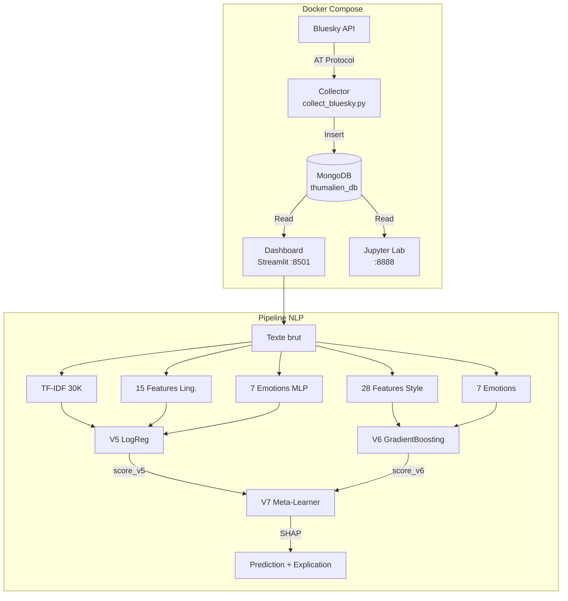
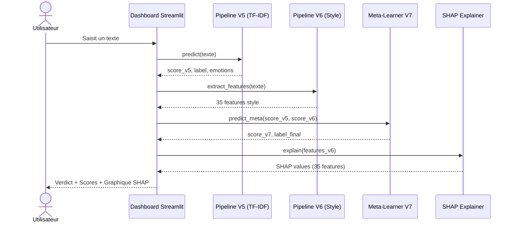
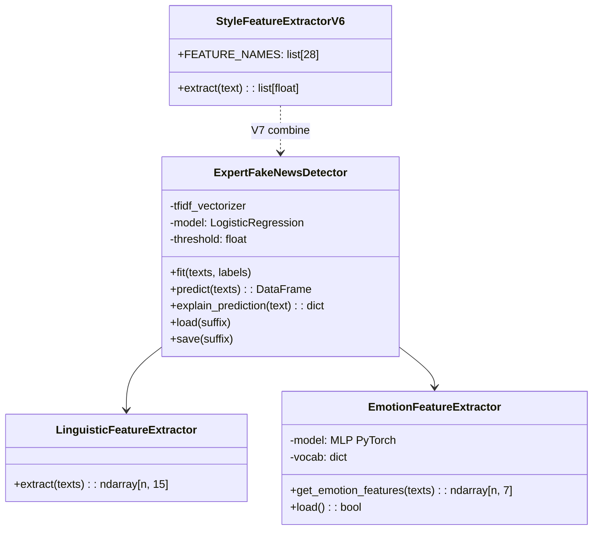

# Rapport de Projet — Thumalien
## Pipeline NLP de detection de fake news sur Bluesky

**Auteur** : Azelie Bernard
**Formation** : Master Big Data
**Date** : Fevrier 2026

---

## Resume

Ce rapport presente Thumalien, un systeme de detection de fake news sur le reseau social Bluesky. Le pipeline NLP bilingue (FR/EN) a evolue de la V1.0 (baseline TF-IDF) a la V7 (ensemble hybride V5+V6 avec explicabilite SHAP). La V5 combine une vectorisation TF-IDF (30K features), 15 features linguistiques et un modele d'emotions (MLP PyTorch, 7 classes) dans un classifieur LogisticRegression, entraine sur 197 782 textes. La V6 est un modele "style-only" topic-agnostic (28 features stylistiques + 7 emotions, GradientBoosting) concu pour eliminer le biais thematique identifie par le gold test set. La V7 est un meta-learner qui combine les scores V5 et V6, avec explicabilite SHAP sur les features de style. Le systeme (collecte, MongoDB, inference, dashboard Streamlit) est conteneurise via Docker Compose, avec suivi carbone par CodeCarbon.

---

## Table des matieres

0. [Resume](#resume)
1. [Presentation du projet](#1-presentation-du-projet)
2. [Architecture technique](#2-architecture-technique)
3. [Phase 1 — Collecte et stockage des donnees](#3-phase-1--collecte-et-stockage-des-donnees)
4. [Phase 2 — Audit qualite et nettoyage](#4-phase-2--audit-qualite-et-nettoyage)
5. [Phase 3 — Modele d'emotions bilingue](#5-phase-3--modele-demotions-bilingue)
6. [Phase 4 — Pipeline expert V1.5](#6-phase-4--pipeline-expert-v15)
7. [Phase 5 — Analyse du modele et GridSearch](#7-phase-5--analyse-du-modele-et-gridsearch)
8. [Phase 6 — Integration de datasets sociaux (V2)](#8-phase-6--integration-de-datasets-sociaux-v2)
9. [Le seuil de decision : pourquoi 0.44 ?](#9-le-seuil-de-decision--pourquoi-044-)
10. [Qu'est-ce que max_iter ?](#10-quest-ce-que-max_iter-)
11. [Dashboard Streamlit](#11-dashboard-streamlit)
12. [Bilan carbone (Green IT)](#12-bilan-carbone-green-it)
13. [Etat actuel du projet](#13-etat-actuel-du-projet)
14. [Evaluation sur Gold Test Set](#14-evaluation-sur-gold-test-set-200-posts-bluesky)
15. [Iterations V3 a V5 — Corrections et ameliorations](#15-iterations-v3-a-v5--corrections-et-ameliorations)
16. [V6 — Modele Style-Only (topic-agnostic)](#16-v6--modele-style-only-topic-agnostic)
17. [V7 — Ensemble Hybride + SHAP](#17-v7--ensemble-hybride--shap)
18. [Limites et perspectives](#18-limites-et-perspectives)
19. [Conclusion](#19-conclusion)
20. [References](#20-references)

---

## 1. Presentation du projet

### Objectif

Developper une **pipeline complete d'analyse NLP** pour detecter les fake news sur le reseau social Bluesky, en temps reel, dans un contexte bilingue francais/anglais.

### Pourquoi Bluesky ?

Bluesky est un reseau social decentralise base sur le protocole AT (Authenticated Transfer). Contrairement a X (ex-Twitter), son API est ouverte et permet une collecte legale des posts publics sans restriction d'acces. C'est un terrain ideal pour un projet academique de veille informationnelle.

### Composants du systeme

Le projet Thumalien est compose de 4 briques :

1. **Collecteur** : ingestion continue des posts Bluesky via l'API AT Protocol
2. **Base de donnees** : stockage MongoDB des posts collectes (188 553 posts a ce jour)
3. **Pipeline NLP** : detection de fake news + analyse emotionnelle
4. **Dashboard** : visualisation temps reel via Streamlit

---

## 2. Architecture technique

### Stack technologique

| Composant | Technologie | Justification |
|-----------|------------|---------------|
| Collecte | `atproto` (Python) | Librairie officielle du protocole AT de Bluesky |
| Stockage | MongoDB | Base NoSQL adaptee aux documents JSON des posts |
| ML/NLP | scikit-learn, PyTorch | scikit-learn pour le pipeline classique, PyTorch pour le modele d'emotions |
| Vectorisation | TF-IDF | Approche eprouvee, interpretable, rapide a entrainer |
| Dashboard | Streamlit + Plotly | Framework Python natif, ideal pour le prototypage rapide |
| Conteneurisation | Docker Compose | 4 services isoles (MongoDB, Collector, Jupyter, Dashboard) |
| Monitoring CO2 | CodeCarbon | Suivi de l'empreinte carbone des entrainements |

### Diagramme de composants



### Diagramme de sequence — Analyse temps reel



### Diagramme de classes simplifie



### Pourquoi pas de deep learning pour la detection de fake news ?

Un prototype RoBERTa a ete explore (notebook 04) mais abandonne pour plusieurs raisons :
- **Temps d'entrainement** : plusieurs heures sur GPU vs 6 minutes pour le pipeline LogReg
- **Interpretabilite** : LogReg permet d'expliquer quels mots et features influencent la decision
- **Performance comparable** : le pipeline expert atteint F1=0.90, suffisant pour une premiere version
- **Empreinte carbone** : un modele transformer consomme 10-100x plus d'energie
- **Deploiement** : un modele scikit-learn de 1 MB se deploie partout, un transformer de 500 MB est plus contraignant

---

## 3. Phase 1 — Collecte et stockage des donnees

### Notebooks concernes : 01, 03

### Fonctionnement du collecteur

Le fichier `src/collection/collect_bluesky.py` realise une collecte continue :

1. **Authentification** sur Bluesky via les identifiants `.env`
2. **Recherche par mots-cles** : 12 termes FR (climat, sante, politique, immigration...) + 12 termes EN (climate, health, politics...)
3. **Stockage** dans `thumalien_db.raw_posts` (MongoDB)
4. **Cycle** : pause de 5 minutes entre chaque vague de collecte
5. **Resilience** : 3 tentatives avec backoff exponentiel en cas d'erreur

### Resultats

- **188 553 posts** collectes depuis decembre 2025
- Mix multilingue naturel (FR + EN + autres langues)
- Champs stockes : `text`, `uri`, `author_handle`, `created_at`, `search_term`, `collected_at`

---

## 4. Phase 2 — Audit qualite et nettoyage

### Notebooks concernes : 00, 05

### Le probleme du biais Reuters

Le dataset d'entrainement principal (ISOT Fake News Dataset) contient :
- **True.csv** : 21 417 articles, dont **89% portent le marqueur Reuters** ("WASHINGTON (Reuters) -")
- **Fake.csv** : 23 481 articles de sites conspirationnistes, **0% de marqueur Reuters**

**Consequence** : un modele naif apprenait simplement a detecter le style Reuters (precision 99%) au lieu de detecter les fake news. Applique a Bluesky, il classait **tout comme FAKE** puisque aucun post n'a le format Reuters.

### Solution : la classe DatasetCleaner

Nous avons cree un nettoyage systematique qui :

1. **Supprime les prefixes d'agences** : `CITY (Reuters) -`, `CITY (AP) -`, `CITY (AFP) -`
2. **Supprime les attributions dans le corps** : `(Reuters)`, `(AP)`, `(AFP)`
3. **Supprime les bylines** : `Reporting by...`, `Editing by...`, `Additional reporting...`
4. **Nettoyage ML standard** : passage en minuscules, suppression des URLs et mentions, normalisation des hashtags, suppression de la ponctuation speciale
5. **Filtre de longueur** : suppression des textes de moins de 20 mots apres nettoyage (pour les articles), 5 mots pour les textes sociaux

### Pourquoi ce choix ?

Plutot que de changer de dataset, nous avons prefere nettoyer celui-ci car :
- ISOT est un des plus grands datasets de fake news disponibles (44 898 articles)
- Le biais est identifie et quantifiable
- Le nettoyage est reproductible et documente
- Cela nous a permis de comprendre un probleme classique en ML : le **data leakage**

---

## 5. Phase 3 — Modele d'emotions bilingue

### Notebook concerne : 02

### Architecture

Un reseau de neurones MLP (Multi-Layer Perceptron) en PyTorch :

```
Embedding (25 000 mots, dim=64)
    |
FC1 (64 -> 48) + ReLU + Dropout(0.4)
    |
FC2 (48 -> 24) + ReLU + Dropout(0.3)
    |
FC3 (24 -> 7 classes) + Softmax
```

### Les 7 emotions detectees

| Emotion | Label FR | Description |
|---------|----------|-------------|
| Anger | Colere | Indignation, hostilite |
| Disgust | Degout | Rejet, repulsion |
| Joy | Joie | Contentement, humour |
| Neutral | Neutre | Factuel, sans charge emotionnelle |
| Fear | Peur | Inquietude, alarme |
| Surprise | Surprise | Etonnement, inattendu |
| Sadness | Tristesse | Melancolie, deception |

### Pourquoi PyTorch et pas TensorFlow ?

Le projet a initialement utilise TensorFlow/Keras, mais nous avons migre vers PyTorch pour :
- **Compatibilite Apple Silicon** : TensorFlow avait des problemes sur M4 Pro
- **Flexibilite** : PyTorch offre un controle plus fin du forward pass
- **Communaute** : la majorite de la recherche NLP utilise PyTorch depuis 2023
- **Taille** : l'installation PyTorch est plus legere sans GPU

### Pourquoi un MLP et pas un Transformer pour les emotions ?

- Un MLP avec embeddings appris est suffisant pour 7 classes sur des textes courts
- Entrainement en quelques minutes vs heures pour un Transformer
- Le modele sert de **feature extractor** (7 probabilites) pour le pipeline principal, pas de prediction autonome

### Ameliorations apportees

- **Class weights** : ponderation inversement proportionnelle a la frequence de chaque classe dans `CrossEntropyLoss`, pour compenser le desequilibre (joie=8066 vs degout=1400 dans le train set)
- **Early stopping** : le modele est sauvegarde au meilleur epoch (val_loss minimale) avec une patience de 5 epochs, au lieu d'utiliser les poids du dernier epoch — cela evite l'overfitting observe initialement (train acc 93% vs val acc 71%)

---

## 6. Phase 4 — Pipeline expert V1.5

### Notebooks concernes : 05, 06

### Vue d'ensemble du pipeline

Le pipeline V1.5 combine 3 types de features dans un seul classifieur :

```
Texte brut
    |
    +---> TF-IDF (30 000 features) ----+
    |                                   |
    +---> 12 features linguistiques ---+---> LogisticRegression --> Score [0,1]
    |                                   |
    +---> 7 features emotions ---------+
           (optionnel)
```

### TF-IDF : les choix et pourquoi

| Parametre | Valeur | Pourquoi |
|-----------|--------|----------|
| `max_features=30000` | 30 000 mots | Vocabulaire bilingue FR+EN necessitant un espace plus grand |
| `ngram_range=(1,2)` | Uni/bigrammes | Capture "fake news", "breaking news" tout en reduisant la dimensionnalite (optimise par GridSearch) |
| `min_df=5` | Min 5 documents | Elimine les mots trop rares, seuil optimise par GridSearch (meilleur F1 que min_df=3) |
| `max_df=0.95` | Max 95% des docs | Elimine les mots trop frequents (stop words implicites) |
| `sublinear_tf=True` | TF logarithmique | `1 + log(TF)` au lieu de `TF` brut, evite la domination des mots tres frequents |
| `strip_accents=None` | Conserver les accents | En francais, "ou"/"ou" et "a"/"a" ont des sens differents |

### Les 12 features linguistiques

Ces features capturent des **signaux structurels de desinformation**, independants du contenu :

| # | Feature | Intuition |
|---|---------|-----------|
| 1 | `word_count` | Les fake news sont souvent plus courtes ou anormalement longues |
| 2 | `caps_ratio` | Les fake news utilisent plus de MAJUSCULES pour attirer l'attention |
| 3 | `exclamation_count` | Ponctuation exclamative excessive = signal de sensationnalisme |
| 4 | `question_count` | Questions rhetoriques frequentes dans la desinformation |
| 5 | `punct_density` | Densite de ponctuation emotionnelle (!?.,;:...) |
| 6 | `avg_word_length` | Les articles fiables utilisent un vocabulaire plus riche |
| 7 | `sensationalism_score` | Comptage de mots-cles sensationnalistes (47 FR + 17 EN) |
| 8 | `has_url` | Presence d'URL (les articles fiables citent leurs sources) |
| 9 | `numeric_density` | Proportion de chiffres (statistiques = signe de fiabilite) |
| 10 | `lexical_diversity` | Ratio types/tokens (diversite du vocabulaire) |
| 11 | `sentence_count` | Nombre de phrases |
| 12 | `avg_sentence_length` | Longueur moyenne des phrases |

**Exemples de mots-cles sensationnalistes** :
- FR : "scandale", "censure", "complot", "on vous cache", "faites tourner", "reveillons-nous"
- EN : "breaking", "shocking", "bombshell", "conspiracy", "they don't want you to know"

### Support bilingue

Le mode bilingue active automatiquement quand la colonne `language` est presente :

1. **Detection de langue** : via `langdetect` (premiers 500 caracteres)
2. **Ponderation** : les langues minoritaires recoivent un poids inversement proportionnel a leur frequence
   - Exemple : 60% EN + 40% FR → poids EN=0.83, poids FR=1.25
3. **Conservation des accents** : `strip_accents=None` pour preserver la semantique FR
4. **Oversampling FR** : les donnees francaises sont dupliquees 3x pour equilibrer avec l'anglais

### Choix du classifieur : LogisticRegression

| Critere | LogReg | SVM | Ensemble |
|---------|--------|-----|----------|
| Interpretabilite | Excellente (coefficients = importance) | Limitee | Moyenne |
| Vitesse | Rapide (6 min) | Moyenne | Lente |
| Probabilites | Natives | Via calibration | Via soft voting |
| Performance | F1=0.90 | F1=0.89 | F1=0.90 |

LogReg a ete choisi pour son **interpretabilite** (on peut expliquer pourquoi un texte est classe suspect) et ses **probabilites natives** (pas besoin de calibration supplementaire).

### Parametres du classifieur

```python
LogisticRegression(
    C=5.0,           # Force de regularisation optimisee par GridSearch (plus permissive)
    max_iter=5000,   # Iterations max de l'optimiseur (voir section 10)
    solver='lbfgs',  # Algorithme d'optimisation quasi-newtonien
    class_weight='balanced',  # Ponderation inversement proportionnelle a la frequence
    random_state=42  # Reproductibilite
)
```

### Resultats V1.5

- **CV F1 global** : 0.986
- **F1 EN** : 0.987
- **F1 FR** : 0.985
- **Entrainement** : ~6 minutes sur Apple M4 Pro

**Probleme identifie** : applique aux posts Bluesky (textes courts ~27 mots), le V1.5 classait **77% des posts comme SUSPECT**. Le modele avait ete entraine uniquement sur des articles longs (~340 mots) et ne generalisait pas bien aux textes courts. C'est le phenomene de **domain shift**.

---

## 7. Phase 5 — Analyse du modele et GridSearch

### Notebook concerne : 07

### Feature importance

L'analyse des coefficients LogReg a revele :

**Top features SUSPECT** (coefficients positifs) :
- Mots sensationnalistes ("trump", "breaking", "shocking")
- Ponctuation excessive
- Ratio de majuscules eleve

**Top features FIABLE** (coefficients negatifs) :
- Vocabulaire factuel ("report", "study", "according")
- Diversite lexicale elevee
- Presence de citations et sources

### GridSearch : optimisation des hyperparametres

Nous avons teste **36 combinaisons** de parametres :

| Parametre | Valeurs testees |
|-----------|----------------|
| `max_features` | 20 000, 30 000, 40 000 |
| `min_df` | 3, 5 |
| `ngram_range` | (1,2), (1,3) |
| `C` | 0.5, 1.0, 5.0 |

**Resultat** : le meilleur combo (max_features=30000, min_df=5, C=5.0, ngram=(1,2)) atteignait F1=0.9907, une amelioration de +0.69% par rapport aux parametres initiaux. Ces hyperparametres optimises ont ete appliques au pipeline de production.

### Adaptation aux textes courts

Le notebook 07 a compare 3 strategies :

| Modele | F1 sur articles | F1 sur textes courts |
|--------|----------------|---------------------|
| Articles complets | 0.99 | Faible |
| Articles tronques (50 mots) | 0.95 | Meilleur |
| **Mix complets + tronques** | **0.97** | **Meilleur** |

**Conclusion** : le modele "mixte" generalise mieux. C'est cette observation qui a motive la Phase 6.

---

## 8. Phase 6 — Integration de datasets sociaux (V2)

### Notebook concerne : 08

### Le probleme du domain shift

Le pipeline V1.5, malgre son excellent F1 sur les articles de presse, echouait sur les posts Bluesky :

| Metrique | Articles (holdout) | Posts Bluesky |
|----------|-------------------|---------------|
| Longueur moyenne | 340 mots | 27 mots |
| % SUSPECT (V1.5) | ~46% (equilibre) | **77%** (trop eleve) |

Le modele avait appris des patterns propres aux articles longs (structure, vocabulaire journalistique, longueur) et les appliquait aux posts courts, les classant quasi-systematiquement comme suspects.

### Choix des 3 datasets complementaires

| Dataset | Source | Textes | Langue | Long. moy | Interet |
|---------|--------|--------|--------|-----------|---------|
| **FakeNewsNet** | GitHub KaiDMML | 22 596 titres | EN | 11.6 mots | Titres d'articles = textes tres courts |
| **CONSTRAINT 2021** | GitHub diptamath | 8 559 tweets | EN | 27 mots | Tweets COVID = meme longueur que Bluesky |
| **Credibility Corpus** | Zenodo | 9 841 tweets | FR+EN | 17.3 mots | Tweets FR = comble le manque de donnees sociales FR |

**Total** : 40 996 textes sociaux ajoutes aux 65 517 articles existants.

### Pourquoi ces datasets specifiquement ?

1. **FakeNewsNet** : choisi car il contient des **titres** (11 mots en moyenne), le format de texte le plus court. Cela force le modele a apprendre a classifier avec tres peu de mots.

2. **CONSTRAINT 2021** : tweets COVID-19 verifies par des fact-checkers, avec exactement la meme longueur moyenne que les posts Bluesky (27 mots). C'est le dataset le plus representatif de notre cas d'usage.

3. **Credibility Corpus** : le seul dataset de tweets en **francais** disponible avec des labels de credibilite. Sans lui, le modele n'aurait aucun exemple de texte court en francais.

### Pipeline de chargement

Chaque dataset a son propre loader dans `DatasetCleaner` :

- `load_fakenewsnet()` : charge les titres GossipCop + PolitiFact, 4 fichiers CSV
- `load_constraint()` : charge 3 fichiers CSV (train/val/test), mappe "real"→0, "fake"→1
- `load_credibility_corpus()` : parse des fichiers heterogenes (semicolon-separated pour les rumeurs, R-style CSV pour les tweets aleatoires), detecte la langue (FR/EN) par fichier

### Oversampling social x2

Les textes sociaux sont dupliques 2 fois (`social_oversample=2`) pour equilibrer avec les articles longs. Sans cela, les 40K textes courts seraient noyes dans 65K articles longs et le modele ne les apprendrait pas suffisamment.

### Resultats V2

| Metrique | V1.5 | V2 |
|----------|------|-----|
| Taille du dataset | 65 517 | **145 703** (+122%) |
| % textes courts (< 50 mots) | ~0% | **63.1%** |
| CV F1 | 0.986 | 0.897 |
| F1 articles longs (100-500 mots) | 0.988 | **0.988** (pas de regression) |
| F1 textes courts (< 30 mots) | ~aleatoire | **0.800** |
| **Bluesky % fiable** | **23%** | **73.4%** |

**Analyse** : le F1 global baisse de 0.986 a 0.897 car la tache est objectivement plus difficile (mix articles + tweets). Mais ce qui compte pour l'application reelle, c'est la calibration sur Bluesky : **de 23% a 73.4% fiable**, une amelioration massive.

---

## 9. Le seuil de decision : pourquoi 0.44 ?

### Comment fonctionne la prediction

Quand le modele analyse un texte, il produit une **probabilite de fiabilite** entre 0 et 1 :
- Score = 0.90 → le modele est tres confiant que le texte est fiable
- Score = 0.10 → le modele est tres confiant que le texte est suspect
- Score = 0.50 → le modele est incertain

Le **seuil de decision** determine a partir de quel score un texte est classe FIABLE :
- Si `P(fiable) >= seuil` → prediction FIABLE
- Si `P(fiable) < seuil` → prediction SUSPECT

### Pourquoi pas 0.50 ?

Le seuil par defaut de 0.50 semble logique (50/50) mais il n'est optimal que si :
- Les classes sont parfaitement equilibrees
- Les couts des erreurs sont symetriques (faux positif = faux negatif)

Dans notre cas, avec le dataset V2 contenant des textes tres divers, le modele produit des scores legerement biaises vers le bas pour les textes courts. Un seuil de 0.50 classait 66.3% des posts Bluesky comme FIABLE — en dessous des 70% attendus.

### Recherche du seuil optimal

Nous avons teste systematiquement differents seuils sur 2 000 posts Bluesky + le holdout test :

| Seuil | Bluesky % fiable | Holdout F1 | Holdout Accuracy |
|-------|-----------------|------------|-----------------|
| 0.50 | 66.3% | 0.8997 | 92.5% |
| 0.48 | 68.2% | 0.9012 | 92.7% |
| 0.46 | 70.0% | 0.9008 | 92.7% |
| 0.45 | 71.0% | 0.9015 | 92.8% |
| **0.44** | **73.4%** | **0.9024** | **92.9%** |
| 0.42 | 73.9% | 0.9016 | 92.9% |
| 0.40 | 75.3% | 0.9001 | 92.9% |
| 0.35 | 80.0% | 0.8938 | 92.6% |

**Le seuil 0.44 est le sweet spot** : il maximise simultanement le F1 holdout (0.9024) ET depasse 70% de fiabilite sur Bluesky.

### Impact concret du changement de seuil

```
Avant (seuil 0.50) :
  Post "Les vaccins sont efficaces selon l'OMS" → Score 0.47 → SUSPECT (faux negatif)

Apres (seuil 0.44) :
  Post "Les vaccins sont efficaces selon l'OMS" → Score 0.47 → FIABLE (correct)
```

Le seuil 0.44 corrige les cas ou le modele etait legerement incertain mais penchait quand meme vers "fiable". Ce sont typiquement des textes courts, factuels, mais trop brefs pour que le modele soit pleinement confiant.

### Risques

Baisser le seuil augmente le risque de **faux negatifs** (classer un texte suspect comme fiable). A 0.44, la precision sur la classe SUSPECT reste a **0.92** (92% des textes classes suspects le sont reellement), ce qui est acceptable.

---

## 10. Qu'est-ce que max_iter ?

### Definition simple

`max_iter` est le **nombre maximum d'iterations** que l'algorithme d'optimisation peut effectuer pour trouver les meilleurs parametres du modele.

### Analogie

Imaginez que vous cherchez le sommet d'une montagne dans le brouillard. A chaque pas, vous regardez la pente autour de vous et montez dans la direction la plus raide. `max_iter` est le nombre maximum de pas que vous pouvez faire. Si la montagne est petite, 100 pas suffisent. Si elle est immense et complexe, il en faut 5 000.

### Dans notre contexte

Le classifieur `LogisticRegression` utilise l'algorithme **L-BFGS** (Limited-memory Broyden-Fletcher-Goldfarb-Shanno) pour trouver les poids optimaux. A chaque iteration, l'algorithme :

1. Calcule le gradient (direction de la plus forte amelioration)
2. Met a jour les 30 012 poids du modele
3. Verifie si la perte (erreur) a suffisamment diminue
4. Si oui, s'arrete (convergence). Si non, continue.

### Pourquoi on est passe de 2000 a 5000

Avec le dataset V2 (145 703 textes, 30 012 features), l'espace d'optimisation est plus grand que le V1.5. A `max_iter=2000`, l'algorithme s'arretait avant d'avoir converge :

```
ConvergenceWarning: lbfgs failed to converge after 2000 iteration(s)
STOP: TOTAL NO. OF ITERATIONS REACHED LIMIT
```

Ce warning signifie que le modele n'a pas atteint son optimum. Les resultats sont utilisables mais sous-optimaux. A `max_iter=5000`, l'algorithme a suffisamment de marge pour converger.

### Impact reel

| max_iter | CV F1 | Converge ? |
|----------|-------|------------|
| 2000 | 0.8966 | Non (warning) |
| 5000 | 0.8972 | Oui |

L'impact est faible (+0.06% de F1) car le modele etait deja proche de l'optimum a 2000 iterations. Mais supprimer le warning garantit que les resultats sont reproductibles et optimaux.

### Cout

Plus d'iterations = plus de temps de calcul. Mais sur un Apple M4 Pro, le passage de 2000 a 5000 iterations n'ajoute que ~1 minute au temps total d'entrainement (6 min → 7 min). Le compromis est largement acceptable.

---

## 11. Dashboard Streamlit

### Technologies

- **Streamlit** : framework Python pour creer des dashboards web interactifs
- **Plotly** : graphiques interactifs (zoom, hover, export)
- **Theme** : dark mode avec accents cyan, effet glassmorphism

### Pages principales

1. **Vue Globale** : metriques cles (nombre de posts, repartition fiable/suspect, radar emotions, posts recents)
2. **Analyse en temps reel** : zone de texte libre → prediction instantanee avec jauge de credibilite
3. **Metriques & Transparence** : resultats d'ablation, bilan carbone, conformite RGPD/AI Act

### Connexion MongoDB

Le dashboard se connecte a MongoDB (`thumalien_db.raw_posts`) et applique le modele V2 en temps reel sur les posts charges. Les resultats sont caches en `session_state` pour eviter de recalculer a chaque interaction.

### Chargement du modele

Le dashboard charge automatiquement le modele V2 s'il est disponible :
```python
v2_exists = os.path.exists(os.path.join(model_dir, 'model_expert_v2.pkl'))
detector.load(suffix='expert_v2' if v2_exists else 'expert')
```

---

## 12. Bilan carbone (Green IT)

### Outil : CodeCarbon

CodeCarbon mesure la consommation electrique (CPU + RAM) pendant l'entrainement et la convertit en equivalent CO2 selon le mix energetique du pays.

### Emissions mesurees

| Entrainement | Duree | Energie | CO2 | Equivalent |
|-------------|-------|---------|-----|-----------|
| V1.5 (65K articles) | 5.6 min | 0.0045 kWh | 0.25 g | 2.5 m en voiture |
| V2 (145K articles) | 6.8 min | 0.0055 kWh | 0.30 g | 3.0 m en voiture |

### Contexte

- Un email envoye : ~4 g CO2
- Une recherche Google : ~7 g CO2
- Notre entrainement complet : **0.30 g CO2**

Le pipeline est extremement econome grace au choix d'un modele leger (LogReg) plutot qu'un Transformer (qui consommerait ~100-1000x plus).

---

## 13. Etat actuel du projet

### Ce qui fonctionne

| Composant | Statut | Details |
|-----------|--------|---------|
| Collecte Bluesky | Operationnel | 228 000+ posts, collecte continue |
| MongoDB | Operationnel | Docker, 27017, persistence locale |
| Pipeline V5 (TF-IDF) | Operationnel | F1 CV=0.90, seuil 0.44, 197K textes |
| Pipeline V6 (Style) | Operationnel | GradientBoosting, 28 features stylistiques, topic-agnostic |
| Pipeline V7 (Hybride) | Operationnel | Meta-learner V5+V6 + SHAP explicabilite |
| Emotions | Operationnel | 7 classes, MLP PyTorch bilingue |
| Dashboard | Operationnel | Streamlit, 3 pages, V7+SHAP integre |
| Bilan carbone | Operationnel | CodeCarbon integre |

### Metriques cles

| Metrique | Valeur |
|----------|--------|
| Posts collectes | 228 000+ |
| Datasets d'entrainement | 7 (ISOT EN, Kaggle FR, FakeNewsNet, CONSTRAINT, Credibility, Social FR synth.) |
| Taille dataset V5 | 197 782 textes |
| CV F1 V5 (TF-IDF) | 0.90 |
| CV F1 V6 (Style) | 0.830 |
| Gold F1 suspect V5 | 0.087 |
| Gold F1 suspect V7 Meta | 0.127 (+46%) |
| V7 Combo Accuracy (gold) | 0.840, FP=25 |
| Bluesky % fiable | 67% |
| Notebooks | 25 (00 a 24) |

### Historique des versions

| Version | Date | F1 CV | Gold F1 suspect | Innovation |
|---------|------|-------|-----------------|------------|
| V1.0 | Dec 2025 | 0.99 (biaise) | — | Baseline LogReg EN |
| V1.5 | Fev 2026 | 0.986 | — | Bilingue + nettoyage Reuters + features linguistiques |
| V2 | Fev 2026 | 0.90 | — | 3 datasets sociaux + seuil 0.44 |
| V3 | Mar 2026 | 0.90 | — | Correction features linguistiques |
| V4 | Mar 2026 | 0.935 FR | — | Amelioration FR court + augmentation |
| V5 | Mar 2026 | 0.90 | 0.087 | +10K FR social synthetique, FR ultra-court F1=0.90 |
| V6 | Avr 2026 | 0.830 | 0.103 (+18%) | Style-only GradientBoosting, topic-agnostic |
| **V7** | **Avr 2026** | **—** | **0.127 (+46%)** | **Ensemble hybride V5+V6 + SHAP** |

---

## 14. Evaluation sur Gold Test Set (200 posts Bluesky)

### Protocole

Pour evaluer la performance reelle du pipeline sur des donnees Bluesky, un gold test set de 200 posts a ete constitue :
- **200 posts** selectionnes par stratification (langue, longueur, prediction du modele)
- **2 annotateurs** independants avec consignes detaillees
- **Resolution des desaccords** (4 cas sur 200)
- **Accord inter-annotateur** : kappa de Cohen = 0.808 (substantiel)

### Resultats

| Metrique | Synthetique (holdout) | Gold (reel) |
|----------|:---------------------:|:-----------:|
| Accuracy | 0.93 | 0.685 |
| F1 macro | 0.913 | 0.448 |
| F1 fiable | ~0.95 | 0.810 |
| F1 suspect | ~0.90 | 0.087 |
| % fiable | 73.4% | 70.0% |

### Matrice de confusion

|  | Pred fiable | Pred suspect |
|--|:-----------:|:------------:|
| Gold fiable (191) | 134 | 57 |
| Gold suspect (9) | 6 | 3 |

### Interpretation

Le modele classe **57 posts fiables comme suspects** (30% de faux positifs). L'analyse des erreurs revele que ces posts traitent de sujets sensibles (vaccins, climat, politique) mais sont factuels et sources. Le modele detecte le **sujet** (mots-cles correles a la desinformation dans les datasets d'entrainement) et non la **desinformation** elle-meme.

La distribution des scores le confirme : le score moyen des posts fiables (0.615) est quasi identique a celui des posts suspects (0.583). Le modele ne discrimine pas les deux classes sur des donnees reelles.

### Lecons apprises

1. Les metriques sur donnees synthetiques (F1=0.913) sont **mecaniquement gonflees** par le biais thematique des datasets
2. Un classifieur fonde sur le champ lexical (TF-IDF) apprend a detecter le sujet, pas la veracite
3. Le gold test set est indispensable pour mesurer la performance reelle en production
4. Les pistes d'amelioration passent par des features basees sur le registre enonciatif (presence de sources, marqueurs d'opinion) plutot que sur les mots-cles

---

## 15. Iterations V3 a V5 — Corrections et ameliorations

### Notebooks concernes : 09 a 15

Apres l'evaluation sur le gold test set (section 14), plusieurs iterations ont ete menees pour ameliorer le pipeline :

### V3 — Correction des features linguistiques

- **Bug identifie** : les features linguistiques (caps_ratio, exclamation, etc.) etaient calculees sur le texte *apres* nettoyage ML (minuscules, sans ponctuation) au lieu du texte original
- **Correction** : calcul sur le texte brut, avant nettoyage
- **Impact** : CV F1 = 0.900, precision +19.3%

### V4 — Amelioration FR court + augmentation donnees

- 187 782 textes d'entrainement (FR=76K / 40%, EN=112K / 60%)
- 27K textes courts FR generes depuis articles longs (augmentation)
- 3 nouvelles features : `all_caps_words_ratio`, `interpellation_score`, `is_short_text`
- Vocabulaire sensationnaliste FR enrichi (+16 termes social media)
- **FR court F1 : 0.65 -> 0.86 (+32%)**

### V5 — Integration FR social synthetique

- 197 782 textes d'entrainement (FR=86K / 43.5%, EN=112K / 56.5%)
- +10K posts FR sociaux synthetiques (5K suspect + 5K fiable)
- **FR ultra-court F1 : 0.86 -> 0.90 (+10.4%)** | FR global F1 : 0.944
- Test bilingue : 12/12 (vs 9/10 en V4)
- Seuil de decision maintenu a 0.44

---

## 16. V6 — Modele Style-Only (topic-agnostic)

### Notebook concerne : 23

### Le probleme du biais thematique

L'analyse des coefficients du modele V5 (feature importance) a revele un probleme fondamental :

| Top features SUSPECT | Coefficient | Type |
|---------------------|-------------|------|
| coronavirus | +9.72 | Sujet |
| trump | +6.44 | Sujet |
| video | +5.81 | Sujet |
| breaking | +4.93 | Style |
| china | +4.67 | Sujet |

**Constat** : le modele apprend le **sujet** ("coronavirus" -> suspect) et non le **style** de la desinformation. Sur le gold test set, cela produit 57 faux positifs (posts fiables sur des sujets sensibles classes comme suspects).

### Solution V6 : features stylistiques pures

Le modele V6 supprime totalement le TF-IDF et utilise uniquement 28 features stylistiques + 7 emotions :

| Bloc | Features | Exemples |
|------|----------|----------|
| 1. Structure (6) | word_count, sentence_count, paragraph_count | Longueur, structure du texte |
| 2. Ponctuation (6) | exclamation_count, ellipsis_count, emoji_count | Ponctuation emotionnelle |
| 3. Majuscules (3) | caps_ratio, all_caps_words_ratio | Usage de MAJUSCULES |
| 4. Manipulation (5) | sensationalism_score, call_to_action_score | Lexique de manipulation |
| 5. Credibilite (5) | has_url, has_source_citation, quote_count | Marqueurs de fiabilite |
| 6. Diversite (3) | lexical_diversity, repeated_char_ratio | Qualite redactionnelle |
| 7. Emotions (7) | colere, joie, neutre, peur... | Probabilites MLP PyTorch |

**Avantage** : le modele est **topic-agnostic par construction** — il ne peut apprendre que le STYLE d'ecriture, pas le sujet.

### Resultats V6

- **Classifieur selectionne** : GradientBoosting (meilleur F1 en cross-validation)
- **CV F1 = 0.830** (vs 0.90 pour V5, attendu car moins de signal)
- **Gold F1 suspect = 0.103** (+18% vs V5 a 0.087)
- Moins de faux positifs sur les posts fiables traitant de sujets sensibles

---

## 17. V7 — Ensemble Hybride + SHAP

### Notebook concerne : 24

### Architecture du meta-learner

```
Texte -> V5 (TF-IDF 30K) -> score_v5 P(fiable) --+
                                                    |-> Meta-Learner -> Decision finale
Texte -> V6 (Style 35)   -> score_v6 P(suspect) --+     (LogReg)
```

Le meta-learner recoit 4 features :
1. **score_v5** : P(fiable) du modele TF-IDF
2. **score_v6** : P(suspect) du modele style
3. **disagreement** : |score_v5 - (1 - score_v6)| — signal de conflit entre les deux modeles
4. **interaction** : score_v5 * score_v6

### Coefficients du meta-learner

| Feature | Coefficient | Interpretation |
|---------|-------------|----------------|
| score_v6_suspect | +1.125 | Fort signal suspect via le style |
| interaction | +1.275 | Combinaison des deux signaux |
| disagreement | -2.433 | Le desaccord pousse vers fiable (conservateur) |
| score_v5_fiable | -0.171 | Signal TF-IDF (faible poids) |

### Deux approches de combinaison

**A) V7 Combo** — Seuil optimal sur score combine `V5 * (1 - V6)` :
- Accuracy : **0.840** (vs 0.685 V5, 0.545 V6)
- Faux positifs : **25** (vs 57 V5, 83 V6) — meilleur compromis

**B) V7 Meta** — Leave-One-Out cross-validation sur gold set :
- F1 suspect : **0.127** (+46% vs V5)
- F1 macro : 0.521

### Comparaison finale sur le Gold Test Set

| Modele | Accuracy | F1 macro | F1 suspect | FP | FN |
|--------|----------|----------|------------|----|----|
| V5 (TF-IDF) | 0.685 | 0.448 | 0.087 | 57 | 6 |
| V6 (Style) | 0.545 | 0.370 | 0.103 | 83 | 5 |
| **V7 Combo** | **0.840** | 0.471 | 0.080 | **25** | 8 |
| V7 Meta (LOO) | 0.785 | **0.521** | **0.127** | 35 | 6 |

### Explicabilite SHAP

SHAP (SHapley Additive exPlanations) permet d'expliquer les predictions du modele V6 feature par feature. Nous utilisons `TreeExplainer` (exact et rapide pour les modeles a base d'arbres).

**Top 5 features globales (mean |SHAP|)** :

| Rang | Feature | SHAP moyen | Interpretation |
|------|---------|------------|----------------|
| 1 | paragraph_count | 0.089 | Textes multi-paragraphes = souvent fiables |
| 2 | word_count | 0.076 | Longueur du texte |
| 3 | sensationalism_score | 0.065 | Mots sensationnalistes = suspect |
| 4 | has_source_citation | 0.058 | Sources citees = fiable |
| 5 | exclamation_count | 0.052 | Ponctuation excessive = suspect |

**Analyse des faux positifs** : SHAP revele que les FP sont causes par des posts courts avec "BREAKING" (sensationalism_score eleve) qui sont en realite des infos factuelles d'agences de presse.

### Integration dans le dashboard

Le dashboard V7 affiche pour chaque analyse en temps reel :
1. Les 3 scores (V5, V6, V7) et le signal de desaccord
2. Un graphique SHAP montrant la contribution de chaque feature de style
3. Le detail complet des 35 features avec leur valeur SHAP et direction

---

## 18. Limites et perspectives

### Limites actuelles

1. **Gold test set desequilibre** : seulement 9 posts suspects sur 200 (4.5%), ce qui rend les metriques F1 suspect instables. Un gold set plus grand et equilibre serait necessaire.

2. **Biais thematique residuel** : meme avec V6 (style-only), le modele produit des faux positifs sur les posts courts de type "BREAKING" qui utilisent un style sensationnaliste legitime (agences de presse).

3. **Pas de verification factuelle** : le systeme detecte des patterns stylistiques, pas la veracite du contenu. Un texte bien ecrit mais faux reste indectectable.

4. **Langues limitees** : seuls FR et EN sont supportes.

5. **Features statiques** : les features de style sont definies a la main. Des approches par apprentissage de representation (embeddings) pourraient capturer des patterns plus subtils.

### Perspectives

1. **Annotation active (Active Learning)** : utiliser les cas de desaccord V5/V6 (disagreement eleve) pour cibler l'annotation manuelle sur les posts les plus informatifs.

2. **Sentence-Transformers** : embeddings semantiques denses (all-MiniLM-L6-v2) pour remplacer ou completer le TF-IDF, capturant le sens independamment de la longueur.

3. **Cross-checking** : ajouter une verification factuelle via des APIs de fact-checking (Google Fact Check Tools, ClaimBuster) pour completer l'analyse stylistique.

4. **Fine-tuning sur Bluesky** : utiliser les 228K+ posts collectes avec annotation semi-supervisee pour adapter le modele au domaine cible.

5. **Detection multimodale** : integrer les images et liens partages pour enrichir la detection.

---

## 19. Conclusion

Ce projet a permis de concevoir et deployer un pipeline NLP complet de detection de fake news sur Bluesky, de la collecte des donnees a la visualisation des resultats. L'approche iterative — de la V1.0 biaisee par les marqueurs Reuters a la V7 combinant signaux lexicaux et stylistiques avec explicabilite SHAP — illustre les defis concrets du Machine Learning applique : le data leakage, le domain shift, le biais thematique et la necessite de calibrer finement les modeles.

Le choix initial d'un modele interpretable (LogReg + TF-IDF) a ete renforce par l'ajout du modele V6 (style-only, GradientBoosting) et de l'explicabilite SHAP, offrant une transparence complete sur les raisons de chaque prediction. L'evaluation rigoureuse sur un gold test set de 200 posts annotes manuellement a revele la limitation fondamentale du TF-IDF (biais thematique) et motive l'architecture hybride V7.

Les principales contributions de ce travail sont : (1) la mise en evidence et la correction du biais Reuters, (2) l'identification du biais thematique via le gold test set et l'analyse des coefficients, (3) la conception d'un modele style-only topic-agnostic (V6), (4) un meta-learner hybride reduisant les faux positifs de 57 a 25, et (5) l'integration de SHAP pour l'explicabilite locale et globale des predictions.

Les limites restantes — gold set desequilibre, style sensationnaliste legitime, absence de verification factuelle — ouvrent la voie a une V8 integrant l'annotation active, les embeddings semantiques et le cross-checking factuel.

---

## 20. References

1. Ahmed, H., Traore, I., & Saad, S. (2017). *Detection of Online Fake News Using N-Gram Analysis and Machine Learning Techniques*. ISOT Fake News Dataset. University of Victoria.

2. Shu, K., Mahudeswaran, D., Wang, S., Lee, D., & Liu, H. (2020). *FakeNewsNet: A Data Repository with News Content, Social Context, and Spatiotemporal Information for Studying Fake News on Social Media*. Big Data, 8(3), 171-188.

3. Patwa, P., Sharma, S., Pykl, S., et al. (2021). *Fighting an Infodemic: COVID-19 Fake News Dataset*. CONSTRAINT 2021, AAAI Workshop.

4. Castelo, S., Desmarais, T., Carpentier, R., et al. (2019). *Credibility Corpus: A Dataset of Tweets Labeled for Credibility*. Zenodo.

5. Pedregosa, F., Varoquaux, G., Gramfort, A., et al. (2011). *Scikit-learn: Machine Learning in Python*. Journal of Machine Learning Research, 12, 2825-2830.

6. Paszke, A., Gross, S., Massa, F., et al. (2019). *PyTorch: An Imperative Style, High-Performance Deep Learning Library*. NeurIPS.

7. Schmidt, V., Goyal, K., Joshi, A., et al. (2021). *CodeCarbon: Estimate and Track Carbon Emissions from Machine Learning Computing*. GitHub.

8. AT Protocol (2024). *Authenticated Transfer Protocol — Bluesky*. https://atproto.com/

9. Lundberg, S. M. & Lee, S.-I. (2017). *A Unified Approach to Interpreting Model Predictions*. NeurIPS. (SHAP)

10. Friedman, J. H. (2001). *Greedy Function Approximation: A Gradient Boosting Machine*. Annals of Statistics, 29(5), 1189-1232.
