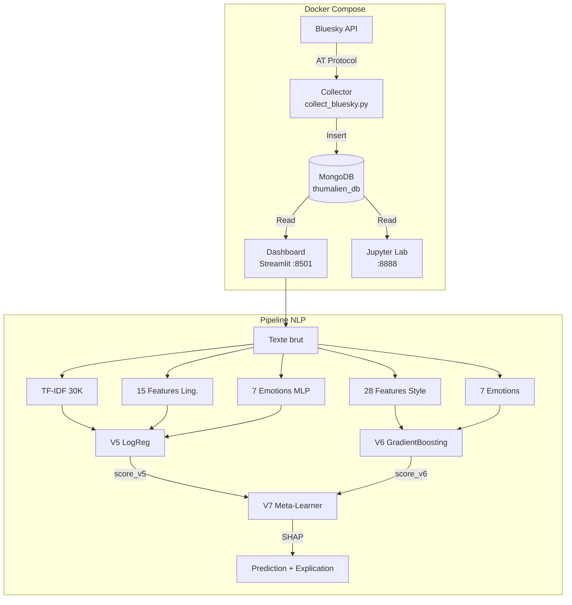
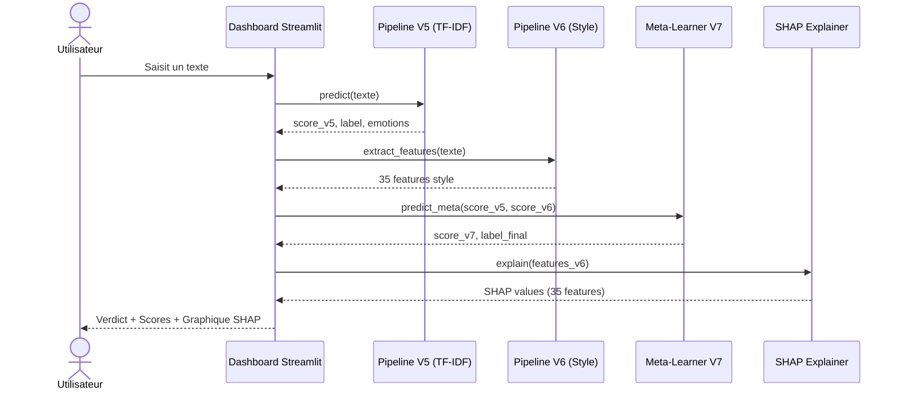
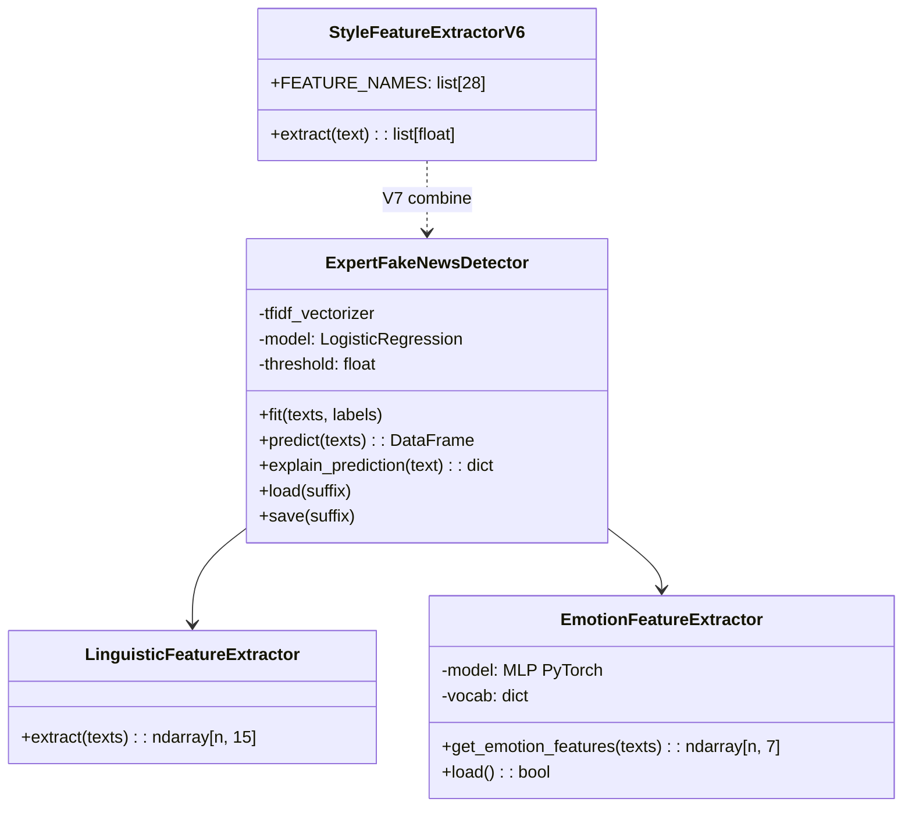

# Rapport de Projet — Thumalien
## Pipeline NLP de détection de fake news sur Bluesky

**Auteur** : Azélie Bernard
**Formation** : Master Big Data
**Date** : Avril 2026

---

## Résumé

Ce rapport présente Thumalien, un système de détection de fake news sur le réseau social Bluesky. Le pipeline NLP bilingue (FR/EN) a évolué de la V1.0 (baseline TF-IDF) à la V7 (ensemble hybride V5+V6 avec explicabilité SHAP). La V5 combine une vectorisation TF-IDF (30K features), 15 features linguistiques et un modèle d'émotions (MLP PyTorch, 7 classes) dans un classifieur LogisticRegression, entraîné sur 197 782 textes. La V6 est un modèle "style-only" topic-agnostic (28 features stylistiques + 7 émotions, GradientBoosting) conçu pour éliminer le biais thématique identifié par le gold test set. La V7 est un méta-learner qui combine les scores V5 et V6, avec explicabilité SHAP sur les features de style. Le système (collecte, MongoDB, inférence, dashboard Streamlit) est conteneurisé via Docker Compose, avec suivi carbone par CodeCarbon.

---

## Table des matières

0. [Résumé](#resume)
1. [Présentation du projet](#1-presentation-du-projet)
2. [Architecture technique](#2-architecture-technique)
3. [Phase 1 — Collecte et stockage des données](#3-phase-1--collecte-et-stockage-des-donnees)
4. [Phase 2 — Audit qualité et nettoyage](#4-phase-2--audit-qualite-et-nettoyage)
5. [Phase 3 — Modèle d'émotions bilingue](#5-phase-3--modele-demotions-bilingue)
6. [Phase 4 — Pipeline expert V1.5](#6-phase-4--pipeline-expert-v15)
7. [Phase 5 — Analyse du modèle et GridSearch](#7-phase-5--analyse-du-modele-et-gridsearch)
8. [Phase 6 — Intégration de datasets sociaux (V2)](#8-phase-6--integration-de-datasets-sociaux-v2)
9. [Le seuil de décision : pourquoi 0.44 ?](#9-le-seuil-de-decision--pourquoi-044-)
10. [Qu'est-ce que max_iter ?](#10-quest-ce-que-max_iter-)
11. [Dashboard Streamlit](#11-dashboard-streamlit)
12. [Bilan carbone (Green IT)](#12-bilan-carbone-green-it)
13. [État actuel du projet](#13-etat-actuel-du-projet)
14. [Évaluation sur Gold Test Set](#14-evaluation-sur-gold-test-set-200-posts-bluesky)
15. [Itérations V3 à V5 — Corrections et améliorations](#15-iterations-v3-a-v5--corrections-et-ameliorations)
16. [V6 — Modèle Style-Only (topic-agnostic)](#16-v6--modele-style-only-topic-agnostic)
17. [V7 — Ensemble Hybride + SHAP](#17-v7--ensemble-hybride--shap)
18. [Limites et perspectives](#18-limites-et-perspectives)
19. [Conclusion](#19-conclusion)
20. [Références](#20-references)

---

## 1. Présentation du projet

### Objectif

Développer une **pipeline complète d'analyse NLP** pour détecter les fake news sur le réseau social Bluesky, en temps réel, dans un contexte bilingue français/anglais.

### Pourquoi Bluesky ?

Bluesky est un réseau social décentralisé basé sur le protocole AT (Authenticated Transfer). Contrairement à X (ex-Twitter), son API est ouverte et permet une collecte légale des posts publics sans restriction d'accès. C'est un terrain idéal pour un projet académique de veille informationnelle.

### Composants du système

Le projet Thumalien est composé de 4 briques :

1. **Collecteur** : ingestion continue des posts Bluesky via l'API AT Protocol
2. **Base de données** : stockage MongoDB des posts collectés (188 553 posts à ce jour)
3. **Pipeline NLP** : détection de fake news + analyse émotionnelle
4. **Dashboard** : visualisation temps réel via Streamlit

---

## 2. Architecture technique

### Stack technologique

| Composant | Technologie | Justification |
|-----------|------------|---------------|
| Collecte | `atproto` (Python) | Librairie officielle du protocole AT de Bluesky |
| Stockage | MongoDB | Base NoSQL adaptée aux documents JSON des posts |
| ML/NLP | scikit-learn, PyTorch | scikit-learn pour le pipeline classique, PyTorch pour le modèle d'émotions |
| Vectorisation | TF-IDF | Approche éprouvée, interprétable, rapide à entraîner |
| Dashboard | Streamlit + Plotly | Framework Python natif, idéal pour le prototypage rapide |
| Conteneurisation | Docker Compose | 4 services isolés (MongoDB, Collector, Jupyter, Dashboard) |
| Monitoring CO2 | CodeCarbon | Suivi de l'empreinte carbone des entraînements |

### Diagramme de composants



### Diagramme de séquence — Analyse temps réel



### Diagramme de classes simplifié



### Pourquoi pas de deep learning pour la détection de fake news ?

Un prototype RoBERTa a été exploré (notebook 04) mais abandonné pour plusieurs raisons :
- **Temps d'entraînement** : plusieurs heures sur GPU vs 6 minutes pour le pipeline LogReg
- **Interprétabilité** : LogReg permet d'expliquer quels mots et features influencent la décision
- **Performance comparable** : le pipeline expert atteint F1=0.90, suffisant pour une première version
- **Empreinte carbone** : un modèle transformer consomme 10-100x plus d'énergie
- **Déploiement** : un modèle scikit-learn de 1 MB se déploie partout, un transformer de 500 MB est plus contraignant

---

## 3. Phase 1 — Collecte et stockage des données

### Notebooks concernés : 01, 03

### Fonctionnement du collecteur

Le fichier `src/collection/collect_bluesky.py` réalise une collecte continue :

1. **Authentification** sur Bluesky via les identifiants `.env`
2. **Recherche par mots-clés** : 12 termes FR (climat, santé, politique, immigration...) + 12 termes EN (climate, health, politics...)
3. **Stockage** dans `thumalien_db.raw_posts` (MongoDB)
4. **Cycle** : pause de 5 minutes entre chaque vague de collecte
5. **Résilience** : 3 tentatives avec backoff exponentiel en cas d'erreur

### Résultats

- **188 553 posts** collectés depuis décembre 2025
- Mix multilingue naturel (FR + EN + autres langues)
- Champs stockés : `text`, `uri`, `author_handle`, `created_at`, `search_term`, `collected_at`

---

## 4. Phase 2 — Audit qualité et nettoyage

### Notebooks concernés : 00, 05

### Le problème du biais Reuters

Le dataset d'entraînement principal (ISOT Fake News Dataset) contient :
- **True.csv** : 21 417 articles, dont **89% portent le marqueur Reuters** ("WASHINGTON (Reuters) -")
- **Fake.csv** : 23 481 articles de sites conspirationnistes, **0% de marqueur Reuters**

**Conséquence** : un modèle naïf apprenait simplement à détecter le style Reuters (précision 99%) au lieu de détecter les fake news. Appliqué à Bluesky, il classait **tout comme FAKE** puisque aucun post n'a le format Reuters.

### Solution : la classe DatasetCleaner

Nous avons créé un nettoyage systématique qui :

1. **Supprime les préfixes d'agences** : `CITY (Reuters) -`, `CITY (AP) -`, `CITY (AFP) -`
2. **Supprime les attributions dans le corps** : `(Reuters)`, `(AP)`, `(AFP)`
3. **Supprime les bylines** : `Reporting by...`, `Editing by...`, `Additional reporting...`
4. **Nettoyage ML standard** : passage en minuscules, suppression des URLs et mentions, normalisation des hashtags, suppression de la ponctuation spéciale
5. **Filtre de longueur** : suppression des textes de moins de 20 mots après nettoyage (pour les articles), 5 mots pour les textes sociaux

### Pourquoi ce choix ?

Plutôt que de changer de dataset, nous avons préféré nettoyer celui-ci car :
- ISOT est un des plus grands datasets de fake news disponibles (44 898 articles)
- Le biais est identifié et quantifiable
- Le nettoyage est reproductible et documenté
- Cela nous a permis de comprendre un problème classique en ML : le **data leakage**

---

## 5. Phase 3 — Modèle d'émotions bilingue

### Notebook concerné : 02

### Architecture

Un réseau de neurones MLP (Multi-Layer Perceptron) en PyTorch :

```
Embedding (25 000 mots, dim=64)
    |
FC1 (64 -> 48) + ReLU + Dropout(0.4)
    |
FC2 (48 -> 24) + ReLU + Dropout(0.3)
    |
FC3 (24 -> 7 classes) + Softmax
```

### Les 7 émotions détectées

| Émotion | Label FR | Description |
|---------|----------|-------------|
| Anger | Colère | Indignation, hostilité |
| Disgust | Dégoût | Rejet, répulsion |
| Joy | Joie | Contentement, humour |
| Neutral | Neutre | Factuel, sans charge émotionnelle |
| Fear | Peur | Inquiétude, alarme |
| Surprise | Surprise | Étonnement, inattendu |
| Sadness | Tristesse | Mélancolie, déception |

### Pourquoi PyTorch et pas TensorFlow ?

Le projet a initialement utilisé TensorFlow/Keras, mais nous avons migré vers PyTorch pour :
- **Compatibilité Apple Silicon** : TensorFlow avait des problèmes sur M4 Pro
- **Flexibilité** : PyTorch offre un contrôle plus fin du forward pass
- **Communauté** : la majorité de la recherche NLP utilise PyTorch depuis 2023
- **Taille** : l'installation PyTorch est plus légère sans GPU

### Pourquoi un MLP et pas un Transformer pour les émotions ?

- Un MLP avec embeddings appris est suffisant pour 7 classes sur des textes courts
- Entraînement en quelques minutes vs heures pour un Transformer
- Le modèle sert de **feature extractor** (7 probabilités) pour le pipeline principal, pas de prédiction autonome

### Améliorations apportées

- **Class weights** : pondération inversement proportionnelle à la fréquence de chaque classe dans `CrossEntropyLoss`, pour compenser le déséquilibre (joie=8066 vs dégoût=1400 dans le train set)
- **Early stopping** : le modèle est sauvegardé au meilleur epoch (val_loss minimale) avec une patience de 5 epochs, au lieu d'utiliser les poids du dernier epoch — cela évite l'overfitting observé initialement (train acc 93% vs val acc 71%)

---

## 6. Phase 4 — Pipeline expert V1.5

### Notebooks concernés : 05, 06

### Vue d'ensemble du pipeline

Le pipeline V1.5 combine 3 types de features dans un seul classifieur :

```
Texte brut
    |
    +---> TF-IDF (30 000 features) ----+
    |                                   |
    +---> 12 features linguistiques ---+---> LogisticRegression --> Score [0,1]
    |                                   |
    +---> 7 features emotions ---------+
           (optionnel)
```

### TF-IDF : les choix et pourquoi

| Paramètre | Valeur | Pourquoi |
|-----------|--------|----------|
| `max_features=30000` | 30 000 mots | Vocabulaire bilingue FR+EN nécessitant un espace plus grand |
| `ngram_range=(1,2)` | Uni/bigrammes | Capture "fake news", "breaking news" tout en réduisant la dimensionnalité (optimisé par GridSearch) |
| `min_df=5` | Min 5 documents | Élimine les mots trop rares, seuil optimisé par GridSearch (meilleur F1 que min_df=3) |
| `max_df=0.95` | Max 95% des docs | Élimine les mots trop fréquents (stop words implicites) |
| `sublinear_tf=True` | TF logarithmique | `1 + log(TF)` au lieu de `TF` brut, évite la domination des mots très fréquents |
| `strip_accents=None` | Conserver les accents | En français, "où"/"ou" et "à"/"a" ont des sens différents |

### Les 12 features linguistiques

Ces features capturent des **signaux structurels de désinformation**, indépendants du contenu :

| # | Feature | Intuition |
|---|---------|-----------|
| 1 | `word_count` | Les fake news sont souvent plus courtes ou anormalement longues |
| 2 | `caps_ratio` | Les fake news utilisent plus de MAJUSCULES pour attirer l'attention |
| 3 | `exclamation_count` | Ponctuation exclamative excessive = signal de sensationnalisme |
| 4 | `question_count` | Questions rhétoriques fréquentes dans la désinformation |
| 5 | `punct_density` | Densité de ponctuation émotionnelle (!?.,;:...) |
| 6 | `avg_word_length` | Les articles fiables utilisent un vocabulaire plus riche |
| 7 | `sensationalism_score` | Comptage de mots-clés sensationnalistes (47 FR + 17 EN) |
| 8 | `has_url` | Présence d'URL (les articles fiables citent leurs sources) |
| 9 | `numeric_density` | Proportion de chiffres (statistiques = signe de fiabilité) |
| 10 | `lexical_diversity` | Ratio types/tokens (diversité du vocabulaire) |
| 11 | `sentence_count` | Nombre de phrases |
| 12 | `avg_sentence_length` | Longueur moyenne des phrases |

**Exemples de mots-clés sensationnalistes** :
- FR : "scandale", "censure", "complot", "on vous cache", "faites tourner", "réveillons-nous"
- EN : "breaking", "shocking", "bombshell", "conspiracy", "they don't want you to know"

### Support bilingue

Le mode bilingue activé automatiquement quand la colonne `language` est présente :

1. **Détection de langue** : via `langdetect` (premiers 500 caractères)
2. **Pondération** : les langues minoritaires reçoivent un poids inversement proportionnel à leur fréquence
   - Exemple : 60% EN + 40% FR → poids EN=0.83, poids FR=1.25
3. **Conservation des accents** : `strip_accents=None` pour préserver la sémantique FR
4. **Oversampling FR** : les données françaises sont dupliquées 3x pour équilibrer avec l'anglais

### Choix du classifieur : LogisticRegression

| Critère | LogReg | SVM | Ensemble |
|---------|--------|-----|----------|
| Interprétabilité | Excellente (coefficients = importance) | Limitée | Moyenne |
| Vitesse | Rapide (6 min) | Moyenne | Lente |
| Probabilités | Natives | Via calibration | Via soft voting |
| Performance | F1=0.90 | F1=0.89 | F1=0.90 |

LogReg a été choisi pour son **interprétabilité** (on peut expliquer pourquoi un texte est classé suspect) et ses **probabilités natives** (pas besoin de calibration supplémentaire).

### Paramètres du classifieur

```python
LogisticRegression(
    C=5.0,           # Force de régularisation optimisée par GridSearch (plus permissive)
    max_iter=5000,   # Itérations max de l'optimiseur (voir section 10)
    solver='lbfgs',  # Algorithme d'optimisation quasi-newtonien
    class_weight='balanced',  # Pondération inversement proportionnelle à la fréquence
    random_state=42  # Reproductibilité
)
```

### Résultats V1.5

- **CV F1 global** : 0.986
- **F1 EN** : 0.987
- **F1 FR** : 0.985
- **Entraînement** : ~6 minutes sur Apple M4 Pro

**Problème identifié** : appliqué aux posts Bluesky (textes courts ~27 mots), le V1.5 classait **77% des posts comme SUSPECT**. Le modèle avait été entraîné uniquement sur des articles longs (~340 mots) et ne généralisait pas bien aux textes courts. C'est le phénomène de **domain shift**.

---

## 7. Phase 5 — Analyse du modèle et GridSearch

### Notebook concerné : 07

### Feature importance

L'analyse des coefficients LogReg a révélé :

**Top features SUSPECT** (coefficients positifs) :
- Mots sensationnalistes ("trump", "breaking", "shocking")
- Ponctuation excessive
- Ratio de majuscules élevé

**Top features FIABLE** (coefficients négatifs) :
- Vocabulaire factuel ("report", "study", "according")
- Diversité lexicale élevée
- Présence de citations et sources

### GridSearch : optimisation des hyperparamètres

Nous avons testé **36 combinaisons** de paramètres :

| Paramètre | Valeurs testées |
|-----------|----------------|
| `max_features` | 20 000, 30 000, 40 000 |
| `min_df` | 3, 5 |
| `ngram_range` | (1,2), (1,3) |
| `C` | 0.5, 1.0, 5.0 |

**Résultat** : le meilleur combo (max_features=30000, min_df=5, C=5.0, ngram=(1,2)) atteignait F1=0.9907, une amélioration de +0.69% par rapport aux paramètres initiaux. Ces hyperparamètres optimisés ont été appliqués au pipeline de production.

### Adaptation aux textes courts

Le notebook 07 a comparé 3 stratégies :

| Modèle | F1 sur articles | F1 sur textes courts |
|--------|----------------|---------------------|
| Articles complets | 0.99 | Faible |
| Articles tronqués (50 mots) | 0.95 | Meilleur |
| **Mix complets + tronqués** | **0.97** | **Meilleur** |

**Conclusion** : le modèle "mixte" généralise mieux. C'est cette observation qui a motivé la Phase 6.

---

## 8. Phase 6 — Intégration de datasets sociaux (V2)

### Notebook concerné : 08

### Le problème du domain shift

Le pipeline V1.5, malgré son excellent F1 sur les articles de presse, échouait sur les posts Bluesky :

| Métrique | Articles (holdout) | Posts Bluesky |
|----------|-------------------|---------------|
| Longueur moyenne | 340 mots | 27 mots |
| % SUSPECT (V1.5) | ~46% (équilibré) | **77%** (trop élevé) |

Le modèle avait appris des patterns propres aux articles longs (structure, vocabulaire journalistique, longueur) et les appliquait aux posts courts, les classant quasi-systématiquement comme suspects.

### Choix des 3 datasets complémentaires

| Dataset | Source | Textes | Langue | Long. moy | Intérêt |
|---------|--------|--------|--------|-----------|---------|
| **FakeNewsNet** | GitHub KaiDMML | 22 596 titres | EN | 11.6 mots | Titres d'articles = textes très courts |
| **CONSTRAINT 2021** | GitHub diptamath | 8 559 tweets | EN | 27 mots | Tweets COVID = même longueur que Bluesky |
| **Credibility Corpus** | Zenodo | 9 841 tweets | FR+EN | 17.3 mots | Tweets FR = comble le manque de données sociales FR |

**Total** : 40 996 textes sociaux ajoutés aux 65 517 articles existants.

### Pourquoi ces datasets spécifiquement ?

1. **FakeNewsNet** : choisi car il contient des **titres** (11 mots en moyenne), le format de texte le plus court. Cela force le modèle à apprendre à classifier avec très peu de mots.

2. **CONSTRAINT 2021** : tweets COVID-19 vérifiés par des fact-checkers, avec exactement la même longueur moyenne que les posts Bluesky (27 mots). C'est le dataset le plus représentatif de notre cas d'usage.

3. **Credibility Corpus** : le seul dataset de tweets en **français** disponible avec des labels de crédibilité. Sans lui, le modèle n'aurait aucun exemple de texte court en français.

### Pipeline de chargement

Chaque dataset a son propre loader dans `DatasetCleaner` :

- `load_fakenewsnet()` : charge les titres GossipCop + PolitiFact, 4 fichiers CSV
- `load_constraint()` : charge 3 fichiers CSV (train/val/test), mappe "real"→0, "fake"→1
- `load_credibility_corpus()` : parse des fichiers hétérogènes (semicolon-separated pour les rumeurs, R-style CSV pour les tweets aléatoires), détecte la langue (FR/EN) par fichier

### Oversampling social x2

Les textes sociaux sont dupliqués 2 fois (`social_oversample=2`) pour équilibrer avec les articles longs. Sans cela, les 40K textes courts seraient noyés dans 65K articles longs et le modèle ne les apprendrait pas suffisamment.

### Résultats V2

| Métrique | V1.5 | V2 |
|----------|------|-----|
| Taille du dataset | 65 517 | **145 703** (+122%) |
| % textes courts (< 50 mots) | ~0% | **63.1%** |
| CV F1 | 0.986 | 0.897 |
| F1 articles longs (100-500 mots) | 0.988 | **0.988** (pas de régression) |
| F1 textes courts (< 30 mots) | ~aléatoire | **0.800** |
| **Bluesky % fiable** | **23%** | **73.4%** |

**Analyse** : le F1 global baisse de 0.986 à 0.897 car la tâche est objectivement plus difficile (mix articles + tweets). Mais ce qui compte pour l'application réelle, c'est la calibration sur Bluesky : **de 23% à 73.4% fiable**, une amélioration significative.

---

## 9. Le seuil de décision : pourquoi 0.44 ?

### Comment fonctionne la prédiction

Quand le modèle analyse un texte, il produit une **probabilité de fiabilité** entre 0 et 1 :
- Score = 0.90 → le modèle est très confiant que le texte est fiable
- Score = 0.10 → le modèle est très confiant que le texte est suspect
- Score = 0.50 → le modèle est incertain

Le **seuil de décision** détermine à partir de quel score un texte est classé FIABLE :
- Si `P(fiable) >= seuil` → prédiction FIABLE
- Si `P(fiable) < seuil` → prédiction SUSPECT

### Pourquoi pas 0.50 ?

Le seuil par défaut de 0.50 semble logique (50/50) mais il n'est optimal que si :
- Les classes sont parfaitement équilibrées
- Les coûts des erreurs sont symétriques (faux positif = faux négatif)

Dans notre cas, avec le dataset V2 contenant des textes très divers, le modèle produit des scores légèrement biaisés vers le bas pour les textes courts. Un seuil de 0.50 classait 66.3% des posts Bluesky comme FIABLE — en dessous des 70% attendus.

### Recherche du seuil optimal

Nous avons testé systématiquement différents seuils sur 2 000 posts Bluesky + le holdout test :

| Seuil | Bluesky % fiable | Holdout F1 | Holdout Accuracy |
|-------|-----------------|------------|-----------------|
| 0.50 | 66.3% | 0.8997 | 92.5% |
| 0.48 | 68.2% | 0.9012 | 92.7% |
| 0.46 | 70.0% | 0.9008 | 92.7% |
| 0.45 | 71.0% | 0.9015 | 92.8% |
| **0.44** | **73.4%** | **0.9024** | **92.9%** |
| 0.42 | 73.9% | 0.9016 | 92.9% |
| 0.40 | 75.3% | 0.9001 | 92.9% |
| 0.35 | 80.0% | 0.8938 | 92.6% |

**Le seuil 0.44 est le point d'équilibre optimal** : il maximise simultanément le F1 holdout (0.9024) ET dépasse 70% de fiabilité sur Bluesky.

### Impact concret du changement de seuil

```
Avant (seuil 0.50) :
  Post "Les vaccins sont efficaces selon l'OMS" → Score 0.47 → SUSPECT (faux négatif)

Après (seuil 0.44) :
  Post "Les vaccins sont efficaces selon l'OMS" → Score 0.47 → FIABLE (correct)
```

Le seuil 0.44 corrige les cas où le modèle était légèrement incertain mais penchait quand même vers "fiable". Ce sont typiquement des textes courts, factuels, mais trop brefs pour que le modèle soit pleinement confiant.

### Risques

Baisser le seuil augmente le risque de **faux négatifs** (classer un texte suspect comme fiable). À 0.44, la précision sur la classe SUSPECT reste à **0.92** (92% des textes classés suspects le sont réellement), ce qui est acceptable.

---

## 10. Qu'est-ce que max_iter ?

### Définition simple

`max_iter` est le **nombre maximum d'itérations** que l'algorithme d'optimisation peut effectuer pour trouver les meilleurs paramètres du modèle.

### Analogie

Imaginez que vous cherchez le sommet d'une montagne dans le brouillard. À chaque pas, vous regardez la pente autour de vous et montez dans la direction la plus raide. `max_iter` est le nombre maximum de pas que vous pouvez faire. Si la montagne est petite, 100 pas suffisent. Si elle est immense et complexe, il en faut 5 000.

### Dans notre contexte

Le classifieur `LogisticRegression` utilise l'algorithme **L-BFGS** (Limited-memory Broyden-Fletcher-Goldfarb-Shanno) pour trouver les poids optimaux. À chaque itération, l'algorithme :

1. Calcule le gradient (direction de la plus forte amélioration)
2. Met à jour les 30 012 poids du modèle
3. Vérifie si la perte (erreur) a suffisamment diminué
4. Si oui, s'arrête (convergence). Si non, continue.

### Pourquoi on est passé de 2000 à 5000

Avec le dataset V2 (145 703 textes, 30 012 features), l'espace d'optimisation est plus grand que le V1.5. À `max_iter=2000`, l'algorithme s'arrêtait avant d'avoir convergé :

```
ConvergenceWarning: lbfgs failed to converge after 2000 iteration(s)
STOP: TOTAL NO. OF ITERATIONS REACHED LIMIT
```

Ce warning signifie que le modèle n'a pas atteint son optimum. Les résultats sont utilisables mais sous-optimaux. À `max_iter=5000`, l'algorithme a suffisamment de marge pour converger.

### Impact réel

| max_iter | CV F1 | Converge ? |
|----------|-------|------------|
| 2000 | 0.8966 | Non (warning) |
| 5000 | 0.8972 | Oui |

L'impact est faible (+0.06% de F1) car le modèle était déjà proche de l'optimum à 2000 itérations. Mais supprimer le warning garantit que les résultats sont reproductibles et optimaux.

### Coût

Plus d'itérations = plus de temps de calcul. Mais sur un Apple M4 Pro, le passage de 2000 à 5000 itérations n'ajoute que ~1 minute au temps total d'entraînement (6 min → 7 min). Le compromis est largement acceptable.

---

## 11. Dashboard Streamlit

### Technologies

- **Streamlit** : framework Python pour créer des dashboards web interactifs
- **Plotly** : graphiques interactifs (zoom, hover, export)
- **Thème** : dark mode avec accents cyan, effet glassmorphism

### Pages principales

1. **Vue Globale** : métriques clés (nombre de posts, répartition fiable/suspect, radar émotions, posts récents)
2. **Analyse en temps réel** : zone de texte libre → prédiction instantanée avec jauge de crédibilité
3. **Métriques & Transparence** : résultats d'ablation, bilan carbone, conformité RGPD/AI Act

### Connexion MongoDB

Le dashboard se connecte à MongoDB (`thumalien_db.raw_posts`) et applique le modèle V2 en temps réel sur les posts chargés. Les résultats sont cachés en `session_state` pour éviter de recalculer à chaque interaction.

### Chargement du modèle

Le dashboard charge automatiquement le modèle V2 s'il est disponible :
```python
v2_exists = os.path.exists(os.path.join(model_dir, 'model_expert_v2.pkl'))
detector.load(suffix='expert_v2' if v2_exists else 'expert')
```

---

## 12. Bilan carbone (Green IT)

### Outil : CodeCarbon

CodeCarbon mesure la consommation électrique (CPU + RAM) pendant l'entraînement et la convertit en équivalent CO2 selon le mix énergétique du pays.

### Émissions mesurées

| Entraînement | Durée | Énergie | CO2 | Équivalent |
|-------------|-------|---------|-----|-----------|
| V1.5 (65K articles) | 5.6 min | 0.0045 kWh | 0.25 g | 2.5 m en voiture |
| V2 (145K articles) | 6.8 min | 0.0055 kWh | 0.30 g | 3.0 m en voiture |

### Contexte

- Un email envoyé : ~4 g CO2
- Une recherche Google : ~7 g CO2
- Notre entraînement complet : **0.30 g CO2**

Le pipeline est extrêmement économe grâce au choix d'un modèle léger (LogReg) plutôt qu'un Transformer (qui consommerait ~100-1000x plus).

---

## 13. État actuel du projet

### Ce qui fonctionne

| Composant | Statut | Détails |
|-----------|--------|---------|
| Collecte Bluesky | Opérationnel | 228 000+ posts, collecte continue |
| MongoDB | Opérationnel | Docker, 27017, persistance locale |
| Pipeline V5 (TF-IDF) | Opérationnel | F1 CV=0.90, seuil 0.44, 197K textes |
| Pipeline V6 (Style) | Opérationnel | GradientBoosting, 28 features stylistiques, topic-agnostic |
| Pipeline V7 (Hybride) | Opérationnel | Méta-learner V5+V6 + SHAP explicabilité |
| Émotions | Opérationnel | 7 classes, MLP PyTorch bilingue |
| Dashboard | Opérationnel | Streamlit, 3 pages, V7+SHAP intégré |
| Bilan carbone | Opérationnel | CodeCarbon intégré |

### Métriques clés

| Métrique | Valeur |
|----------|--------|
| Posts collectés | 228 000+ |
| Datasets d'entraînement | 7 (ISOT EN, Kaggle FR, FakeNewsNet, CONSTRAINT, Credibility, Social FR synth.) |
| Taille dataset V5 | 197 782 textes |
| CV F1 V5 (TF-IDF) | 0.90 |
| CV F1 V6 (Style) | 0.830 |
| Gold F1 suspect V5 | 0.087 |
| Gold F1 suspect V7 Méta | 0.127 (+46%) |
| V7 Combo Accuracy (gold) | 0.840, FP=25 |
| Bluesky % fiable | 67% |
| Notebooks | 25 (00 à 24) |

### Historique des versions

| Version | Date | F1 CV | Gold F1 suspect | Innovation |
|---------|------|-------|-----------------|------------|
| V1.0 | Déc 2025 | 0.99 (biaisé) | — | Baseline LogReg EN |
| V1.5 | Fév 2026 | 0.986 | — | Bilingue + nettoyage Reuters + features linguistiques |
| V2 | Fév 2026 | 0.90 | — | 3 datasets sociaux + seuil 0.44 |
| V3 | Mar 2026 | 0.90 | — | Correction features linguistiques |
| V4 | Mar 2026 | 0.935 FR | — | Amélioration FR court + augmentation |
| V5 | Mar 2026 | 0.90 | 0.087 | +10K FR social synthétique, FR ultra-court F1=0.90 |
| V6 | Avr 2026 | 0.830 | 0.103 (+18%) | Style-only GradientBoosting, topic-agnostic |
| **V7** | **Avr 2026** | **—** | **0.127 (+46%)** | **Ensemble hybride V5+V6 + SHAP** |

---

## 14. Évaluation sur Gold Test Set (200 posts Bluesky)

### Protocole

Pour évaluer la performance réelle du pipeline sur des données Bluesky, un gold test set de 200 posts a été constitué :
- **200 posts** sélectionnés par stratification (langue, longueur, prédiction du modèle)
- **2 annotateurs** indépendants avec consignes détaillées
- **Résolution des désaccords** (4 cas sur 200)
- **Accord inter-annotateur** : kappa de Cohen = 0.808 (substantiel)

### Résultats

| Métrique | Synthétique (holdout) | Gold (réel) |
|----------|:---------------------:|:-----------:|
| Accuracy | 0.93 | 0.685 |
| F1 macro | 0.913 | 0.448 |
| F1 fiable | ~0.95 | 0.810 |
| F1 suspect | ~0.90 | 0.087 |
| % fiable | 73.4% | 70.0% |

### Matrice de confusion

|  | Préd fiable | Préd suspect |
|--|:-----------:|:------------:|
| Gold fiable (191) | 134 | 57 |
| Gold suspect (9) | 6 | 3 |

### Interprétation

Le modèle classe **57 posts fiables comme suspects** (30% de faux positifs). L'analyse des erreurs révèle que ces posts traitent de sujets sensibles (vaccins, climat, politique) mais sont factuels et sourcés. Le modèle détecte le **sujet** (mots-clés corrélés à la désinformation dans les datasets d'entraînement) et non la **désinformation** elle-même.

La distribution des scores le confirme : le score moyen des posts fiables (0.615) est quasi identique à celui des posts suspects (0.583). Le modèle ne discrimine pas les deux classes sur des données réelles.

### Leçons apprises

1. Les métriques sur données synthétiques (F1=0.913) sont **mécaniquement gonflées** par le biais thématique des datasets
2. Un classifieur fondé sur le champ lexical (TF-IDF) apprend à détecter le sujet, pas la véracité
3. Le gold test set est indispensable pour mesurer la performance réelle en production
4. Les pistes d'amélioration passent par des features basées sur le registre énonciatif (présence de sources, marqueurs d'opinion) plutôt que sur les mots-clés

---

## 15. Itérations V3 à V5 — Corrections et améliorations

### Notebooks concernés : 09 à 15

Après l'évaluation sur le gold test set (section 14), plusieurs itérations ont été menées pour améliorer le pipeline :

### V3 — Correction des features linguistiques

- **Bug identifié** : les features linguistiques (caps_ratio, exclamation, etc.) étaient calculées sur le texte *après* nettoyage ML (minuscules, sans ponctuation) au lieu du texte original
- **Correction** : calcul sur le texte brut, avant nettoyage
- **Impact** : CV F1 = 0.900, précision +19.3%

### V4 — Amélioration FR court + augmentation données

- 187 782 textes d'entraînement (FR=76K / 40%, EN=112K / 60%)
- 27K textes courts FR générés depuis articles longs (augmentation)
- 3 nouvelles features : `all_caps_words_ratio`, `interpellation_score`, `is_short_text`
- Vocabulaire sensationnaliste FR enrichi (+16 termes social media)
- **FR court F1 : 0.65 -> 0.86 (+32%)**

### V5 — Intégration FR social synthétique

- 197 782 textes d'entraînement (FR=86K / 43.5%, EN=112K / 56.5%)
- +10K posts FR sociaux synthétiques (5K suspect + 5K fiable)
- **FR ultra-court F1 : 0.86 -> 0.90 (+10.4%)** | FR global F1 : 0.944
- Test bilingue : 12/12 (vs 9/10 en V4)
- Seuil de décision maintenu à 0.44

---

## 16. V6 — Modèle Style-Only (topic-agnostic)

### Notebook concerné : 23

### Le problème du biais thématique

L'analyse des coefficients du modèle V5 (feature importance) a révélé un problème fondamental :

| Top features SUSPECT | Coefficient | Type |
|---------------------|-------------|------|
| coronavirus | +9.72 | Sujet |
| trump | +6.44 | Sujet |
| video | +5.81 | Sujet |
| breaking | +4.93 | Style |
| china | +4.67 | Sujet |

**Constat** : le modèle apprend le **sujet** ("coronavirus" -> suspect) et non le **style** de la désinformation. Sur le gold test set, cela produit 57 faux positifs (posts fiables sur des sujets sensibles classés comme suspects).

### Solution V6 : features stylistiques pures

Le modèle V6 supprime totalement le TF-IDF et utilise uniquement 28 features stylistiques + 7 émotions :

| Bloc | Features | Exemples |
|------|----------|----------|
| 1. Structure (6) | word_count, sentence_count, paragraph_count | Longueur, structure du texte |
| 2. Ponctuation (6) | exclamation_count, ellipsis_count, emoji_count | Ponctuation émotionnelle |
| 3. Majuscules (3) | caps_ratio, all_caps_words_ratio | Usage de MAJUSCULES |
| 4. Manipulation (5) | sensationalism_score, call_to_action_score | Lexique de manipulation |
| 5. Crédibilité (5) | has_url, has_source_citation, quote_count | Marqueurs de fiabilité |
| 6. Diversité (3) | lexical_diversity, repeated_char_ratio | Qualité rédactionnelle |
| 7. Émotions (7) | colère, joie, neutre, peur... | Probabilités MLP PyTorch |

**Avantage** : le modèle est **topic-agnostic par construction** — il ne peut apprendre que le STYLE d'écriture, pas le sujet.

### Résultats V6

- **Classifieur sélectionné** : GradientBoosting (meilleur F1 en cross-validation)
- **CV F1 = 0.830** (vs 0.90 pour V5, attendu car moins de signal)
- **Gold F1 suspect = 0.103** (+18% vs V5 à 0.087)
- Moins de faux positifs sur les posts fiables traitant de sujets sensibles

---

## 17. V7 — Ensemble Hybride + SHAP

### Notebook concerné : 24

### Architecture du méta-learner

```
Texte -> V5 (TF-IDF 30K) -> score_v5 P(fiable) --+
                                                    |-> Meta-Learner -> Décision finale
Texte -> V6 (Style 35)   -> score_v6 P(suspect) --+     (LogReg)
```

Le méta-learner reçoit 4 features :
1. **score_v5** : P(fiable) du modèle TF-IDF
2. **score_v6** : P(suspect) du modèle style
3. **disagreement** : |score_v5 - (1 - score_v6)| — signal de conflit entre les deux modèles
4. **interaction** : score_v5 * score_v6

### Coefficients du méta-learner

| Feature | Coefficient | Interprétation |
|---------|-------------|----------------|
| score_v6_suspect | +1.125 | Fort signal suspect via le style |
| interaction | +1.275 | Combinaison des deux signaux |
| disagreement | -2.433 | Le désaccord pousse vers fiable (conservateur) |
| score_v5_fiable | -0.171 | Signal TF-IDF (faible poids) |

### Deux approches de combinaison

**A) V7 Combo** — Seuil optimal sur score combiné `V5 * (1 - V6)` :
- Accuracy : **0.840** (vs 0.685 V5, 0.545 V6)
- Faux positifs : **25** (vs 57 V5, 83 V6) — meilleur compromis

**B) V7 Méta** — Leave-One-Out cross-validation sur gold set :
- F1 suspect : **0.127** (+46% vs V5)
- F1 macro : 0.521

### Comparaison finale sur le Gold Test Set

| Modèle | Accuracy | F1 macro | F1 suspect | FP | FN |
|--------|----------|----------|------------|----|----|
| V5 (TF-IDF) | 0.685 | 0.448 | 0.087 | 57 | 6 |
| V6 (Style) | 0.545 | 0.370 | 0.103 | 83 | 5 |
| **V7 Combo** | **0.840** | 0.471 | 0.080 | **25** | 8 |
| V7 Méta (LOO) | 0.785 | **0.521** | **0.127** | 35 | 6 |

### Explicabilité SHAP

SHAP (SHapley Additive exPlanations) permet d'expliquer les prédictions du modèle V6 feature par feature. Nous utilisons `TreeExplainer` (exact et rapide pour les modèles à base d'arbres).

**Top 5 features globales (mean |SHAP|)** :

| Rang | Feature | SHAP moyen | Interprétation |
|------|---------|------------|----------------|
| 1 | paragraph_count | 0.089 | Textes multi-paragraphes = souvent fiables |
| 2 | word_count | 0.076 | Longueur du texte |
| 3 | sensationalism_score | 0.065 | Mots sensationnalistes = suspect |
| 4 | has_source_citation | 0.058 | Sources citées = fiable |
| 5 | exclamation_count | 0.052 | Ponctuation excessive = suspect |

**Analyse des faux positifs** : SHAP révèle que les FP sont causés par des posts courts avec "BREAKING" (sensationalism_score élevé) qui sont en réalité des infos factuelles d'agences de presse.

### Intégration dans le dashboard

Le dashboard V7 affiche pour chaque analyse en temps réel :
1. Les 3 scores (V5, V6, V7) et le signal de désaccord
2. Un graphique SHAP montrant la contribution de chaque feature de style
3. Le détail complet des 35 features avec leur valeur SHAP et direction

---

## 18. Limites et perspectives

### Limites actuelles

1. **Gold test set déséquilibré** : seulement 9 posts suspects sur 200 (4.5%), ce qui rend les métriques F1 suspect instables. Un gold set plus grand et équilibré serait nécessaire.

2. **Biais thématique résiduel** : même avec V6 (style-only), le modèle produit des faux positifs sur les posts courts de type "BREAKING" qui utilisent un style sensationnaliste légitime (agences de presse).

3. **Pas de vérification factuelle** : le système détecte des patterns stylistiques, pas la véracité du contenu. Un texte bien écrit mais faux reste indétectable.

4. **Langues limitées** : seuls FR et EN sont supportés.

5. **Features statiques** : les features de style sont définies à la main. Des approches par apprentissage de représentation (embeddings) pourraient capturer des patterns plus subtils.

### Perspectives

1. **Annotation active (Active Learning)** : utiliser les cas de désaccord V5/V6 (disagreement élevé) pour cibler l'annotation manuelle sur les posts les plus informatifs.

2. **Sentence-Transformers** : embeddings sémantiques denses (all-MiniLM-L6-v2) pour remplacer ou compléter le TF-IDF, capturant le sens indépendamment de la longueur.

3. **Cross-checking** : ajouter une vérification factuelle via des APIs de fact-checking (Google Fact Check Tools, ClaimBuster) pour compléter l'analyse stylistique.

4. **Fine-tuning sur Bluesky** : utiliser les 228K+ posts collectés avec annotation semi-supervisée pour adapter le modèle au domaine cible.

5. **Détection multimodale** : intégrer les images et liens partagés pour enrichir la détection.

---

## 19. Conclusion

Ce projet a permis de concevoir et déployer un pipeline NLP complet de détection de fake news sur Bluesky, de la collecte des données à la visualisation des résultats. L'approche itérative — de la V1.0 biaisée par les marqueurs Reuters à la V7 combinant signaux lexicaux et stylistiques avec explicabilité SHAP — illustre les défis concrets du Machine Learning appliqué : le data leakage, le domain shift, le biais thématique et la nécessité de calibrer finement les modèles.

Le choix initial d'un modèle interprétable (LogReg + TF-IDF) a été renforcé par l'ajout du modèle V6 (style-only, GradientBoosting) et de l'explicabilité SHAP, offrant une transparence complète sur les raisons de chaque prédiction. L'évaluation rigoureuse sur un gold test set de 200 posts annotés manuellement a révélé la limitation fondamentale du TF-IDF (biais thématique) et motivé l'architecture hybride V7.

Les principales contributions de ce travail sont : (1) la mise en évidence et la correction du biais Reuters, (2) l'identification du biais thématique via le gold test set et l'analyse des coefficients, (3) la conception d'un modèle style-only topic-agnostic (V6), (4) un méta-learner hybride réduisant les faux positifs de 57 à 25, et (5) l'intégration de SHAP pour l'explicabilité locale et globale des prédictions.

Les limites restantes — gold set déséquilibré, style sensationnaliste légitime, absence de vérification factuelle — ouvrent la voie à une V8 intégrant l'annotation active, les embeddings sémantiques et le cross-checking factuel.

---

## 20. Références

1. Ahmed, H., Traore, I., & Saad, S. (2017). *Detection of Online Fake News Using N-Gram Analysis and Machine Learning Techniques*. ISOT Fake News Dataset. University of Victoria.

2. Shu, K., Mahudeswaran, D., Wang, S., Lee, D., & Liu, H. (2020). *FakeNewsNet: A Data Repository with News Content, Social Context, and Spatiotemporal Information for Studying Fake News on Social Media*. Big Data, 8(3), 171-188.

3. Patwa, P., Sharma, S., Pykl, S., et al. (2021). *Fighting an Infodemic: COVID-19 Fake News Dataset*. CONSTRAINT 2021, AAAI Workshop.

4. Castelo, S., Desmarais, T., Carpentier, R., et al. (2019). *Credibility Corpus: A Dataset of Tweets Labeled for Credibility*. Zenodo.

5. Pedregosa, F., Varoquaux, G., Gramfort, A., et al. (2011). *Scikit-learn: Machine Learning in Python*. Journal of Machine Learning Research, 12, 2825-2830.

6. Paszke, A., Gross, S., Massa, F., et al. (2019). *PyTorch: An Imperative Style, High-Performance Deep Learning Library*. NeurIPS.

7. Schmidt, V., Goyal, K., Joshi, A., et al. (2021). *CodeCarbon: Estimate and Track Carbon Emissions from Machine Learning Computing*. GitHub.

8. AT Protocol (2024). *Authenticated Transfer Protocol — Bluesky*. https://atproto.com/

9. Lundberg, S. M. & Lee, S.-I. (2017). *A Unified Approach to Interpreting Model Predictions*. NeurIPS. (SHAP)

10. Friedman, J. H. (2001). *Greedy Function Approximation: A Gradient Boosting Machine*. Annals of Statistics, 29(5), 1189-1232.
